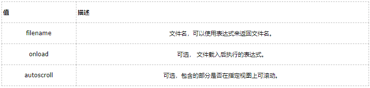

###1.指令
**ng-app**,ng- 都是angular的指令系统
ng-app: ng-app是angular的初始化，一个页面只能有一个ng-app,位置不限制。在页面上加入了这个执行，那么从当前的元素以及儿子元素，都交给angular管理，不赋值的话，会有一个默认模块。
ng-app="myApp"这里如果加了自定义的名字，那么必须创建对应的模块。
**ng-model**:双向绑定数据
**ng-init**：给字段赋予初始值。ng-init=”val=0”。
**ng-bind**:单向绑定，只能用于双标签，如果要在单标签上使用，那么我们就使用表达式，表达式有一个闪烁的问题，它渲染在html的双标签位置。与{{}}的作用一样显示数据。

写法有：ng-bind  data-ng-bind  x-ng-bind

{{表达式}}：用于显示数据。

一次性数据绑定：{{::表达式}}

**ng-controller**控制器，链接数据的的桥梁

不同于以上的功能性指令，Angular还定义了一些用于和事件绑定的指令：

- ng-blur：失去焦点

- ng-change：发生改变

- ng-copy： 拷贝完成

- ng-click：单击

- ng-dblclick：双击

- ng-focus： 得到焦点

- ng-submit：

- ng-click/dblclick

- ng-mousedown/up

- ng-mouseenter/leave

- ng-mousemove/over/out

- ng-keydown/up/press

- ng-focus/blur

- ng-submit

###2.指令闪烁 ng-cloak
解决表达式闪烁的问题

**1. Class=”ng-cloak”**

**2.在对应的标签中加上 ng-cloak指令即可。**

虽然ng-bind 能解决 {{}} 闪现的问题，但是 ng-bind不能用单标签 ng-bind 只能用于双标签，在单标签上是无法解决
  在单标签上，为了解决闪现表达的可以使用 ng-cloak,也可以在表标签上加上 class="ng-cloak"
`<input type="text" ng-model="name" ng-cloak/>`

###3.ng-class ng-class-even ng-class-odd
ng-class 实现多个选择多个 {"red":true,"font":true}
如果值为True表示可用，否则false 不可以用
ng-class {"A":red,"B":green}[A] 多选择一个样式
```
<li ng-repeat="x in data" ng-class='{a:"blue",b:"green",c:"pink"}[x.main]'>{{x.title}}</li>
$scope.data=[ {title:"标题", main:"a"}, {title:"标题1", main:"b"}, {title:"标题2", main:"c"} ];
```

###4.ng-repeat 指令
js控制器里定义一个data数据：
```
angular.module("myApp",[]).controller("testContoller",function($scope){
    $scope.data=[
        {title:"标题", main:"主要内容"},
        {title:"标题1", main:"主要内容1"},
        {title:"标题2", main:"主要内容2"}
        ]
});
```

 第一种使用：
```
<p ng-repeat="a in data" ng-cloak>{{a.title}},{{a.main}}</p>
```
 第二种使用：

如果使用ng-repeat-start那么必须要结合ng-repeat-end
```
<div ng-repeat-start="o in data"></div>
<p ng-cloak>{{o.title}}</p>
<div ng-repeat-end=""></div>
```

```
<ul>
    <li ng-repeat="obj in data" ng-class="$even==true?'pink':obj.color " >{{obj.name}}</li>
</ul>
```
\$even：奇数行$even的值为true，偶数行为false;

\$odd：奇数行$odd的值为false，偶数行为true;

###5.ng-show ng-hide
ng-show ：默认值是隐藏;布尔值为true时显示
ng-hide:默认值是显示；布尔值为true时隐藏

`<div ng-show>测试盒子</div>`

###6.ng-if
ng-if:值为true的时候显示，为false时该元素及其所有子元素被移除；默认为false。
```
<div  ng-if="true">测试盒子</div>

<p ng-if="false">
    2222
    <span>11111</span>
</p>
```

###7.ng-switch
<!--当data.name为1时，第一个span显示，当输入的data.name为2时第二个span显示-->
```
<div ng-switch="data.name">
    <input type="text" ng-model="data.name"/><br/>
    <span ng-switch-when="1">{{data.names}}</span>
    <span ng-switch-when="2">{{data.namess}}</span>
</div>

$scope.data={
   name:"",
    names:"张三",
    namess:"小明"
}
```

###8.ng-checked
###9.ng-include
语法
```
<element ng-include="filename" onload="expression" autoscroll="expression" ></element>
```
ng-include 指令作为元素使用:
```
<ng-include src="filename" onload="expression" autoscroll="expression" ></ng-include>
```
所有的 HTML 元素都支持该指令。



###10.ng-copy
元素文本被拷贝时执行的表达式。

`<element ng-copy="expression"></element>`