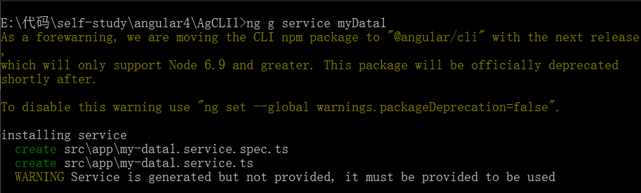
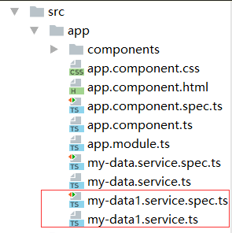

1.创建服务

打开命令窗口，cd到项目目录下，输入  ng g service myData1  回车 创建服务，如下图所示：



这样就成功创建了服务，此时，可以在项目的app文件夹下生成了两个service文件，



2.引入注册服务

服务创建好之后，要先引入注册之后才能用。

首先要在app.module.ts里：

引入     `import { MyDataService } from './my-data.service';`

注册     ` providers:[MyDataService]；`

app.module.ts整体代码如下：
```
import { NgModule }      from '@angular/core';//引入angular核心模块
import { BrowserModule } from '@angular/platform-browser'; //浏览器解析
import { FormsModule }   from '@angular/forms'; // <-- NgModel lives here

//引入组件
import { AppComponent } from './app.component';
import { HeaderComponent } from './components/header/header.component';
import { NewsComponent } from './components/news/news.component';

//1.引入服务  注册服务
import { MyDataService } from './my-data.service';

@NgModule({
  imports: [    //配置模块   /*引入模块   请求数据模块*/
    BrowserModule,
    FormsModule // <-- import the FormsModule before binding with [(ngModel)]
  ],
  declarations: [       //声明 注册  组件     所有自定义的组件都要在这里声明
    AppComponent,
    HeaderComponent,
    NewsComponent
  ],
  providers:[MyDataService],    /*服务  工具*/
  bootstrap: [ AppComponent ]   //启动模块  /*加载根组件*/
})
export class AppModule { }    //暴露跟模块
```
app.module.ts里引入注册之后，还需要在用到服务的地方引用，我写的demo是在news组件里用到了*MyDataService服务，所以就在news.component.ts里引入
```
//要用服务 1.需要在app.module.ts 引入和注册    2.在使用的地方引入

import { MyDataService } from '../../my-data.service';
```

这样就可以在*news.component.ts中使用**MyDataService**服务了；*

*3.使用服务*

*使用服务就是把服务实例化，在**news.component.ts中用构造函数来实例化我们定义的服务:*
```
  constructor(private  storage:MyDataService) {
      console.log(this.storage);
      this.news = this.storage.getItem('msgList') || [];
  } 
```
这样就可以使用服务了。

我这里写了一个小demo,使用服务实现数据的缓存处理：

html:
```
<h3>{{newsTitle}}</h3>
<input type="text" [(ngModel)]="currentMsg"><button (click)="addList()">增加+</button>
<ul>
  <li *ngFor="let item of news;let key =index">
    {{item}}------<button (click)="delete(key)">删除</button>
  </li>
</ul>
```

news.component.ts:
```
import { Component, OnInit } from '@angular/core';

//要用服务 1.需要在app.module.ts 引入和注册    2.在使用的地方引入

import { MyDataService } from '../../my-data.service';

@Component({
  selector: 'app-news',
  templateUrl: './news.component.html',
  styleUrls: ['./news.component.css']
})
export class NewsComponent implements OnInit {

  public news = [];
  public newsTitle = '填写个人信息，添加到列表';
  public currentMsg;

  constructor(private  storage:MyDataService) {

      this.news = this.storage.getItem('msgList') || [];
  }

  ngOnInit() {


  }

  addList() {
    this.news.push(this.currentMsg);
    this.storage.setItem('msgList',this.news);
  }
  delete(i){
    this.news.splice(i,1);
    this.storage.setItem('msgList',this.news);
  }

}
```

my-data1.sevice.ts:
```
import { Injectable } from '@angular/core';

@Injectable()
export class MyDataService {

  constructor() { }

  setItem(key,value){
    localStorage.setItem(key,JSON.stringify(value));
  }
  getItem(key){
    return JSON.parse(localStorage.getItem(key));
  }
  removeItem(key){
    localStorage.removeItem(key);
  }

}
```