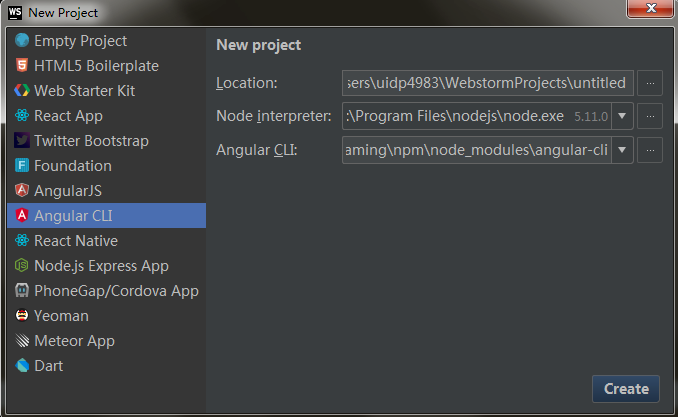
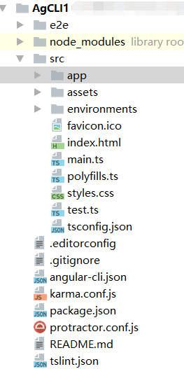
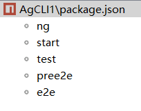
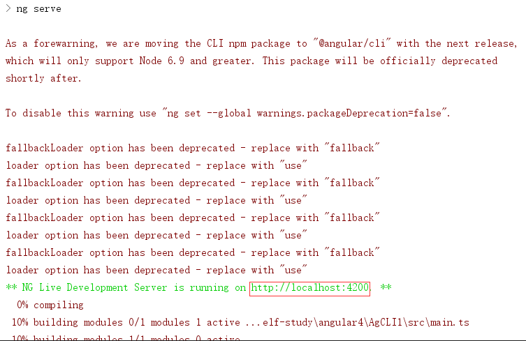

创建项目之前需要先安装angular cli，（angular是用typescript编写的，所以先安装typescript，再安装angularjs-cli）。打开命令窗口输入 npm install -g angular-cli ，等待安装完成，就可以打开webStorm创建项目了。

1.首先需要创建一个project。

可以看到图片上有两个关于Angular的选择。一个是AngularJS,这个创建的是基于Angular1.0版本类的project。另一个Angular CLI创建的才是基于Angular2.0的项目。

WebStorm有这点的好处就是会自动链接到你电脑里已经安装的路径上。从图片可以看出：Node interpreter：就是链接到我电脑里面安装node的路径下。

location路径是你创建项目保存的地址，可以自己随意定义，路径选好之后点击Create,然后webstrom就会开始自动安装依赖，这可能会需要一会儿，等待安装完成会看到项目结构如下图：

就这样我们就创建成功了。

webStorm 可以帮我们将ts自动转为js .会在上方提示你需不需要将ts转为js文件，点击ok就可以了。

项目创建好了，怎么运行呢？运行项目这边有个步骤，就是得先开启服务。

找到你的package.json文件鼠标右击，找到show npm Scripts，就会看到下面有一个类似图片这样的树结构

双击start服务器就运行起来了，这时你会看到控制台如下图：

可以看到Server is running on http://localhost:4200

这样我们在浏览器运行http://localhost:4200  就可以看到我们运行的项目啦