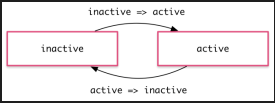
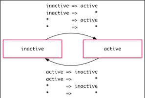
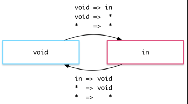

如果引入时出现提示`找不到@angular/platform-browser/animations`，则应该更新@angular/cli依赖包到最新版本，更新步骤:
```
1. npm uninstall -g @angular/cli

2. npm cache clean

3. npm install -g @angular/cli@latest
```
然后进入到项目所在文件夹执行如下操作：
```
4. npm install --save-dev @angular/cli@latest

5. npm install @angular/common@latest @angular/compiler@latest @angular/compiler-cli@latest @angular/core@latest @angular/forms@latest @angular/http@latest @angular/platform-browser@latest @angular/platform-browser-dynamic@latest @angular/platform-server@latest @angular/router@latest @angular/animations@latest typescript@latest --save

6. npm install zone.js@0.8.4 --save

7. npm install
```
在app.module.ts引入动画相关模块
```
import {BrowserModule } from '@angular/platform-browser'; //浏览器解析

import{BrowserAnimationsModule} from '@angular/platform-browser/animations';

@NgModule({

  imports:[ //配置模块 /*引入模块 请求数据模块*/

    BrowserModule,

    BrowserAnimationsModule

  ]/启动模块 /*加载根组件*/

})
```
需要动画效果的ts文件（user-center）：
```
import { Component,Input } from '@angular/core';
import {trigger, state, style, animate, transition } from '@angular/animations';
let animation = [
  trigger('chgSate',[
    state('inactive', style({
      background:'#ccc',
      height:'100px',
      width:'100px'
    })),
    state('active',style({
        background:'#c1b018',
        height:'250px',
        width:'300px'
    })),
    transition('inactive => active',animate('500ms ease-in')),
    transition('active => inactive',animate('100ms ease-out'))
  ])
];

@Component({
 ...
  animations:animation
})
export class UserCenterComponent implements OnInit {
  public state:String = 'inactive';
 ...
  go(){
    this.state = 'active';
  }
  back(){
    this.state = 'inactive';
  }
}
```
html文件：
```
<p [@chgSate]="state">动画效果</p>
<button (click)="go()">go</button>
<button (click)="back()">back</button>
```
**>状态与转场**
```
 state('inactive', style({
      background:'#ccc',
      height:'100px',
      width:'100px'
    })),
    state('active',style({
        background:'#c1b018',
        height:'250px',
        width:'300px'
    }))
```

这些 [state](https://angular.cn/api/animations/state) 具体定义了每个状态的最终样式。一旦元素转场到那个状态，该样式就会被应用到此元素上，当它留在此状态时，这些样式也会一直保持着。 从这个意义上讲，这里其实并不只是在定义动画，而是在定义该元素在不同状态时应该具有的样式。

定义完状态，就能定义在状态之间的各种转场了。每个转场都会控制一条在一组样式和下一组样式之间切换的时间线：

```
transition('inactive => active',animate('500ms ease-in')),
transition('active => inactive',animate('100ms ease-out'))
```




如果多个转场都有同样的时间线配置，就可以把它们合并进同一个 [transition](https://angular.cn/api/animations/transition) 定义中：

`transition('inactive => active, active => inactive', animate('100ms ease-out'))`


如果要对同一个转场的两个方向都使用相同的时间线（就像前面的例子中那样），就可以使用 <=> 这种简写语法：

`transition('inactive <=> active', animate('100ms ease-out'))`

有时希望一些样式只在动画期间生效，但在结束后并不保留它们。这时可以把这些样式内联在 [transition](https://angular.cn/api/animations/transition) 中进行定义。
```
transition('inactive => active', [
  style({
    backgroundColor: '#cfd8dc',
    transform: 'scale(1.3)'
  }),
  animate('80ms ease-in', style({
    backgroundColor: '#eee',
    transform: 'scale(1)'
  }))
]),
...
```

**>(通配符)状态**

*(通配符)状态匹配任何动画状态。当定义那些不需要管当前处于什么状态的样式及转场时，这很有用。

* 当该元素的状态从 active 变成任何其它状态时，active => * 转场都会生效。

* 当在任意两个状态之间切换时，* => * 转场都会生效。



**>void 状态**

有一种叫做 void 的特殊状态，它可以应用在任何动画中。它表示元素没有被附加到视图。这种情况可能是由于它尚未被添加进来或者已经被移除了。 void 状态在定义“进场”和“离场”的动画时会非常有用。

比如当一个元素离开视图时，* => void 转场就会生效，而不管它在离场以前是什么状态。




*通配符状态也能匹配 void。

**>自动属性值计算**

有时候，你在开始运行之前都无法知道某个样式属性的值。比如，元素的宽度和高度往往依赖于它们的内容和屏幕的尺寸。处理这些属性对 CSS 动画而言通常是相当棘手的。

如果用 Angular 动画，就可以用一个特殊的* 属性值来处理这种情况。该属性的值将会在运行期被计算出来，然后插入到这个动画中。
```
trigger('shrinkOut', [
  state('in', style({height: '*'})),
  transition('* => void', [
    style({height: '*'}),
    animate(250, style({height: 0}))
  ])
])
```

**>动画时间线**

对每一个动画转场效果，有三种时间线属性可以调整：持续时间(duration)、延迟(delay)和缓动(easing)函数。它们被合并到了一个单独的转场时间线字符串。

1. **持续时间**

持续时间控制动画从开始到结束要花多长时间。可以用三种方式定义持续时间：

● 作为一个普通数字，以毫秒为单位，如：100

● 作为一个字符串，以毫秒为单位，如：'100ms'

● 作为一个字符串，以秒为单位，如：'0.1s'

2. **延迟**

延迟控制的是在动画已经触发但尚未真正开始转场之前要等待多久。可以把它添加到字符串中的持续时间后面，它的选项格式也跟持续时间是一样的：

● 等待 100 毫秒，然后运行 200 毫秒：'0.2s 100ms'。

3. **缓动函数**

[缓动函数](http://easings.net/)用于控制动画在运行期间如何加速和减速。比如：使用 ease-in 函数意味着动画开始时相对缓慢，然后在进行中逐步加速。可以通过在这个字符串中的持续时间和延迟后面添加第三个值来控制使用哪个缓动函数(如果没有定义延迟就作为第二个值)。

l 等待 100 毫秒，然后运行 200 毫秒，并且带缓动：'0.2s 100ms ease-out'

l 运行 200 毫秒，并且带缓动：'0.2s ease-in-out'

**>基于关键帧(Keyframes)的多阶段动画**

通过定义动画的关键帧，可以把两组样式之间的简单转场，升级成一种更复杂的动画，它会在转场期间经历一个或多个中间样式。

每个关键帧都可以被指定一个偏移量，用来定义该关键帧将被用在动画期间的哪个时间点。偏移量是一个介于 0(表示动画起点)和 1(表示动画终点)之间的数组。

例子使用关键帧来为进场和离场动画添加一些“反弹效果”：[](#multi-step-animations-with-keyframes "Link to this heading")
```
trigger('flyInOut', [
  state('in', style({transform: 'translateX(0)'})),
  state('out', style({transform: 'translateX(-300%)',opacity: 0})),
  transition('in => out', [
    animate(500, keyframes([
      style({opacity: 1, transform: 'translateX(-30px)', offset: 0}),
      style({opacity: 0, transform: 'translateX(300%)',     offset: 0.8}),
      style({opacity: 0, transform: 'translateX(-300%)',     offset: 1.0})
    ]))
  ]),
  transition('out => in', [
    animate(500, keyframes([
      style({opacity: 1, transform: 'translateX(-300%)',     offset: 0}),
      style({opacity: 1, transform: 'translateX(30px)', offset: 0.7}),
      style({opacity: 1, transform: 'translateX(0)',  offset: 1.0})
    ]))
  ])
])
```

**>并行动画组(Group)**

你也可能会希望为同时发生的几个动画配置不同的时间线。比如，同时对两个 CSS 属性做动画，但又得为它们定义不同的缓动函数。这种情况下就可以用动画组来解决了。
```
trigger('flyInOut', [
  state('in', style({width: 120, transform: 'translateX(0)', opacity: 1})),
  transition('void => *', [
    style({width: 10, transform: 'translateX(50px)', opacity: 0}),
    group([
      animate('0.3s 0.1s ease', style({
        transform: 'translateX(0)',
        width: 120
      })),
      animate('0.3s ease', style({
        opacity: 1
      }))
    ])
  ]),
  transition('* => void', [
    group([
      animate('0.3s ease', style({
        transform: 'translateX(50px)',
        width: 10
      })),
      animate('0.3s 0.2s ease', style({
        opacity: 0
      }))
    ])
  ])
])
```

**>动画回调**

当动画开始和结束时，会触发一个回调。
```
<li
    (@flyInOut.start)="animationStarted($event)"
    (@flyInOut.done)="animationDone($event)"
    [@flyInOut]="'in'">{{hero.name}}</li>
```