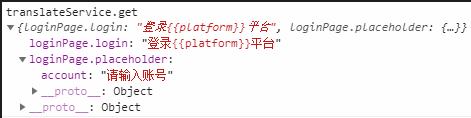

国际化是一个设计和准备应用程序的过程，使其能用于不同的语言。 本地化是一个把国际化的应用针对部分区域翻译成特定语言的过程。

Angular 简化了国际化工作的下列几个方面：
1.用本地格式显示日期、数字、百分比以及货币。
2.准备组件模板中待翻译的文本。
3.处理单词的复数形式。
4.处理候选文本。

**实例**
ngx-translate
目录结构

**(1)npm 安装 ngx-translate 模块**
```
npm install @ngx-translate/core --save
npm install @ngx-translate/http-loader --save
```
**(2)模块配置**
配置app.module.ts文件
```
import { TranslateHttpLoader } from '@ngx-translate/http-loader';
import { HttpClient, HttpClientModule } from '@angular/common/http';
import {TranslateModule,TranslateLoader,TranslateCompiler,TranslateParser,MissingTranslationHandler, MissingTranslationHandlerParams} from '@ngx-translate/core';
import {MultiTranslateHttpLoader} from "ngx-translate-multi-http-loader";

export function createTranslateHttpLoader(http: Http) {
return new TranslateHttpLoader(http, './assets/i18n/', '.json');
}
@NgModule({
  imports: [
    TranslateModule.forRoot({
      loader: {
        provide: TranslateLoader,
        useFactory: (createTranslateHttpLoader),
        deps: [Http]
      }
    })
  ]
})
```
子模块配置
如果采用了angular的子模块懒加载功能的话，则需要对子模块也进行配置，若没有则略过。
导入的文件包和函数配置等都是相同的，只有imports注入的时候不太一样，需要使用forChild()的方法
```
export function createTranslateHttpLoader(http: Http) {
  return new TranslateHttpLoader(http, './assets/i18n/', '.json');
}
```
导入多个文件写法：
```
export function createTranslateLoader(http: HttpClient) {
  return new MultiTranslateHttpLoader(http, [
    {prefix: "./assets/translations/share/", suffix: ".json"},
    {prefix: "./assets/translations/quotes/", suffix: ".json"},
  ]);
}
```
子模块中的翻译服务声明与根模块中的定义略有不同:
```
imports: [
  TranslateModule.forChild({
    loader: {
     provide: TranslateLoader, 
      useFactory:(createTranslateLoader), 
      deps: [HttpClient]
    },
    isolate: true //隔离服务
  })
]
```

**(3)配置app.component.ts文件**
```
import { TranslateService } from '@ngx-translate/core';

constructor(public translateService: TranslateService) {}
ngOnInit() {
// --- set i18n begin ---
// 参数类型为数组，数组元素为本地语言json配置文件名
this.translateService.addLangs(['th', 'en', 'zh']);
// 设置默认语言
this.translateService.setDefaultLang('th');
// 检索指定的翻译语言，返回Observable
const browserLang = this.translateService.getBrowserLang();
this.translateService.use(browserLang.match(/th|en|zh/) ? browserLang : 'th').subscribe(res => {
// ... do something
});
// --- set i18n end ---
//订阅语言切换事件
this.translateService.onLangChange.subscribe((params) => {
// do something

});

}
change() {
const currentLang = 'en';
this.translateService.use(currentLang);

}
```

**(4)添加多语言文件**
在 src/app/assets/ 下创建 i18n 文件夹，并在文件夹内创建 en.json 、th.json和 zh.json 文件

**(5)在html及ts中使用**
json文件
en.json
```
{
"hello": "Hello",
  "loginPage":{
    "placeholder":{
      "account":"input your account"
    },
    "login": "Login {{platform}} platform",
    "agreement": "click ivew <a href=\"www.xxxx.com\" class=\"gray-color\">User Agreement</a>",
    "thirdParty": "{{thirdParty}} login"
  }
}
```
zh.json
```
{
"hello": "你好",
"loginPage":{
  "placeholder":{
    "account":"请输入账号"
  },
  "login": "登录{{platform}}平台",
  "agreement": "点击查看<a href=\"www.xxxx.com\" class=\"gray-color\">用户协议</a>",
  "thirdParty": "使用{{thirdParty}}登录"
  }
}
```

html中使用（非模块化）
 ```
<div>
<span> {{'test the i18n module: ngx-translate' | translate }}</span>
<h1>{{ 'hello' | translate }}</h1>
<button (click)="change()">切換語言</button>
</div>
 ```
html（模块化）
```
<div>{{'model1.hello' | translate}}</div>
<span>{{'model2.' + data.name | translate}}</span>
<!-- 在节点属性上调用 -->
<ion-input type="text" [placeholder]=" 'loginPage.placeholder.account' | translate "></ion-input>

<!-- 带参数，即翻译的句子中有不固定字符串，eg: 登录xx平台 -->
<button ion-button full round (click)="login()">
<!-- 参数为对象类型，zh.json中platform用{{ }}括起来，一一对应 -->
{{ 'loginPage.login' | translate: { platform: 'QQ' } }}
</button>
参数可以传常量，也可以传变量，传变量的写法：
{{ 'loginPage.login' | translate: { platform: platformName } }}
此处platformName 为ts文件中的变量；


<!-- 富文本翻译 -->
<div [innerHTML]=" 'loginPage.agreement' | translate "></div>

<!-- 使用指令解析 -->
<ul>
<!-- 两种实现方式，当做指令的属性数据传递或者渲染为节点元素的内容。PS: 指令不能绑定在ionic的组件上 -->
<li [translate]="'loginPage.thirdParty'" [translateParams]="{ thirdParty: '微信' }"></li>
<li translate [translateParams]="{ thirdParty: '微博' }">loginPage.thirdParty</li>
</ul>
```

**ts中使用**
TranslateService提供了一系列的方法，这里讲下get和instant两个方法。get方法有两个参数，第一个参数是键，必填，字符串或字符串数组类型，第二个参数是插入字符串中的值，可选，对象类型。返回类型为Observable，注意，如果第一个参数传递的是数组，返回的数据是以数组元素为键的对象。
```
this.translateService.get(['loginPage.login', 'loginPage.placeholder'])
.subscribe(res => {
console.log('translateService.get', res);
})

this.dic = this.translate.instant("login.loging")
```
打印结果：


**ngx-translate-extract 翻译文件提取工具**
安装：
`npm install @biesbjerg/ngx-translate-extract --save-dev`

配置package.json文件：
```
"scripts": {
"extract": "ngx-translate-extract --input ./src --output ./src/assets/i18n/ --clean --sort --format namespaced-json"
}

ngx-translate-extract 还支持具有延迟加载的多个模块。在这种情况下，需要为每个模块创建一个Json文件:
"scripts": {
"i18n_home": "ngx-translate-extract --i ./src/app/home ./src/app/jybhome --o ./src/assets/translations/home/en-uk.json ./src/assets/translations/home/zh-cn.json ./src/assets/translations/home/zh-hk.json --clean --sort --format namespaced-json",
"i18n_login": "ngx-translate-extract --i ./src/app/login --o ./src/assets/translations/login/en-uk.json ./src/assets/translations/login/zh-cn.json ./src/assets/translations/login/zh-hk.json --clean --sort --format namespaced-json",
"extract":"npm run i18n_home && npm run i18n_login"
}
```
配置好之后运行 npm run extract就可以了。每次更新同样运行这个指令就可以。

以上只能提取html中的翻译字段，想要提取ts中的翻译字段，首先要在package.json文件下增加配置：
```
"i18n_home": "ngx-translate-extract --i ./src/app/home --o ./src/assets/translations/home/en-uk.json ./src/assets/translations/home/zh-cn.json ./src/assets/translations/home/zh-hk.json --clean --format namespaced-json --marker _",
```
在最后增加上标记函数提取指令 --marker _ ; 
之后，在当前ts添加如下代码：
```
import { _ } from '@biesbjerg/ngx-translate-extract/dist/utils/utils';
ngOnInit() {
_("login.loging");
this.translate.get("login.loging").subscribe(x=> this.dic =x );
}
```
引入标记函数，执行_(“....”)即可把翻译字段提取到json文件中，this.translate.get是从json文件里读取字段翻译值；

如果是模块化的结构，可以不在当前ts引用，在最顶层组件引用即可：
```
import { _ } from '@biesbjerg/ngx-translate-extract/dist/utils/utils';
ngOnInit() {
_(["login.loging","login.newStr"]);
}
```

命令行参数：

**--input ./src**

设置要在其中查找翻译的源目录。默认是扫描所有html和ts文件。您可以使用一个额外的——patterns参数来指定其他文件扩展名。

**--output ./src/assets/i18n/*.json**
这指定要更新哪些文件。这里的示例更新./src/assets/i18n文件夹中所有以json结尾的现有语言文件。要添加新语言，只需向翻译文件夹中添加一个新的(空的)文件。如果希望更精确地更新内容，还可以列出各个文件。

**--clean**
此选项删除源文件中未找到的所有翻译。通常这是一个好主意，使其保持文件一致。

**--sort**
对JSON文件进行排序。

**--format namespaced-json**
使用本教程中使用的嵌套对象结构创建JSON文件。

**--marker _**
ngx-translate-extract可以在TypeScript文件中搜索要翻译的字符串。你必须用一个标记函数包围字符串，例如_('app.title')