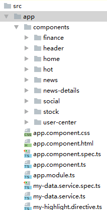

demo文档结构：

**>父组件给子组件传值**
首先在父组件所在在模块中引入子组件

```
import {RecConnectComponent} from './components/rec-connect/rec-connect.component';

declarations: [ ...RecConnectComponent],
```
父组件
Html文件：
```
<app-header [getParentMsg]="parentMsg"></app-header>    //父组件调用子组件
```
.ts文件
```
export class AppComponent {
  public parentMsg='我是一条来自父组件的消息';
}
```
子组件（app-header）
.ts文件：
```
import { Component, OnInit ,Input} from '@angular/core';
export class HeaderComponent implements OnInit {
  @Input()  getParentMsg:string;//接收父组件传过来的值 getParentMsg可以直接用
}
```
**>子组件给父组件传值**
子组件
.ts文件
```
//子组件引入Output 和 EventEmitter
import { Component, OnInit ,Output,EventEmitter} from '@angular/core';
let sonMsg = '我是一条来自子组件的消息';
export class HeaderComponent implements OnInit {
	//子组件中实例化 EventEmitter
	@Output() private toParent = new EventEmitter<string>();   
	/*用EventEmitter 和output装饰器配合使用  <string>指定类型变量*/
	public anotherSonMsg = '子组件传来的第二条消息';
	ngOnInit() { 
		this.sendParent();
	}
	sendParent(){
  		this.toParent.emit(`${sonMsg};${this.anotherSonMsg}`);
		//子组件通过  EventEmitter 对象outer实例广播数据
	}
}
```
父组件
.html文件
```
<app-header (toParent)="getMsg($event)"></app-header>
```
.ts文件
```
export class AppComponent {
//子组件toParent调用的时候，getMsg函数就会被调用
  getMsg(msg:string){
    console.log('父子传值：',msg);
  }
}
```
**>父子组件动态交互**
子组件接收父组件的数据，可以**拦截属性的数据**并进行相应的处理。 
拦截有两种方式： 
**1. setter拦截输入属性 **
```
private _name:Array<string>;
@Input()
//getParentMsg:string;//接收父组件传过来的值
set getParentMsg(name:Array<string>){
  this._name = name.map((val)=>(val&&val.trim() || '未定义名称'));
}
get getParentMsg(){return this._name}
```
打印getParentMsg得到的值：["我是一条来自父组件的消息", "Mr. IQ", "未定义名称", "Bombasto"]
**2. ngOnChanges监听数据变化 **
ngOnChanges监听数据绑定中发生的数据变化，该方法接收一个对象参数，包含当前值和变化前的值。
```
//引入OnChanges、SimpleChange
import { Component, OnChanges, SimpleChange,OnInit ,Input,Output,EventEmitter} from '@angular/core';
export class HeaderComponent implements OnInit {
  @Input()getParentMsg:Array<string>;//接收父组件传过来的值
  //ngOnChanges监听数据变化  处理父组件传值
  ngOnChanges(changes:{[propKey: string]: SimpleChange}){
    console.log('ngOnChanges监听数据变化:',changes);
    if(changes['getParentMsg']){
      let msg:Array<string> = changes['getParentMsg'].currentValue;
      this.getParentMsg = msg.map((val)=>(val&&val.trim() || '未定义名称'));
    }
  }
}

changes = {
  getParentMsg: {
    currentValue: ["  来自父组件的消息  ", "Mr. IQ", "   ",Bombasto  "]，
    previousValue: {}
  }
}
```
**4.父组件与子组件通过本地变量互动**
父组件
.ts文件   引入子组件类
```
import { HeaderComponent }  from './components/header/header.component';
```
.html文件
```
<app-header #timer></app-header>
<button (click)="timer.start(timer.getParentMsg)">测试标签</button>
<button (click)="timer.stop()" >测试标签</button>
```
把本地变量(#timer)放到(app-header)标签中，用来代表子组件。这样父组件的模板就得到了子组件的引用，于是可以在父组件的模板中访问子组件的所有属性和方法

子组件
.ts文件
```
export class HeaderComponent implements OnInit {
 public getParentMsg:string = '子组件的值';
  start(msg) { alert(msg)}
  stop()  {alert('stop')}
}
```
这个本地变量方法是个简单便利的方法。但是它也有局限性，因为父组件-子组件的连接必须全部在父组件的模板中进行。父组件本身的代码对子组件没有访问权。
**5.父组件调用@ViewChild() 调用子组件方法和属性**
父组件
.ts文件：
```
import { ViewChild } from '@angular/core';
import { HeaderComponent }  from './components/header/header.component';
@ViewChild(HeaderComponent)
private getSonData: HeaderComponent;
showSonData(){
  this.getSonData.start(this.getSonData.getParentMsg);
}
```
**6.通过服务通信**
服务 my-data.service.ts
```
export class MyDataService {
//父子组件通过服务通信
  private parMsg = new Subject<string>();
  private sonMsg = new Subject<string>();
  parMsg$ = this.parMsg.asObservable();
  sonMsg$ = this.sonMsg.asObservable();

  parMsgs(msg:string){
    this.parMsg.next(msg);
  }
  sonMsgs(msg:string){
    this.sonMsg.next(msg);
  }
}
```
数据流程图：
`组件触发数据改变-->调用服务的函数（parMsgs || sonMsgs），并把改变数据作为参数传递过去-->服务的asObservable()广播改变-->组件通过订阅（parMsg$ || sonMsg$）得到改变数据`

父组件 app.component.ts
```
//导入服务
import { MyDataService } from './my-data.service';
export class AppComponent {
  servMsg = '这是通过服务实现父子组件通信的';
  constructor(private myDataService: MyDataService) {
    myDataService.sonMsg$.subscribe(
      val=> {
        this.servMsg = val;
      });
  }
  servMsgChgP(){
    this.servMsg = '父组件传递数据';
    this.myDataService.parMsgs(this.servMsg);
  };
}
```
.html
```
<button (click)="servMsgChgP()">{{servMsg}}</button>
```
子组件 header.component.ts
```
//导入服务
import { MyDataService } from './../../my-data.service';
import { Subscription }   from 'rxjs/Subscription';
subscription: Subscription;
servMsg:string= '父子组件传递数据';
constructor(private location:Location,private router:Router,private myDataService: MyDataService) {
  this.subscription = myDataService.parMsg$.subscribe(
    val=> {
      this.servMsg = val;
    });
}
servMsgChgS(){
  this.servMsg = '子组件传递数据';
  this.myDataService.sonMsgs(this.servMsg);
}
```
.html
```
<li><a (click)="servMsgChgS()">{{servMsg}}</a></li>
```
这样就实现了通过服务来实现父子组件通信；
此外其组件也可以订阅值改变的通知：
Home.component.ts
```
//导入服务
import { MyDataService } from './../../my-data.service';
import { Subscription }   from 'rxjs/Subscription';
export class HomeComponent implements OnInit {
  msg:string = '22222';
  subscription: Subscription;
  constructor(private myDataService: MyDataService) {
    this.subscription = myDataService.parMsg$.subscribe(
      val=> {
        this.msg = val;
      });
    myDataService.sonMsg$.subscribe(
      val=> {
        this.msg = val;
      });
  }
}
```
.html
```
<span>{{msg}}</span>
```