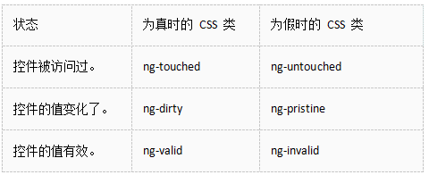
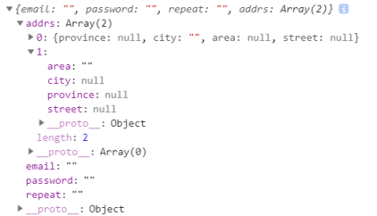
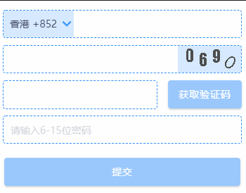
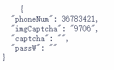
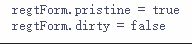
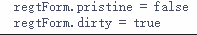
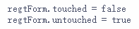
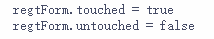
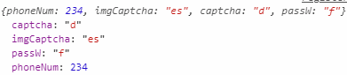
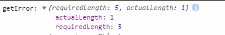

**>用户输入**

通过\$event对象取得用户输入`<input (keyup)="onKey($event)">`

**$event的类型**
```
onKey(event: KeyboardEvent) { // with type info 

  this.values += (<HTMLInputElement>event.target).value + ' | '; 

}
```
$event的类型现在是KeyboardEvent。 不是所有的元素都有value属性，所以它将target转换为输入元素。 OnKey方法更加清晰的表达了它期望从模板得到什么，以及它是如何解析事件的。

传入 $event 是靠不住的做法，还有另一种获取用户数据的方式：使用 Angular 的模板引用变量。在标识符前加上井号 (#) 就能声明一个模板引用变量。
```
<input #box (keyup)="onKey(box.value)">
<p>{{values}}</p>
onKey(value: string) { this.values += value + ' | '; }
```

**按键事件过滤（通过key.enter）**

keyup.enter：只有按下回车键才被触发
```
<input #box (keyup.enter)="onEnter(box.value)">
<p>{{value}}</p>
onEnter(value: string) { this.value = value; }
```

**失去焦点事件 (blur)**

keyup.enter有一个bug就是如果用户没有先按回车键，而是移开了鼠标，点击了页面中其它地方，输入框的当前值就会丢失。通过同时监听输入框的回车键和失去焦点事件来修正这个问题。
```
<input #box
       (keyup.enter)="update(box.value)"
       (blur)="update(box.value)">
<p>{{value}}</p>
update(value: string) { this.value = value; }
```

**>模板驱动表单**

开发表单需要设计能力，而框架支持双向数据绑定、变更检测、验证和错误处理。

这个页面演示了如何从草稿构建一个简单的表单。这个过程中你将学会如何：

* 用组件和模板构建 Angular 表单

* 用 [ngModel](https://angular.cn/api/forms/NgModel) 创建双向数据绑定，以读取和写入输入控件的值

* 跟踪状态的变化，并验证表单控件

* 使用特殊的 CSS 类来跟踪控件的状态并给出视觉反馈

* 向用户显示验证错误提示，以及启用/禁用表单控件

* 使用模板引用变量在 HTML 元素之间共享信息

通过 ngModel 跟踪修改状态与有效性验证：

```
<!--当在表单中使用 [(ngModel)] 时，必须要定义 name 属性。-->
<input type="text" class="form-control" id="name" required [(ngModel)]="model.name" name="name" #name="ngModel">
<!--当控件是有效的 (valid) 或全新的 (pristine) 时，隐藏消息-->
<div [hidden]="name.valid || name.pristine"
     class="alert alert-danger">
  Name is required
</div>

<button type="submit" class="btn btn-s
```
`heroForm.reset()  重置表格`

**>响应式表单**
1.基础知识
首先需要在跟模块引入
```
import {FormsModule , ReactiveFormsModule} from '@angular/forms';
```
导出：
```
imports: [
...
FormsModule,
ReactiveFormsModule
],
```
基础的表单类
* AbstractControl是三个具体表单类的抽象基类。 并为它们提供了一些共同的行为和属性，其中有些是可观察对象（Observable）。
* FormControl 用于跟踪一个单独的表单控件的值和有效性状态。它对应于一个HTML表单控件，比如输入框和下拉框。它是Angular表单中的最小单元。
* FormGroup用于跟踪一组AbstractControl的实例的值和有效性状态。 该组的属性中包含了它的子控件。组件中的顶级表单就是一个FormGroup。
* FormArray用于跟踪AbstractControl实例组成的有序数组的值和有效性状态。
* FormBuilder 快速构建表单，
```
this.user = new FormGroup({
  email: new FormControl('', [Validators.required, Validators.pattern(/[a-zA-Z0-9]/)]),
  password: new FormControl('', [Validators.required]),
  repeat: new FormControl('', [Validators.required]),
  address: new FormGroup({
    province: new FormControl(''),
    city: new FormControl(''),
    area: new FormControl(''),
    addr: new FormControl('')
  })
});
```
从上面的代码中我们可以看到，这里的表单（ FormGroup ）是由一系列的表单控件（ FormControl ）构成的。其实 FormGroup 的构造函数接受的是三个参数： controls（表单控件『数组』，其实不是数组，是一个类似字典的对象） 、 validator（验证器） 和 asyncValidator（异步验证器） ，其中只有 controls 数组是必须的参数，后两个都是可选参数。
```
// FormGroup 的构造函数
constructor(
 controls: {
 [key: string]: AbstractControl;
 },
 validator?: ValidatorFn,
 asyncValidator?: AsyncValidatorFn
)
```
我们上面的代码中就没有使用验证器和异步验证器的可选参数，而且注意到我们提供 controls 的方式是，一个 key 对应一个 FormControl 。比如下面的 key 是 password，对应的值是 new FormControl('', [Validators.required]) 。这个 key 对应的就是模板中的 formControlName 的值，我们模板代码中设置了 formControlName="password" ，而表单控件会根据这个 password 的控件名来跟踪实际的渲染出的表单页面上的控件（比如 `<input formcontrolname="password">`）的值和验证状态。
`password = new FormControl('', [Validators.required]);`

那么可以看出，这个表单控件的构造函数同样也接受三个可选参数，分别是：控件初始值（ formState ）、控件验证器或验证器数组（ validator ）和控件异步验证器或异步验证器数组（ asyncValidator ）。上面的那行代码中，初始值为空字符串，验证器是『必选』，而异步验证器我们没有提供。
```
// FormControl 的构造函数
constructor(
  formState?: any, // 控件初始值
  validator?: ValidatorFn | ValidatorFn[], // 控件验证器或验证器数组
  asyncValidator?: AsyncValidatorFn | AsyncValidatorFn[] // 控件异步验证器或异步验证器数组
)
```
由此可以看出，响应式表单区别于模板驱动型表单的的主要特点在于：是由组件类去创建、维护和跟踪表单的变化，而不是依赖模板。

那么我们是否在响应式表单中还可以使用 ngModel 呢？当然可以，但这样的话表单的值会在两个不同的位置存储了： ngModel 绑定的对象和 FormGroup ，这个在设计上我们一般是要避免的，也就是说尽管可以这么做，但我们不建议这么做。

上面的表单构造起来虽然也不算太麻烦，但是在表单项目逐渐多起来之后还是一个挺麻烦的工作，所以 Angular 提供了一种快捷构造表单的方式 -- 使用 FormBuilder。
```
// 初始化表单
this.user = this.fb.group({
  email: ['', [Validators.required, Validators.email]],
  password: ['', Validators.required],
  repeat: ['', Validators.required],
  address: this.fb.group({
    province: [],
    city: [],
    area: [],
    addr: []
  })
});
```
使用 FormBuilder 我们可以无需显式声明 FormControl 或 FormGroup 。 FormBuilder 提供三种类型的快速构造： control , group 和 array ，分别对应 FormControl, FormGroup 和 FormArray。 我们在表单中最常见的一种是通过 group 来初始化整个表单。上面的例子中，我们可以看到 group 接受一个字典对象作为参数，这个字典中的 key 就是这个 FormGroup 中 FormControl 的名字，值是一个数组，数组中的第一个值是控件的初始值，第二个是同步验证器的数组，第三个是异步验证器数组（第三个并未出现在我们的例子中）。这其实已经在隐性的使用 FormBuilder.control 了，可以参看下面的 FormBuilder 中的 control 函数定义，其实 FormBuilder 利用我们给出的值构造了相对应的 control ：
```
// FormBuilder 的构造函数
control(
  formState: Object, 
  validator?: ValidatorFn | ValidatorFn[], 
  asyncValidator?: AsyncValidatorFn | AsyncValidatorFn[]
): FormControl;
```
此外还值得注意的一点是 address 的处理，我们可以清晰的看到 FormBuilder 支持嵌套，遇到 FormGroup 时仅仅需要再次使用 this.fb.group({...}) 即可。这样我们的表单在拥有大量的表单项时，构造起来就方便多了。

FormArray 的用法
在购物网站经常遇到需要维护多个地址，因为我们有些商品希望送到公司，有些需要送到家里，还有些给父母采购的需要送到父母那里。这就是一个典型的 FormArray 可以派上用场的场景。所有的这些地址的结构都是一样的，有省、市、区县和街道地址，那么对于处理这样的场景，我们来看看在响应式表单中怎么做
首先，我们需要把 HTML 模板改造一下，现在的地址是多项了，所以我们需要在原来的地址部分外面再套一层，并且声明成 formArrayName="addrs"。 FormArray 顾名思义是一个数组，所以我们要对这个控件数组做一个循环，然后让每个数组元素是 FormGroup，只不过这次我们的 [formGroupName]="i" 是让 formGroupName 等于该数组元素的索引。
```
<div [formGroup]="user">
  <div formArrayName="addrs">
    <button (click)="addAddr()">Add</button>
    <div *ngFor="let item of user.controls['addrs'].controls; let i = index;">
      <div [formGroupName]="i">
        ...
      </div>
    </div>
  </div>
</div>
```
首先是无论表单本身还是控件都可以看成是一系列的基于时间维度的数据流了，这个数据流可以被多个观察者订阅和处理，由于 valueChanges 本身是个 Observable，所以我们就可以利用 RxJS 提供的丰富的操作符，将一个对数据验证、处理等的完整逻辑清晰的表达出来。
```
this.user.valueChanges.subscribe(res => {
  console.log(res);
});
```
打印结果：


**>例子**
```
<form [formGroup]="passForm" text-center class="modifyPassForm" margin>
<input padding id="pass" formControlName = "passWord" type="password" 
class="form-control pas" placeholder="请输入原始密码" autofocus required ngDefaultControl
/>
<ion-text text-left class="errorTip" color="danger" [hidden]="(!passForm.errors?.passWord.oldIsTrue) || passForm.get('passWord').pristine || passForm.value.passWord.length===0">*原始密码错误</ion-text>
<input padding formControlName = "newPassWord" type="password" 
class="form-control pas" placeholder="密码长度为6-8位，包含大小写字母和数字" minLength="6" maxLength="8" required ngDefaultControl
/>
<ion-text text-left class="errorTip" color="danger" [hidden]="(!passForm.hasError('minlength','newPassWord')) || passForm.get('newPassWord').pristine || passForm.value.newPassWord.length===0">*密码长度不小于6</ion-text>
<ion-text text-left class="errorTip" color="danger" [hidden]="(!passForm.hasError('maxlength','newPassWord')) || passForm.get('newPassWord').pristine || passForm.value.newPassWord.length===0">*密码长度不大于8</ion-text>
<input padding formControlName = "newPassWord2" type="password" 
class="form-control" placeholder="请再输一次新密码" minLength="6" maxLength="8" required ngDefaultControl
/>
<ion-text text-left class="errorTip" color="danger" [hidden]="(!passForm.errors?.passWord.newIsSame) || passForm.get('newPassWord2').pristine || (passForm.value.newPassWord.length===0 && passForm.value.newPassWord2.length===0)">*两次密码输入不一致</ion-text>
<ion-button border-radius color="primary loginBtn" [disabled]="passForm.invalid" (click)="onSubmit()" expand="block">确定</ion-button>
</form>
<!-- <p>passForm:{{passForm.value| json}}</p> -->
<!-- <p>passForm.status:{{passForm.status }}</p>
<p>passForm.valid:{{passForm.invalid }}</p>
<p>passForm.errors.passWord?.newIsSame:{{passForm.errors?.passWord?.newIsSame}}</p>
<p>passForm.passWord:{{passForm.get('passWord').pristine}}</p> -->

import { FormGroup, FormControl, Validators, FormBuilder, AbstractControl } from '@angular/forms';
export class ModifyPasswordComponent implements OnInit {
  passForm: FormGroup = this.fb.group({
    passWord: ['',Validators.required],
    newPassWord: ['',[Validators.required, Validators.maxLength(8), Validators.minLength(6)]],
    newPassWord2:['',[Validators.required, Validators.maxLength(8), Validators.minLength(6)]]
  },{validator: this.validPassword.bind(this)});

  validPassword(group: FormGroup): any {
    const passWord: FormControl = group.get('passWord') as FormControl;
    const newPassWord: FormControl = group.get('newPassWord') as FormControl;
    const newPassWord2: FormControl = group.get('newPassWord2') as FormControl;
    const verify1:boolean = this.userSer.password === passWord.value;
    const verify2:boolean = newPassWord.value === newPassWord2.value;
    const valid:boolean = verify1 && verify2;
    const obj = { passWord: {oldIsTrue: null,newIsSame:null}};
    if(!verify1) {
      obj.passWord.oldIsTrue = true;
    }
    if(!verify2) {
      obj.passWord.newIsSame = true;
    }
    // console.log('密码校验结果是' + valid);
    return valid ? null : obj;
  }
}
```
改变表单的值setValue,patchvalue;

验证器文档：https://angular.cn/api/forms/AbstractControl
```
ng-valid: 验证通过

ng-invalid: 验证失败

ng-valid-[key]: 由$setValidity添加的所有验证通过的值

ng-invalid-[key]: 由$setValidity添加的所有验证失败的值

ng-pristine: 控件为初始状态 用户未操作过

ng-dirty: 控件输入值已变更

ng-touched: 控件已失去焦点

ng-untouched: 控件未失去焦点

ng-pending: 任何为满足$asyncValidators的情况
```
案例：以下图注册账号的表单验证为例


```
<form [formGroup]="regtForm" class="regForm">
//input框、验证内容需写到form表单内
</form>
```
创建表单变量
```
regtForm: FormGroup = this.fb.group({//用户输入的注册信息
  phoneNum: ['',Validators.required],
  imgCaptcha:['',Validators.required],
  captcha: ['',Validators.required],
  passW:['',[Validators.required, Validators.maxLength(15), 	Validators.minLength(5)]]
  },{validator: this.validReg.bind(this)});
 constructor(private fb: FormBuilder) { }
```

**>errors**
一个对象，包含由失败的验证所生成的那些错误，如果没出错则为 null。

validReg是自定义的表单验证器：表单内的验证逻辑可以写在这里
```
validReg(group: FormGroup):any {
const phoneNum: FormControl = group.get('phoneNum') as FormControl;
const val = phoneNum.value.toString();
// 当用户选择香港国家区号时 电话号码长度为8位，选择内地国家区号时，长度为11位
const verifyPhNum:boolean = (this.selIdx === 1 && val.length === 11) || (this.selIdx === 0 && val.length === 8);
const obj = {
phoneNum:true
};
return verifyPhNum ? null : obj;

}
```
如果验证通过，验证器return null,如果验证不通过，则返回错误对象；
在html界面上获取到验证结果：
`regtForm.errors?.phoneNum=true`说明电话号码不符合规则；

**>value**
获取验证码按钮的验证规则：手机号码和图形验证码都填写之后才能获取短信验证码
```
<div class="wrap phoneCode" clearfix>
<ion-input formControlName="captcha" type="text" name="captcha"></ion-input>
<ion-button [disabled]="regtForm.errors?.phoneNum || regtForm.value.imgCaptcha.length==0>获取验证码</ion-button>
</div>
```
`regtForm.value.imgCaptcha`  获取绑定图形验证码的值；
可以通过`regtForm.value.***`来获取表单的值
```
<p>
{{regtForm.value|json}}
</p>
```
界面呈现结果：


**>status**
```
<p>
{{regtForm.status|json}}
</p>
```
控件的有效性状态。有四个可能的值：
VALID: 该控件通过了所有有效性检查。
INVALID 该控件至少有一个有效性检查失败了。
PENDING：该控件正在进行有效性检查，处于中间状态。
DISABLED：该控件被禁用，豁免了有效性检查。
这些状态值是互斥的，因此一个控件不可能同时处于有效状态和无效状态或无效状态和禁用状态。
```
<pre>
  regtForm.valid = {{regtForm.valid}}
  regtForm.invalid = {{regtForm.invalid}}
  regtForm.pending = {{regtForm.pending}}
  regtForm.disabled = {{regtForm.disabled}}
  regtForm.enabled = {{regtForm.enabled}}
</pre>
```
**>pristine  dirty**
如果用户尚未修改 UI 中的值，则该控件是 pristine（原始状态）的。那么
用户未修改过UI 中的值：

用户修改过UI 中的值：


**>touched   untouched**

用户尚未在控件上触发过 blur 事件：

用户尚在控件上触发过 blur 事件：


**>valueChanges  statusChanges**
valusChanges：一个多播 Observable（可观察对象），每当控件的值发生变化时，它就会发出一个事件 —— 无论是通过 UI 还是通过程序。
```
//控件值变化监听
this.regtForm.valueChanges.subscribe(res => {
console.log(res);
});
```
打印出该表单最新的值：

statusChanges：一个多播 Observable（可观察对象），每当控件的验证 status 被重新计算时，就会发出一个事件。
```
//控件状态变化监听
this.regtForm.statusChanges.subscribe(res => {
  console.log(res); 
});
```
打印的值可能是：valid 、invalid 、pending 、disabled

 **>markAsTouched()**
```
this.regtForm.controls['phoneNum'].markAsTouched({onlySelf:true});
```


**>setValue()   patchValue()**

例如
```
regtForm= {

  phoneNum: ‘’,

  imgCaptcha:’’,

  captcha: ‘’,

  passW:’’

};
```
`setValue()` 设置该控件的值   相当于重新给form赋值

`this.form .setValue({phoneNum: ‘1824567894 ‘});`

之后再打印form结果是：
```
regtForm= {

phoneNum: ‘1824567894’

};
```
`patchValue()` 修补（patch）该控件的值   相当于修改form的某一个值

`this.form .patchValue({phoneNum: ‘1824567894‘});`

之后再打印form结果是：
```
regtForm= {
  phoneNum: ‘1824567894’,
  imgCaptcha:’’,
  captcha: ‘’,
  passW:’’
};
```
**>get()**

根据指定的控件名称或路径获取子控件。
比如，要获取子控件组 phoneNum中的 name 控件：`this.form.get('person.name');`
或 -`this.form.get(['person', 'name']);`
```
this.regtForm.get('phoneNum')
```
**>getError()**

`getError(errorCode: string, path?: string[]): any`

* **errorCode**  string  要获取的数据的错误码

* **path** string[]  要检查的控件的路径。如果没有提供该参数，则检查该控件中的错误。

* **返回值**：如果指定路径下的控件具有指定的错误，则返回出错数据，否则为 null 或 undefined。

html:
```
{{regtForm.getError('minlength','passW')|json}}
```
ts:
```
console.log('getError:',this.regtForm.getError('minlength','passW'));
```
**注意：'minlength'不能写成'minLength'**

当输入值不符合最小长度时，打印结果：

达到最小长度要求时：`getError: null`

**>hasError()**
`hasError(errorCode: string, path?: string[]): boolean`
* **errorCode**	string	要获取的数据的错误码
* **path**		string[]	要检查的控件的路径。如果没有提供该参数，则检查该控件中的错误。
* **返回值**：如果指定路径下的控件有这个错误则返回 true，否则返回 false。

html:
```
{{regtForm.hasError('minlength','passW')|json}}
```
ts:
```
console.log('hasError:',this.regtForm.hasError('minlength','passW'));
```
不满足最小长度时：`hasError: true`
满足最小长度时：`hasError: false`