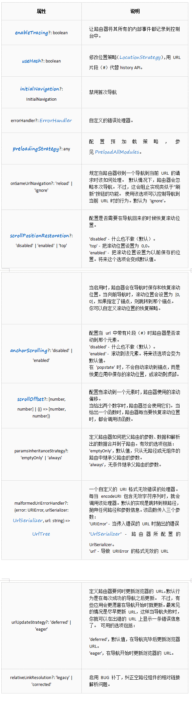
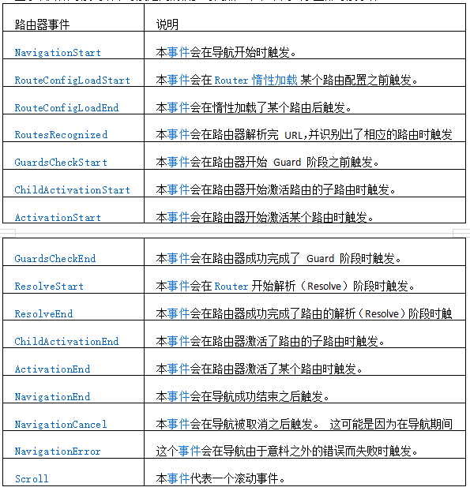

**>创建路由**

```
ng new 项目名称  --routing
```
```
const routes: Routes = [
  {
    path: 'home',
    component:HomeComponent
    // children: []
  },
   {
    path: 'news',
    component:NewsComponent
    // children: []
  }
   { path: '',   redirectTo: '/home', pathMatch: 'full' },
];
```

**>动态路由**
```
import { NgModule } from '@angular/core';
import { Routes, RouterModule } from '@angular/router';

import { NewsComponent } from './components/news/news.component';
import { HomeComponent } from './components/home/home.component';

import { NewcontentComponent } from './components/newcontent/newcontent.component';

const routes: Routes = [
  {
    path: 'home',
    component:HomeComponent
    // children: []
  },
   {
    path: 'news',
    component:NewsComponent
    // children: []
  },{
    path: 'newscontent/:aid',
    component:NewcontentComponent
    // children: []
  },
   { path: '',   redirectTo: '/home', pathMatch: 'full' }
];

@NgModule({
  imports: [RouterModule.forRoot(routes)],
  exports: [RouterModule]
})
export class AppRoutingModule { }
```
**>默认跳转路由**
```
<a routerLink="/home">首页</a>
<a routerLink="/news">新闻</a>
```
```
//刚进来路由为空跳转的路由
{
    path:'',   
    redirectTo:'home',
    pathMatch:"full"
  }


//匹配不到路由的时候加载的组件 或者跳转的路由
{  
    path: '**',  /*任意的路由*/
    // component:HomeComponent
    redirectTo:'home'
  }
```

**>routerLinkActive设置routerLink默认选中路由 **
```
<h1>
  <a routerLink="/home" routerLinkActive="active">首页</a>
  <a routerLink="/news" routerLinkActive="active">新闻</a>
</h1>

.active{
    color:red;
}
```

**>路由的js跳转**
1.引入
```
import { Router } from '@angular/router';
```
2.初始化
```
export class HomeComponent implements OnInit {
    constructor(private router: Router) {
        
    }

  ngOnInit() {
  }

  goNews(){
      //  this.router.navigate(['/news', hero.id]);

      this.router.navigate(['/news']);
  }

}
```
3.路由跳转
```
this.router.navigate(['/news', hero.id]);
```
navigate是Router类的一个方法，主要用来跳转路由。 
函数定义：`navigate(commands: any[], extras?: NavigationExtras) : Promise <boolean>`
```
interface NavigationExtras {
  relativeTo : ActivatedRoute
  queryParams : Params
  fragment : string
  preserveQueryParams : boolean
  preserveFragment : boolean
  skipLocationChange : boolean
  replaceUrl : boolean
}
```
1.`this.router.navigate(['user', 1]); `
以根路由为起点跳转

2.`this.router.navigate(['user', 1],{relativeTo: route}); `
默认值为根路由，设置后相对当前路由跳转，route是ActivatedRoute的实例，使用需要导入ActivatedRoute

3.`this.router.navigate(['user', 1],{ queryParams: { id: 1 } }); `
路由中传参数 /user/1?id=1

4.`this.router.navigate(['view', 1], { preserveQueryParams: true }); `
默认值为false，设为true，保留之前路由中的查询参数/user?id=1 to /view?id=1

5.`this.router.navigate(['user', 1],{ fragment: 'top' }); `
路由中锚点跳转 /user/1#top

6.`this.router.navigate(['/view'], { preserveFragment: true }); `
默认值为false，设为true，保留之前路由中的锚点/user/1#top to /view#top

7.`this.router.navigate(['/user',1], { skipLocationChange: true }); `
默认值为false，设为true路由跳转时浏览器中的url会保持不变，但是传入的参数依然有效

8.`this.router.navigate(['/user',1], { replaceUrl: true }); `
未设置时默认为true，设置为false路由不会进行跳转

**>父子路由**
1.创建组件引入组件
```
import { NewsaddComponent } from './components/newsadd/newsadd.component';
import { NewslistComponent } from './components/newslist/newslist.component';
```
2.配置路由
```
{
    path: 'news',
    component:NewsComponent,

    children: [

      {
        path:'newslist',

        component:NewslistComponent
      },
       {
        path:'newsadd',

        component:NewsaddComponent
      }
    ]
  }
```
3.父组件中定义router-outlet
```
<router-outlet></router-outlet>
```

**>获取路由参数**
1.获取路由参数
```
import { Router, ActivatedRoute, ParamMap } from '@angular/router';
constructor(
private route: ActivatedRoute,
private router: Router,
private service: HeroService
) {}
ngOnInit() {
this.route.paramMap.subscribe(params: ParamMap =>
const id = params.get('id');
);
}
```
2.获取路径?后面的参数 ‘...?mk=E&code=E00700’
```
[routerLink]="['/quotes/stock/' + item.code ]" [queryParams] = "{type:item.type}"
import { ActivatedRoute } from '@angular/router';
constructor(private currRoute: ActivatedRoute {}
this.currRoute.queryParamMap.subscribe(params => {
this.marketCode = params.get('mk');
this.code = params.get('code');
});
```

**>监听路由变化**
检测路由变化，可以使用router.events来监听：
支持的事件类型：
NavigationStart：导航开始
NavigationEnd：导航结束
NavigationCancel：取消导航
NavigationError：导航出错
RoutesRecoginzed：路由已认证

在判断事件类型需要导入对应的事件类型，如：
`import { Router, NavigationStart } from '@angular/router';`

监听单一事件
```
this.router.events
  .filter((event) => event instanceof NavigationEnd)
  .subscribe((event:NavigationEnd) => {
    //do something
});
```

监听多个事件
```
constructor(router:Router) {
  router.events.subscribe(event:Event => {
    if(event instanceof NavigationStart) {
      //
    } else if(event instanceof NavigationEnd) {
      //
    } else if(event instanceof NavigationCancel) {
      //
    } else if(event instanceof NavigationError) {
      //
    } else if(event instanceof RoutesRecognized) {
      //
    }
  });
}
```
监听浏览器回退事件：
```
import { PlatformLocation } from '@angular/common';

constructor(private location: PlatformLocation
) {
history.pushState(null, null,'#');//增加历史路径  阻止回退
location.onPopState((e) => {
  //回退事件
 ........
});
}

ngOnDestroy() {
// 清除监听
this.location.onPopState = () => {};
}
```

**> 路由器的配置项**
```
@NgModule({
imports: [RouterModule.forRoot(routes, {
enableTracing: false,
errorHandler: routerErrHandler,
useHash: true 
})],
exports: [RouterModule]
})

interface ExtraOptions {
enableTracing?: boolean
useHash?: boolean
initialNavigation?: InitialNavigation
errorHandler?: ErrorHandler
preloadingStrategy?: any
onSameUrlNavigation?: 'reload' | 'ignore'
scrollPositionRestoration?: 'disabled' | 'enabled' | 'top'
anchorScrolling?: 'disabled' | 'enabled'
scrollOffset?: [number, number] | (() => [number, number])
paramsInheritanceStrategy?: 'emptyOnly' | 'always'
malformedUriErrorHandler?: (error: URIError, urlSerializer: UrlSerializer, url: string) => UrlTree
urlUpdateStrategy?: 'deferred' | 'eager'
relativeLinkResolution?: 'legacy' | 'corrected'
}
```


**>路由守卫**
Angular提供了一些钩子帮助控制进入或离开路由。这些钩子就是路由守卫，可以通过这些钩子实现上面场景。
* CanActivate: 处理导航到某路由的情况。
* CanDeactivate: 处理从当前路由离开的情况。
* Resolve: 在路由激活之前获取路由数据。

1. 创建路由守卫的服务
```
import { Injectable } from '@angular/core';
import { CanActivate, ActivatedRouteSnapshot, RouterStateSnapshot } from '@angular/router';
import { Router } from "@angular/router";

@Injectable({
  providedIn: 'root'
})
export class StockGuardService implements CanActivate {
  constructor(
    private router: Router
  ) { }
  canActivate(route: ActivatedRouteSnapshot, state: RouterStateSnapshot): boolean {
    // 返回值 true: 跳转到当前路由 false: 不跳转到当前路由
    // 当前路由名称
    const path = route.routeConfig.path;
    console.log(path);
    this.router.navigate(['./quotes/stockPage/stock', 'E00700']); 
    return false;
  }
}
```
2. 在路由中配置路由守卫
```
import {StockGuardService} from './stock-guard.service';
const routes: Routes = [
  {
    path: 'quotesList',
    component: QuotesListComponent
  },
  {
    path: 'collection',
    component: CollectComponent
  },
  {
    path: 'stockPage/:code',
    component: PageRouterComponent,
    canActivate:[StockGuardService],
    children:[
      {
        path: 'stock/:code',
        component: HkComponent
      }
    ]
  },
  {
    path: 'servers',
    component: QuoteServiceComponent
  },
  {
    path: '',
    redirectTo: 'quotesList',
    pathMatch : 'full'
  }
];
```
**>命名出口(outlet)**
港股界面的完整路由：’/quotes/markets/hk’
```
<ion-grid text-center class="headerTab" no-padding>
<ion-row>
<ion-col  no-padding>
<ion-text [routerLink]="['/quotes/markets',{outlets:{'markets':['hk']} }]" >港股</ion-text>
</ion-col>
</ion-grid>

<ion-router-outlet name="markets"></ion-router-outlet>

{
  path: 'markets',
  component: MarketsTabComponent,
  children: [
    {
      path: 'hk',
      component: HkMarketComponent,
      outlet:'markets'
    },
    ...
    {
      path: '',
      redirectTo: 'hk',
      pathMatch : 'full',
      outlet:'markets'
   }
  ]
}
```
**>路由事件**
在每次导航中，Router 都会通过 Router.events 属性发布一些导航事件。这些事件的范围涵

当启用了 [enableTracing](#enableTracing) 选项时，这些事件也同时会记录到控制台中。要想查看对路由导航事件进行过滤的例子，请访问 [Angular 中的可观察对象](https://angular.cn/guide/observables-in-angular)一章的[路由器部分](#router)

```
mport { Router, NavigationStart, NavigationEnd } from '@angular/router';
import { filter } from 'rxjs/operators';

//监听单一事件
this.router.events.pipe(
  filter((event) => event instanceof NavigationEnd)
).subscribe((event:NavigationEnd) => {
  //do something
});
//监听多个事件
constructor(router:Router) {
  this.router.events.subscribe(event:Event => {
  if(event instanceof NavigationStart) {
    //
  } else if(event instanceof NavigationEnd) {
    //
  } else if(event instanceof NavigationCancel) {
    //
  } else if(event instanceof NavigationError) {
    //
  }
});
```