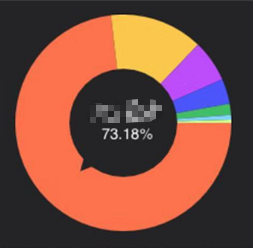
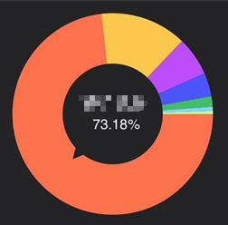

项目需要画一个饼图，个插件没找到符合要求的，于是自己手动画了一个。可是到移动端的时候，或出现模糊不清的情况，研究了一下是高清屏的问题。

因为 canvas 不是矢量图，而是像图片一样是位图模式的。高 dpi 显示设备意味着每平方英寸有更多的像素。也就是说二倍屏，浏览器就会以2个像素点的宽度来渲染一个像素，该 canvas 在 Retina 屏幕下相当于占据了2倍的空间，相当于图片被放大了一倍，因此绘制出来的图片文字等会变模糊。

因此，要做 Retina 屏适配，关键是知道当前屏幕的设备像素比，然后将 canvas 放大到该设备像素比来绘制，然后将 canvas 压缩到一倍来展示。

所以只要加上以下代码即可：
```javascript
        // *****************解决移动端糊的问题
        let dpr = window.devicePixelRatio; // 假设dpr为2
        // 获取css的宽高
        let { width: cssWidth, height: cssHeight } = canvas.getBoundingClientRect();
        // 根据dpr，扩大canvas画布的像素，使1个canvas像素和1个物理像素相等
        canvas.style.width = canvas.width + 'px';
        canvas.style.height = canvas.height + 'px';
     
        canvas.width = dpr * cssWidth;
        canvas.height = dpr * cssHeight;
        // 由于画布扩大，canvas的坐标系也跟着扩大，如果按照原先的坐标系绘图内容会缩小
        // 所以需要将绘制比例放大
        ctx.scale(dpr,dpr);
        // **************************
```
下面开始进行画图，填充文字就可以了，出来的效果就非常清晰了。
解决前：



解决后：




下面贴出来我的完整代码：
```javascript
<canvas id="canvas" width={200} height={200} />

 let canvas = document.getElementById('canvas');
      if(canvas.getContext) {
        let ctx = canvas.getContext('2d');
        // *****************解决移动端糊的问题
        let dpr = window.devicePixelRatio; // 假设dpr为2
        // 获取css的宽高
        let { width: cssWidth, height: cssHeight } = canvas.getBoundingClientRect();
        // 根据dpr，扩大canvas画布的像素，使1个canvas像素和1个物理像素相等
        canvas.style.width = canvas.width + 'px';
        canvas.style.height = canvas.height + 'px';
     
        canvas.width = dpr * cssWidth;
        canvas.height = dpr * cssHeight;
        // 由于画布扩大，canvas的坐标系也跟着扩大，如果按照原先的坐标系绘图内容会缩小
        // 所以需要将绘制比例放大
        ctx.scale(dpr,dpr);
        // **************************

        for(let i = 0; i < listSubPercent.length; i++) {
          ctx.beginPath();
          let startAngle = listSubPercent[i] * Math.PI / 180;
          let endAngle = listSubPercent[i + 1] * Math.PI / 180;
          ctx.arc(pointX, pointY, sectorR, startAngle, endAngle, false);
          ctx.lineTo(pointX, pointY); //转折点
          ctx.fillStyle = colorList[i];
          ctx.fill(); //扇形填充
        }
        //绘制圆形
        ctx.beginPath();
        ctx.moveTo(pointX, pointY); //起始点中心坐标点
        let startAngle = 0; // 开始点
        let endAngle = 2 * Math.PI;
        ctx.arc(pointX, pointY, circleR, startAngle, endAngle, true);
        
        ctx.fillStyle = fillColor; //作对比  暂用此颜色  需要改为黑色才能和三角拼接  rgba(255,165,0,1)类也可以
        ctx.fill(); //圆形填充

        //中间位置的度数
        let middleDegree = (listSubPercent[num + 1] - listSubPercent[num]) / 2 + listSubPercent[num];
        middleDegree = 90 - middleDegree;
        //三角形底边的另一个点的位置
        let X1 = Math.sin((middleDegree + 90) * Math.PI / 180) * 30 + pointX;
        let Y1 = Math.cos((middleDegree + 90) * Math.PI / 180) * 30 + pointY;
        //三角形底边的一个点的位置
        let X = Math.sin((middleDegree + 270) * Math.PI / 180) * 30 + pointX;
        let Y = Math.cos((middleDegree + 270) * Math.PI / 180) * 30 + pointY;
        //三角形顶点的位置
        let RX = Math.sin(middleDegree * Math.PI / 180) * 60 + pointX;
        let RY = Math.cos(middleDegree * Math.PI / 180) * 60 + pointY;
        ctx.beginPath();
        ctx.moveTo(X1, Y1); //起始点
        ctx.lineTo(X, Y); //转折点
        ctx.lineTo(RX, RY); //结束点
        ctx.fillStyle = fillColor;
        ctx.fill(); //三角形填充

        // 绘制文字
        ctx.font = "16px sans-serif";
        ctx.fillStyle = textColor;
        ctx.fillText(data[0].ratingagency, 70, 95);
        ctx.font = "14px sans-serif";
        ctx.fillStyle = textColor;
        ctx.fillText(`${data[0].percentage}%`, 80, 115);
      }
```