# Neo4j + vue3 + vis.js 实现直连数据库展示网络图谱

最近有一个需求，需要展示关系图谱。后台采用了基于图的数据库Neo4j，前端需要直连数据库展示关系图谱（也可以通过接口），之前没有接触过这一块，听到方案后就先进行了预研，记录一下。

## 一、Neo4j安装

### 1. 安装JDK
> Neo4j是基于Java的图形数据库，因此必须安装JAVA的JDK。如果你没有安装过JAVA，那恭喜你很幸运，如果不幸那也没关系，请删除干净，有大佬说过注册表会出问题。(怎么删的这里就不详细说了，网上有很多教程)

**1.1 先下载**

下载地址：https://www.oracle.com/java/technologies/downloads/#jdk18-windows

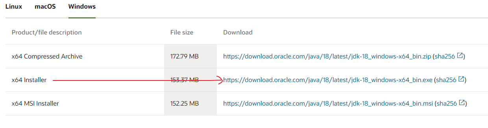

下载之后建议按照指定路径安装，更改也可以，我是按照默认路径安装的（安装的路径需要记一下后便会用到）。安装过程很简单，按照提示步骤点就行了。

**1.2 安装好之后还需要配置JDK环境**

此电脑 -> 属性 -> 高级系统设置 -> 高级 -> 环境变量

新建 JAVA_HOME

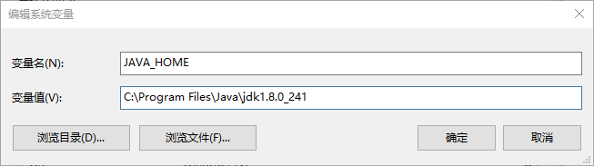

添加CLASSPATH 变量，若没有的话，需新建。
`.;%JAVA_HOME%\lib;%JAVA_HOME%\lib\tools.jar`

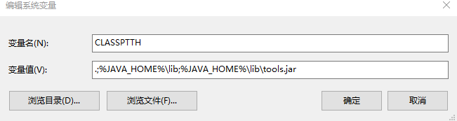

编辑Path变量。把`%JAVA_HOME%\bin;` `%JAVA_HOME%\jre\bin;`加进去

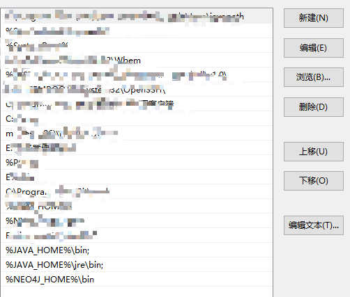

添加完之后点击确定，jdk的环境变量配置完成。测试一下，Win键+R键打开运行，输入cmd，点击确认。输入java –version

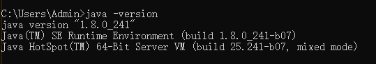


### 2. 安装Neo4j

**2.1 下载Neo4j**

下载地址：https://neo4j.com/download-center/#community

> 注意选择community，社区版免费，企业版收费。

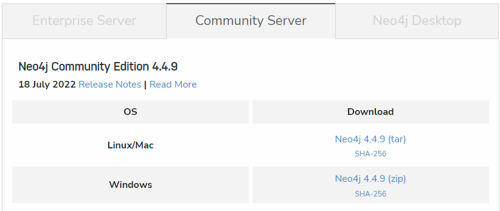

下载好之后，是个压缩包，解压好就可以了。

**2.2 配置Neo4j环境**

环境变量添加NEO4J_HOME

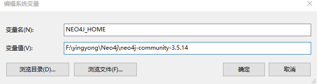

Path加入 `%NEO4J_HOME%\bin;`

配置好之后就可以了现在来启动一下看看是否安装成功，以管理员身份打开cmd，输入`neo4j.bat console`

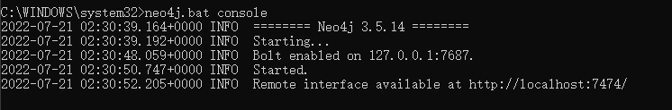

这样就是成功啦~~

打开浏览器，输入网址`http://localhost:7474/`就可以看到界面了

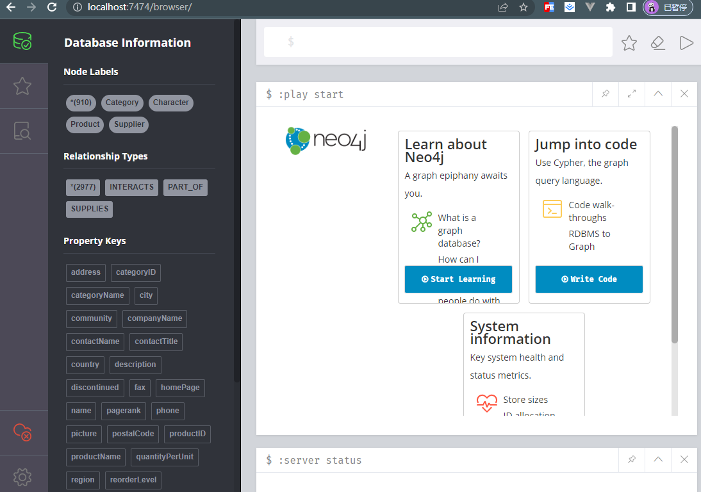


## 二、实现

### 1. 数据库导入数据

安装完成之后可以跟着浏览器界面的向导导入数据，也可以从[neovis官网上的例子](https://github.com/neo4j-contrib/neovis.js/)里拿过来用。

向导从这里进入，点击`White Code`跟着提示一步一步来就行了
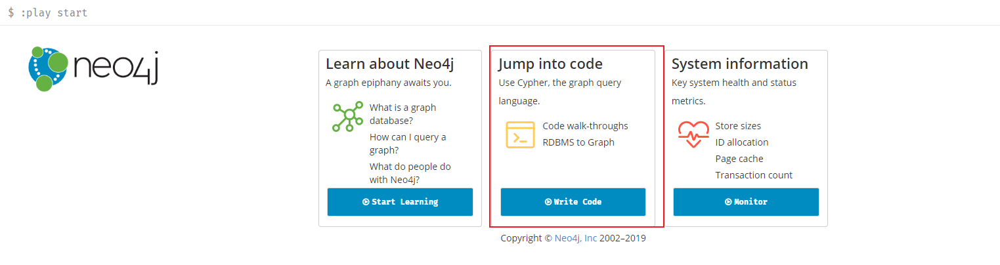

这里是neovis官网上的例子

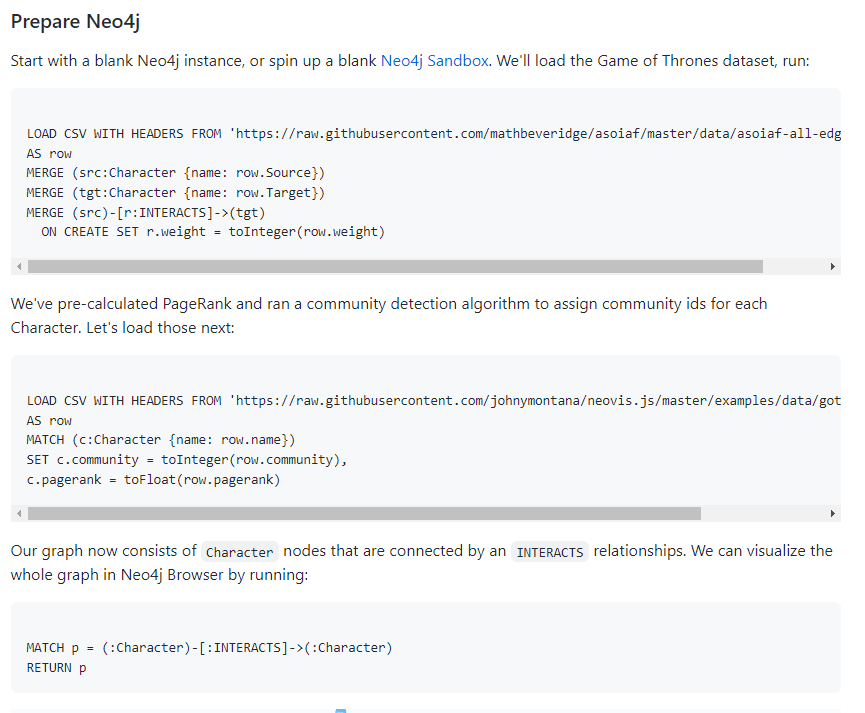

下面就主要说一下从neovis官网上下在数据，把下面的代码输入到浏览器界面命令行，然后点击右边的三角按钮运行:

```
LOAD CSV WITH HEADERS FROM 'https://raw.githubusercontent.com/mathbeveridge/asoiaf/master/data/asoiaf-all-edges.csv'
AS row
MERGE (src:Character {name: row.Source})
MERGE (tgt:Character {name: row.Target})
MERGE (src)-[r:INTERACTS]->(tgt)
  ON CREATE SET r.weight = toInteger(row.weight)
```

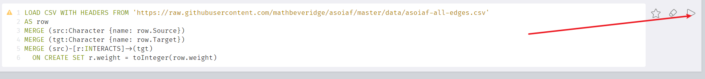

如果数据可以正常导入最好了，但是我这里导入报错（没搞明白为什么，跟着向导导入http协议的数据就可以，有大神知道怎么解决欢迎赐教），后来查到可以把数据下载到本地再导入，于是就去把数据下载下来，然后放到Neo4j文件下的`import`文件夹下面，我的路径是`F:\yingyong\Neo4j\neo4j-community-3.5.14\import`，然后再次执行导入

```
LOAD CSV WITH HEADERS FROM 'file:///asoiaf-all-edges.csv'
AS row
MERGE (src:Character {name: row.Source})
MERGE (tgt:Character {name: row.Target})
MERGE (src)-[r:INTERACTS]->(tgt)
  ON CREATE SET r.weight = toInteger(row.weight)
```

我们预先计算了PageRank，并运行了一个社区检测算法，为每个字符分配社区id。接下来加载:

```
LOAD CSV WITH HEADERS FROM 'file:///got-centralities.csv'
AS row
MATCH (c:Character {name: row.name})
SET c.community = toInteger(row.community),
c.pagerank = toFloat(row.pagerank)
```

我们的图现在包含通过交互关系连接的Character节点。我们可以在Neo4j浏览器中运行以下命令来可视化整个图形:

```
MATCH p = (:Character)-[:INTERACTS]->(:Character)
RETURN p
```

数据库界面上就呈现出了他们的关系图谱：

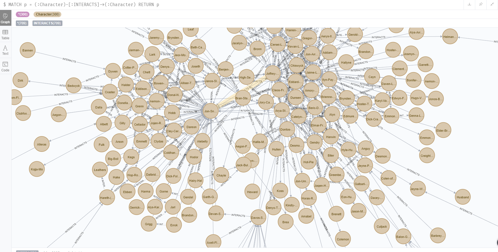

到这里数据就已经准备好了，前期的准备工作就做好了（太难了），下面开始前端部分的任务了。

### 前端展示

前端用到的技术是 vue3 + [vis](https://visjs.org/) + [neo4j-driver]()

**neo4j-driver**

neo4j-driver是一个神器，前端可以不请求接口，通过neo4j-driver直接获取Neo4j图库里的数据。

**Vis**
官网对vis的介绍是：一个动态的，基于浏览器的可视化库。该库被设计为易于使用，可以处理大量动态数据，并支持对数据的操作和与数据的交互。该库由组件DataSet、Timeline、Network、Graph2d和Graph3d组成。

**1. 安装 neo4j-driver  Vis**

创建一个vue项目，然后在vue项目里安装依赖

```
yarn add neo4j-driver  Vis
```
我安装的版本

```
"dependencies": {
    "ant-design-vue": "^3.2.10",
    "core-js": "^3.8.3",
    "neo4j-driver": "^4.4.6",
    "vis": "^4.21.0-EOL",
    "vue": "^3.2.13",
    "vue-router": "^4.0.3",
    "vuex": "^4.0.0"
  }
```

安装完成后，再main.ts里面引入vis的css样式

```
import "vis/dist/vis.min.css";
```

然后就可以在页面使用了。创建一个Neo4jDriverTest.vue文件

```
<template>
  <div class="vis" id="neo4jdrivertest"></div>
</template>

<script lang="ts">
//@ts-nocheck
import { defineComponent, onMounted } from "vue";
import { Network, DataSet } from "vis";
import neo4j from "neo4j-driver";

export default defineComponent({
  name: "Neo4jDriverTest",
  setup() {
    function queryData() {
      const driver = neo4j.driver(
        "neo4j://192.168.0.222:7687",
        neo4j.auth.basic("neo4j", "paint-marco-table-charter-fiona-690")
      );
      const orderStr =
        "MATCH p=((n:Service)-[r:dependency]-(:Service)) return p";
      console.log("driver获取数据库数据:", driver);
      let session = driver.session();
      session
        .run(orderStr, {})
        .then((result) => {
          console.log("neo4j 查询结果", result.records);
          const data = setData(result.records);
          // 画图
          draw(data);
          session.close();
        })
        .catch(function (error) {
          console.log("Cypher 执行失败！", error);
          driver.close();
        });
    }

    function setData(records: any) {
      const nodes = new DataSet(); // 节点数组
      const nodesRelation = new DataSet(); // 节点关系数组
      // 开始处理数据
      for (let i = 0; i < records.length; i++) {
        const segments = records[i]._fields[0].segments[0];
        const startName = segments.start.properties.name;
        const endName = segments.end.properties.name;

        const nodesArray: any[] = Array.from(nodes);
        let hasStartName = false,
          hasEndName = false;
        for (const key in nodes._data) {
          if (key === startName) hasStartName = true;
          if (key === endName) hasEndName = true;
        }

        if (!hasStartName)
          nodes.add({
            label: startName,
            id: startName,
            title: segments.start.properties.describe,
          });
        if (!hasEndName)
          nodes.add({
            label: endName,
            id: endName,
            title: segments.end.properties.describe,
          });

        nodesRelation.add({
          from: startName,
          to: endName,
          label: segments.relationship.type,
          id: i,
          arrows: "to",
        });
      }
      return {
        nodes,
        edges: nodesRelation,
      };
    }

    function draw(data: any) {
      const container = document.getElementById(
        "neo4jdrivertest"
      ) as HTMLElement;
      const options: any = {};
      const network = new Network(container, data, options);
    }

    onMounted(() => {
      queryData();
    });
  },
});
</script>

<style scoped>
.vis {
  height: calc(100% - 100px);
}
</style>

```

界面就可以显示出来关系图谱了~~~~

> 关于options的配置我在这里就不详细说了，官网有很多例子。
访问这个地址 https://visjs.github.io/vis-network/examples/ 可以了解更多详细的配置哦

demo地址：https://github.com/SunPH01/vue-vis.js


