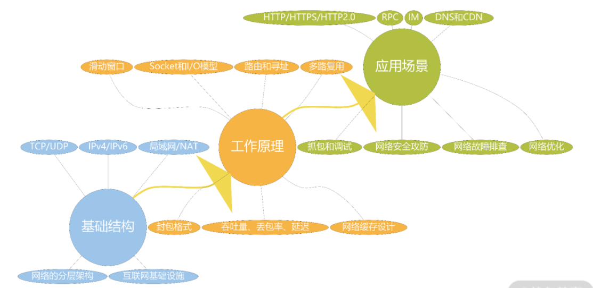
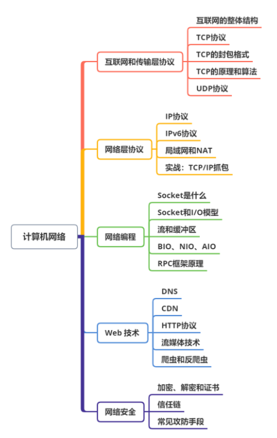
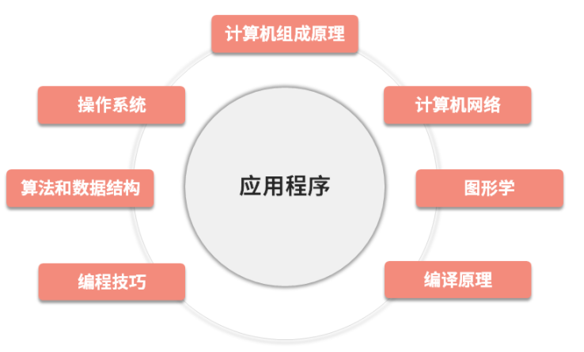

计算机网络知识地图：

计算机网络的知识体系图：

**模块一：互联网和传输层协议**

介绍互联网的体系和整体框架，参与的硬件设备，以及它们的作用。还会介绍传输层协议 TCP 和 UDP，重点讨论它们的工作原理、算法和优化策略。这部分知识是计算机网络的基础，也最能体现网络设计的精髓。

**模块二：网络层协议**

围绕局域网和 IP 协议展开，包括 ARP、IPv4、IPv6、NAT 等基本概念，探讨 IPv6 的工作原理，以及 IPv6 和 IPv4 的兼容策略。IP 协议几乎是网络层的唯一协议，是大厂面试最为热门的内容之一。模块一和模块二属于基础篇，是计算机网络最底层的基础知识。

**模块三：网络编程**

围绕 Socket 讨论网络编程，介绍各种网络 I/O 模型和编程方式的优缺点，并以 RPC 框架设计为题去落地学到的这些知识和实现。讨论在不同的并发量、针对不同服务特性选择不同的 I/O 模型，调整 TCP 关联的参数，等等，进而帮助你学习如何优化自己系统的网络。这部分内容会为企业带来实际价值，因此面试官会重点提问。

**模块四：Web 技术**

讨论平时使用最多且最重要的应用层协议——HTTP 协议（包括 HTTP 2.0），并扩大讨论范围到 Web 技术生态，比如从 DNS 看缓存、从 CDN 看负载均衡、从 HTTP 协议看开发规范、从流媒体技术看协议选择，以及从爬虫技术看网络安全。

**模块五：网络安全**

讨论网络安全技术，一部分是基础设施，比如证书、加解密、公私钥体系、信任链等；另一部分是具体的攻击手段，比如 DDoS、XSS、SQL 注入、ARP 攻击、中间人攻击等，以及它们的防御手段。安全是所有互联网公司的高压线，学完这块内容能够帮助你屏蔽掉一些高危操作，在工作中避免出现安全问题。

计算机领域，上下文指的是计算的背景和环境。我们说一个应用架构好，体现了程序员高超的应用开发能力。既然是应用开发能力，那么它的基础就不应该是电子和数学。程序员写程序，程序经过编译后变成应用，应用执行起来就是进程。

## 构成应用的 7 种基础元素

计算机网络也是本专栏的主角，讲的是应用之间如何进行通信、如何设计应用之间的契约，形成稳定、高效、规范的协作关系（也就是协议）；并通过优化网络的性能，最终节省成本或者让用户满意。比如你：

- 为了让页面秒开、服务秒回；
- 为了优化网络传输细节，去调整 TCP 的滑动窗口；
- 为了提升网络的吞吐量、减少延迟，去开启多路复用能力；
- 为了避免 Downtime，去调整网络的连接池和线程数；
- 为了开发某个应用，尝试去理解一些应用层协议，比如 SSH、RTCP、HTTP2.0， MQTT 等；
- 为了做好日常开发，去理解一些基本概念，比如 DNS、CDN、NAT、IPv4/6 等。

今天，计算机网络已经成为应用提供价值最重要的一环。

