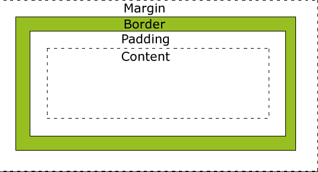
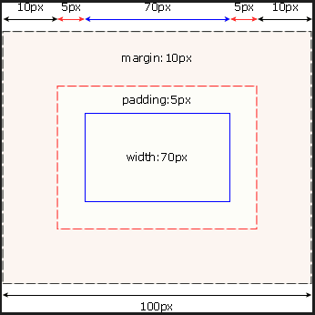
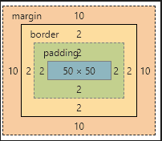
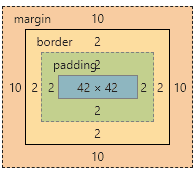

所有HTML元素可以看作盒子，在CSS中，"box model"这一术语是用来设计和布局时使用。
CSS盒模型本质上是一个盒子，封装周围的HTML元素，它包括：边距，边框，填充，和实际内容。
盒模型允许我们在其它元素和周围元素边框之间的空间放置元素。
下面的图片说明了盒子模型(Box Model)：


不同部分的说明：
* Margin(外边距) - 清除边框外的区域，外边距是透明的。
* Border(边框) - 围绕在内边距和内容外的边框。
* Padding(内边距) - 清除内容周围的区域，内边距是透明的。
* Content(内容) - 盒子的内容，显示文本和图像。

在 CSS 中，width 和 height 指的是内容区域的宽度和高度。增加内边距、边框和外边距不会影响内容区域的尺寸，但是会增加元素框的总尺寸。
假设框的每个边上有 10 个像素的外边距和 5 个像素的内边距。如果希望这个元素框达到 100 个像素，就需要将内容的宽度设置为 70 像素，请看下图：


```
#box {
  width: 70px;
  margin: 10px;
  padding: 5px;
}
```
```
盒子的宽度 = width + padding-left + padding-right + border-left + border-right + margin-left + margin-right

盒子的高度 = height + padding-top + padding-bottom + border-top + border-bottom + margin-top + margin-bottom
```
**提示：**内边距、边框和外边距可以应用于一个元素的所有边，也可以应用于单独的边。外边距可以是负值，而且在很多情况下都要使用负值的外边距。

## box-sizing属性
上面说到的是 **默认** 情况下的计算方法，另外一种情况下，width和height属性设置的就是盒子的宽度和高度。盒子的宽度和高度的计算方式由box-sizing属性控制。
```box-sizing: content-box|border-box|inherit:```
* **content-box：**默认值。这是 CSS2.1 指定的宽度和高度的行为。指定元素的宽度和高度（最小/最大属性）适用于box的宽度和高度。元素的填充和边框布局和绘制指定宽度和高度除外。
* **border-box：**	指定宽度和高度（最小/最大属性）确定元素边框。也就是说，对元素指定宽度和高度包括了 padding 和 border 。通过从已设定的宽度和高度分别减去边框和内边距才能得到内容的宽度和高度。
* **inherit：**	指定 box-sizing 属性的值，应该从父元素继承
实例：
```
.box{
  width:50px;
  height:50px;
  border: 2px solid #ccc;
  padding: 2px;
  margin:10px;
}
```
默认情况下`box-sizing: content-box;`布局如下图：



下面看一下`box-sizing: border-box;`的布局：




## 浏览器的兼容性问题
大多数浏览器都会按照上面的图示来呈现内容。然而 IE 5 和 6 的呈现却是不正确的。根据 W3C 的规范，元素内容占据的空间是由 width 属性设置的，而内容周围的 padding 和 border 值是另外计算的。不幸的是，IE5.X 和 6 在怪异模式中使用自己的非标准模型。这些浏览器的 width 属性不是内容的宽度，而是内容、内边距和边框的宽度的总和。