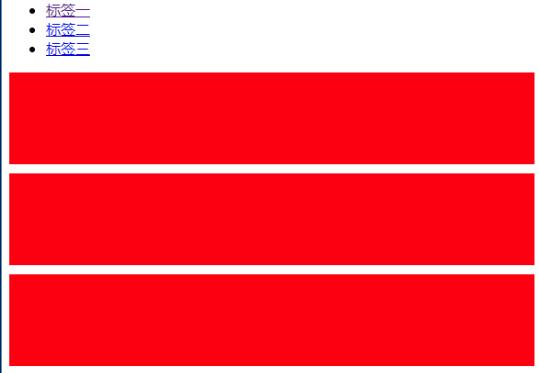
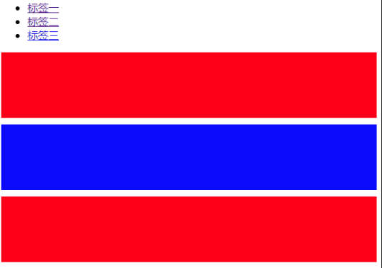

# 伪类
**css2定义：**CSS 伪类用于向某些选择器添加特殊的效果。
单单看定义完全不懂在讲什么。
**CSS3定义：**

* 伪类存在的意义是为了通过选择器找到那些不存在与DOM树中的信息以及不能被常规CSS选择器获取到的信息。
* 伪类由一个冒号:开头，冒号后面是伪类的名称和包含在圆括号中的可选参数。
* 任何常规选择器可以再任何位置使用伪类。伪类语法不区别大小写。一些伪类的作用会互斥，另外一些伪类可以同时被同一个元素使用。并且，为了满足用户在操作DOM时产生的DOM结构改变，伪类也可以是动态的。

其实第一段话就囊括CSS3伪类的全部定义了，这段话中指出CSS3伪类的功能有两种：
* 获取不存在与DOM树中的信息。比如<a>标签的:link、visited等，这些信息不存在与DOM树结构中，只能通过CSS选择器来获取；
* 获取不能被常规CSS选择器获取的信息。比如伪类:target，它的作用是匹配文档(页面)的URI中某个标志符的目标元素，例如我们可以通过如下代码来实现页面内的区域跳转：
```
<ul class="tabs">
    <li><a href="#tab1">标签一</a></li>
    <li><a href="#tab2">标签二</a></li>
    <li><a href="#tab3">标签三</a></li>
</ul>
<div id="tab1" class="tab_content">
<!--tabed content--></div>
<div id="tab2" class="tab_content">
<!--tabed content--></div>
<div id="tab3" class="tab_content">
<!--tabed content--></div>
//css
.tab_content {
  height: 800px;
  background: red;
  margin-bottom: 100px;
}
#tab1:target, #tab2:target, #tab3:target {
    background:blue;
}
```


点击 标签二 ：



`:target`通过CSS实现了常规CSS无法实现的逻辑。
再举个栗子，通过:nth-child()伪类可以实现一些很有意思的效果，比如：
```
table tr:nth-child(2n) td{
   background-color: #ccc;
}
table tr:nth-child(2n+1) td{
   background-color: #fff;
}
table tr:nth-child(2n+1):nth-child(5n) td{
   background-color: #f0f;
}
```
上面的代码将所有偶数行背景色设置为#ccc，不能被5整除的奇数行设置背景色#fff，能够被5整除的奇数行设置背景色#f0f。

如果不使用伪类而是使用JavaScript代码来实现上述的效果，恐怕要复杂很多。

可以总结出:nth-child()伪类的效果是将被常规css选择器筛选出的元素按照既定规定进行再次筛选。

# 伪元素
**CSS2中对伪元素的定义：**伪元素用于向某些选择器设置特殊效果。
**CSS3定义：**

* 伪元素在DOM树中创建了一些抽象元素，这些抽象元素是不存在于文档语言里的（可以理解为html源码）。比如：documen接口不提供访问元素内容的第一个字或者第一行的机制，而伪元素可以使开发者可以提取到这些信息。并且，一些伪元素可以使开发者获取到不存在于源文档中的内容（比如常见的::before,::after）。
* 伪元素的由两个冒号::开头，然后是伪元素的名称。
* 使用两个冒号::是为了区别伪类和伪元素（CSS2中并没有区别）。当然，考虑到兼容性，CSS2中已存的伪元素仍然可以使用一个冒号:的语法，但是CSS3中新增的伪元素必须使用两个冒号::
* 一个选择器只能使用一个伪元素，并且伪元素必须处于选择器语句的最后。(注：不排除未来会加入同时使用多个伪元素的机制。)

同样，第一段话是伪元素的清晰定义，也是伪元素与伪类最大的区别。简单来说，伪元素创建了一个虚拟容器，这个容器不包含任何DOM元素，但是可以包含内容。另外，开发者还可以为伪元素定制样式。

以`::first-line`为例，它获取了指定元素的第一行内容并且将第一行的内容加入到虚拟容器中。如果通过JavaScript来实现这个逻辑，那么要考虑的因素就太多了，比如制定元素的宽度、字体大小，甚至浮动元素的图文混排等等。当然，这些问题确实是可以用JavaScript来解决的，但是相对于::first-line简简单单的几个字，用JavaScript恐怕不止这些吧！

举个综合使用伪类和伪元素的栗子：
```
q:lang(de)::after{
    content: " (German) ";
}
q:lang(en)::after{
    content: " (English) ";
}
q:lang(fr)::after{
    content: " (French) ";
}
q:not(:lang(fr)):not(:lang(de)):not(:lang(en))::after{
    content: " (Unrecognized language) ";
}
```
以上代码通过伪类"lang获取不同lang属性的节点，并为之设置伪元素::after，伪元素的内容是此节点的语言类型。

**最后，总结一下伪类与伪元素的特性及其区别：**
1. 伪类本质上是为了弥补常规CSS选择器的不足，以便获取到更多信息；
2. 伪类的操作对象是文档树中已有的元素，而伪元素则创建了一个文档数外的元素；
3. CSS3中伪类和伪元素的语法不同；CSS3规范中要求使用双冒号(::)表示伪元素，以此来区分伪元素和伪类。然而由于IE8及以下的一些浏览器不兼容双冒号（::）表示得方法，所以除了少部分伪元素，其余伪元素既可以使用单冒号(:)，也可以使用双冒号(::)。
4. 可以同时使用多个伪类，而只能同时使用一个伪元素；

# 伪元素和伪类具体项
## 1、伪元素：

::before/:before　 　在某个元素之前插入一些内容；
::after/:after　　　　在某个元素之后插入一些内容；
::first-letter/:first-letter　　为某个元素中的文字的首字母或第一个字使用样式；
::first-line/:first-line　　　为某个元素的第一行文字使用样式；
::selection　　　　 匹配用户被用户选中或者处于高亮状态的部分；
::placeholder　  　 匹配占位符的文本，只有元素设置了placeholder属性时，该伪元素才能生效；
::backdrop(处于试验阶段)　　用于改变全屏模式下的背景颜色，全屏模式的默认颜色为黑色。该伪元素只支持双冒号的形式；

## 2、伪类：

### （1）表示状态：

:link　　　选择未访问的链接；
:visited　 选择已访问的链接；
:hover　　选择鼠标指针移入链接；
:active　　被激活的链接，即按下单击鼠标左键但未松开；
:focus　　选择获取焦点的输入字段；

### （2）结构化伪类：
:not　　　　　　否定伪类，用于匹配不符合参数选择器的元素；
:first-child　　 匹配元素的第一个子元素；
:last-child　　  匹配元素的最后一个子元素；
first-of-type　 匹配属于其父元素的首个特定类型的子元素的每个元素；
:last-of-type　 匹配元素的最后一个子元素；
:nth-child　　  :nth-child根据元素的位置匹配一个或者多个元素，它接受一个an+b形式的参数（an+b最大数为匹配元素的个数）；
:nth-last-child　　:nth-last-child与:nth-child相似，不同之处在于它是从最后一个子元素开始计数的；
:nth-of-type　   :nth-of-type与nth-child相似，不同之处在于它是只匹配特定类型的元素；
:nth-last-type    :nth-last-of-type与nth-of-type相似，不同之处在于它是从最后一个子元素开始计数的；
:only-child　　    当元素是其父元素中唯一一个子元素时，:only-child匹配该元素；
:only-of-type　　当元素是其父元素中唯一一个特定类型的子元素时，:only-child匹配该元素；
:target　　　　　  当URL带有锚名称，指向文档内某个具体的元素时，:target匹配该元素；

### （3）表单相关伪类：
:checked　　匹配被选中的input元素，这个input元素包括radio和checkbox；
:default　　  匹配默认选中的元素，例如：提交按钮总是表单的默认按钮；
:disabled　  匹配禁用的表单元素；
:empty　　   匹配没有子元素的元素。如果元素中含有文本节点、HTML元素或者一个空格，则:empty不能匹配这个元素；
:enabled　　匹配没有设置disabled属性的表单元素；
:in-range    匹配在指定区域内元素；
:out-of-range　 　 与:in-range相反，它匹配不在指定区域内的元素；
:indeterminate　　indeterminate的英文意思是“不确定的”。当某组中的单选框或复选框还没有选取状态时，:indeterminate匹配该组中所有的单选框或复选框；
:valid　　 　 匹配条件验证正确的表单元素；
:invalid　　  与:valid相反，匹配条件验证错误的表单元素；
:optional　　匹配是具有optional属性的表单元素。当表单元素没有设置为required时，即为optional属性；
:required　　匹配设置了required属性的表单元素；
:read-write　　匹配处于编辑状态的元素。input，textarea和设置了contenteditable的HTML元素获取焦点时即处于编辑状态；
:scope(处于试验阶段)　　匹配处于style作用域下的元素。当style没有设置scope属性时，style内的样式会对整个html起作用；
### （4）语言相关伪类：
:dir(处于实验阶段)　　匹配指定阅读方向的元素，当HTML元素中设置了dir属性时该伪类才能生效。现时支持的阅读方向有两种：ltr（从左往右）和rtl（从右往左）。目前，只有火狐浏览器支持:dir伪类，并在火狐浏览器中使用时需要添加前缀( -moz-dir() )；
:lang　　　　匹配设置了特定语言的元素，设置特定语言可以通过为了HTML元素设置lang=””属性，设置meta元素的charset=””属性，或者是在http头部上设置语言属性；
###（5）其他伪类：
 :root　　匹配文档的根元素。一般的html文件的根元素是html元素，而SVG或XML文件的根元素则可能是其他元素；
:fullscreen　　匹配处于全屏模式下的元素。全屏模式不是通过按F11来打开的全屏模式，而是通过Javascript的Fullscreen API来打开的，不同的浏览器有不同的Fullscreen 　API。目前，:fullscreen需要添加前缀才能使用；

 注：伪元素虽然强大，但是还是有一些特定的标签是不支持伪元素 before 和 after 的。诸如  、<input>、<iframe>，这几个标签是不支持类似 img::before 这样使用。究其原因，要想要标签支持伪元素，需要这个元素是要可以插入内容的，也就是说这个元素要是一个容器，而 input，img，iframe 等元素都不能包含其他元素，所以不能通过伪元素插入内容