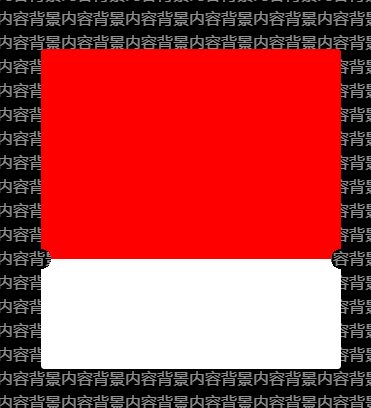
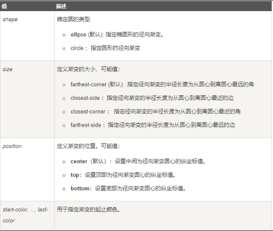

最新开发遇到一个弹框，弹框中间有两个内凹的半圆，而且还是透明的，不能遮挡到底层的内容。基于这个需求，找到了一个比较好的实现方法。

先上一下demo效果图：


**实现这个效果主要是用了background-image 结合径向渐变radial-gradient。**
示例：
`background-image: radial-gradient(circle 10px at 0 100%,  transparent 50px, red 50%);`

而对于径向渐变，主要是3个参数控制。
一个是原点和大小。大小类似border-radius的感觉，原点使用at表示可以指定点的坐标，或使用left、right、top、bottom来表示。
其次是两个颜色和透明度、大小等。这里50px或百分比，亲测第一个只有50才是半圆角，而第二个50%貌似影响不大。

下面是代码：
```html
<style>
    p{
      margin:0;
      padding:0;
    }
	.top-box{
		width:100%;
		height:200px;
		background: red;
		position: relative;
		margin-bottom:20px;
		border-radius: 4px 4px 0 0;
	}
	.bottom-box{
		width:100%;
		height:100px;
		background: #fff;
		position: relative;
		border-radius: 0 0 4px 4px;
	}
	.top-box p,.bottom-box p{
		width: calc(100% - 20px);
		height:10px;
		position:absolute;
		left: 10px;
	}
	.top-box p{
		background: red;
		bottom: -10px;
	}
	.bottom-box p{
		background: #fff;
		top: -10px;
	}
	.top-box p::before,.bottom-box p::before{
		content:'';
		position:absolute;
		width: 10px;
		height: 10px;
		left:-10px;
	}
	.top-box p::after,.bottom-box p::after{
		content:'';
		position:absolute;
		width: 10px;
		height: 10px;
		right:-10px;
	}
	.top-box p::before{
		background-image: radial-gradient(circle 10px at 0 100%,  transparent 50px, red 50%);
	}
	.top-box p::after{
		background-image: radial-gradient(circle 10px at 100% 100%,  transparent 50px, red 50%);
	}
	.bottom-box p::before{
		background-image: radial-gradient(circle 10px at 0 0,  transparent 50px, #fff 50%);
	}
	.bottom-box p::after{
		background-image: radial-gradient(circle 10px at 100% 0,  transparent 50px, #fff 50%);
	}

</style>


<div id="modal">
	<div class="mask"></div>
	<div class="wrap">
		<div class="top-box">
			<p></p>
		</div>
		<div class="bottom-box">
			<p></p>
		</div>
	</div>
</div>

```

最后补充一下径向渐变**radial-gradient()** 函数的知识点
> 语法：
> `background-image: radial-gradient(shape size at position, start-color, ..., last-color);`

