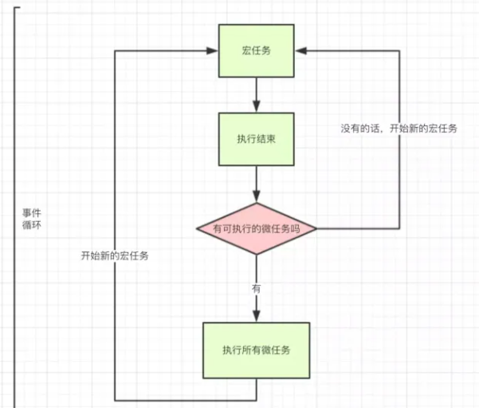

async/await、promise和setTimeout的执行顺序你真的懂了么？要想弄懂这些事件的执行循序，要先从js EventLoop 事件循环机制说起。

| 宏任务（macro-task） | 微任务(micro-task) |
| ----- | ----- |
| script | promise/[then/catch/finally](非new Promise) |
| setTimeout | process.nextTick(node.js环境) |
| setInterval | MutaionOberver(浏览器环境) |
| setImmediate(node.js环境) | Object.observer |

事件的执行顺序，是先执行宏任务，然后执行微任务，这个是基础。
1. 一开始整个脚本作为一个宏任务执行
2. 执行过程中同步代码直接执行，宏任务进入宏任务队列，微任务进入微任务队列
3. 当前宏任务执行完出队，检查微任务列表，有则依次执行，直到全部执行完
4. 执行浏览器UI线程的渲染工作
5. 检查是否有`Web Worker`任务，有则执行
6. 执行完本轮的宏任务，回到2，依此循环，直到宏任务和微任务队列都为空

微任务和宏任务的问题应该是前端面试中比较常见的，他们都从属于异步任务，主要区别在于他们的执行顺序，Event Loop的走向和取值。


这张图的意思就是：

1）、存在微任务的话，那么就执行所有的微任务

2）、微任务都执行完之后，执行下一个宏任务

3）、1， 2以此循环着

对于微任务的执行顺序上也有些需要注意的地方

基本上，若你喜欢异步任务尽可能快地执行，那就使用process.nextTick

根据语言规格，Promise对象的回调函数，会进入异步任务里面的”微任务“（microtask）队列。微任务队列追加在process.nextTick队列的后面。
所以，下面的代码输出顺序为：
```
process.nextTick(()=>console.log(1))
Promise.resolve().then(()=>console.log(2))
process.nextTick(()=>console.log(3))
Promise.resolve().then(()=>console.log(4))
//输出为
//1
//3
//2
//4
//上面的代码中，process.nextTick的回调会早执行于Promise
```

了解了基础之后，那就通过一个实例来练习一下：

```
console.log('1');

setTimeout(function() {
    console.log('2');
    process.nextTick(function() {
        console.log('3');
    })
    new Promise(function(resolve) {
        console.log('4');
        resolve();
    }).then(function() {
        console.log('5')
    })
})
process.nextTick(function() {
    console.log('6');
})
new Promise(function(resolve) {
    console.log('7');
    resolve();
}).then(function() {
    console.log('8')
})

setTimeout(function() {
    console.log('9');
    process.nextTick(function() {
        console.log('10');
    })
    new Promise(function(resolve) {
        console.log('11');
        resolve();
    }).then(function() {
        console.log('12')
    })
})
```

第一轮循环：
1. 首先打印1；
2. 接下来是setTimeout是异步任务且是宏任务，加入宏任务暂且记为 setTimeout1；
3. 接下来是 process 微任务 加入微任务队列 记为 process1；
4. 接下来是 new Promise 里面直接 resolve(7) 所以打印 7 后面的then是微任务 记为 then1；
5. 接下来是setTimeout，加入宏任务记为setTimeout2；

这一轮循环结束，打印的结果： 1 7
宏任务队列： setTimeout1、setTimeout2
微任务队列：process1、then1

第二轮循环：
1. 执行微任务队列；
2. 执行process1，打印6；
3. 执行then1，打印8；
4. 微任务执行完毕后，开始执行宏任务队列；
5. 执行setTimeout1，先打印2；
6. 接下来是process微任务，加入微任务队列标记为process2；
7. 接下来new Promise 里面直接 resolve(4) 所以打印 4，后面的then加入微任务标记为then2；


第二轮循环结束，当前为止打印的结果： 1 7 6 8 2 4 
宏任务队列： setTimeout2
微任务队列：process2、then2

第三轮循环：
1. 执行所有微任务；
2. 执行process2，打印3；
3. 执行then2，打印5；
4. 微任务执行完毕后，开始执行宏任务队列；
5. 执行setTimeout2，先打印9；
6. 接下来是process微任务，加入微任务队列标记为process3；
7. 接下来new Promise 里面直接 resolve(11) 所以打印 11，后面的then加入微任务标记为then3；

第三轮循环结束，当前为止打印的结果： 1 7 6 8 2 4 3 5 9 11
宏任务队列： 
微任务队列：process3、then3

第四轮循环：
1. 执行所有微任务；
2. 执行process3，打印10；
3. 执行then3，打印12；

第四轮循环结束，当前为止打印的结果： 1 7 6 8 2 4 3 5 9 11 10 12
此时宏任务和微任务都为空，代码执行结束。

到这里你是不是已经信心满满，原来是这样啊，我已经掌握了。好，那下面就再来一道题来检验一下学习成果吧

```
async function a1 () {
    console.log('a1 start')
    await a2()
    console.log('a1 end')
}
async function a2 () {
    console.log('a2')
}
console.log('script start')
setTimeout(() => {
    console.log('setTimeout')
}, 0)
Promise.resolve().then(() => {
    console.log('promise1')
})
a1()
let promise2 = new Promise((resolve) => {
    resolve('promise2.then')
    console.log('promise2')
})
promise2.then((res) => {
    console.log(res)
    Promise.resolve().then(() => {
        console.log('promise3')
    })
})
Promise.resolve().then(() => {
    console.log('promiseTag')
})
process.nextTick(function() {
    console.log('nextTick');
})
console.log('script end')
```
正确答案是：script start, a1 start, a2,  promise2, script end, nextTick， promise1, a1 end, promise2.then，promiseTag, promise3，setTimeout1
你答对了么？如果答对了那下面就可以忽略了，答错的小伙伴来看一下过程吧：

第一轮循环：
1. 首先打印 script start；
2. 然后是setTimeout宏任务，加入宏任务列表，记为setTimeout1；
3. 接下来是Promise微任务，加入微任务，记为 then1；
4. 接下来执行a1函数，打印 a1 start,执行a2，打印a2，返回一个promise对象，await让出了线程，把返回的promise加入微任务，记为then2，所以a2后面的代码也要等then2执行完之后才能继续执行；
5. 接下来定义了promise2，然后执行promise2，new Promise里直接resolve('promise2')，所以打印promise2，promise2的then加入微任务，记为then3；
6. 接下来执行Promise微任务，加入微任务，记为 then4；
7. 接下来是process微任务，加入微任务并前置，记为process1；
8. 接下来打印 script end。

第一轮循环结束，当前打印结果为： script start, a1 start, a2,  promise2, script end
宏任务列表：setTimeout1
微任务列表：process1、then1、then2、then3、then4

第二轮循环：
1. 首先执行微任务列表；
2. 执行process1， 打印 nextTick；
3. 执行then1，打印 promise1;
4. 执行then2，打印 a1 end;
5. 执行then3, 打印promise2，接下来是Promise微任务，加入当前微任务列表末尾，记为 then5；
6. 执行then4，打印promiseTag；
6. 执行then5，打印promise3；
6. 然后执行宏任务；
7. 执行setTimeout1，打印setTimeout1。


第二轮循环结束，当前打印结果为： script start, a1 start, a2,  promise2, script end, nextTick， promise1, a1 end, promise2.then，promiseTag, promise3，setTimeout1
此时宏任务和微任务都为空，代码执行结束。
