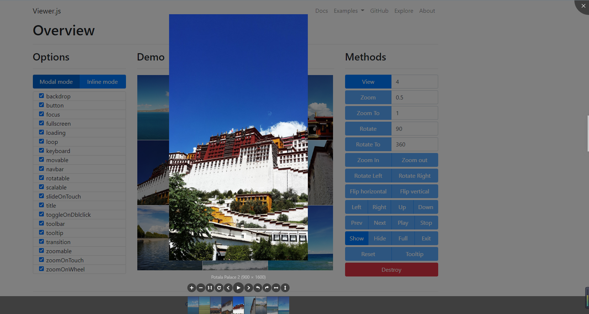

# [Viewer.js](https://github.com/fengyuanchen/viewerjs)

图片查看器,展示效果如下



## 入门

### 安装

```shell
npm install viewerjs
```

html引入

```html
<link  href="/path/to/viewer.css" rel="stylesheet">
<script src="/path/to/viewer.js"></script>
```

或者导入

```javascript
// vue使用
import Viewer from 'viewerjs'
import 'viewerjs/dist/viewer.css'
```


### 用法

```js
new Viewer(element[, options])
```

- **element**
  - 类型: `HTMLElement`
  - 目标图像或要查看的图像容器。

- **options** (optional)
  - 类型: `Object`
  - 查看选项。

#### 例子

```html
<div class="img-viewer" id="viewerWrap">
    <ul>
        <li v-for="(item,index) of fileUrls" :key="index"></li>
    </ul>
</div>
```

```js
import Viewer from 'viewerjs'
import 'viewerjs/dist/viewer.css'

const ViewerDom = document.getElementById('viewerWrap')
this.viewer = new Viewer(ViewerDom, {
    title: false, // 当前图片标题
    transition: false, // 使用 CSS3 过度
    hide: () => {
        // 监听关闭  do something
        this.viewer.destroy()
    }
})
// 然后，通过单击显示一幅图像，或调用this.viewer.show()
```

##  键盘支持

> 仅在 modal 模式下可用.

- `Esc`: 退出全屏或关闭查看器或退出模式模式或停止播放。
- `Space`: 停止播放。
- `Tab`: 在查看器中的按钮上切换聚焦状态。
- `Enter`: 触发按钮上的click事件处理程序。
- `←`查看上一张图像。
- `→`查看下一张图像。
- `↑`: 放大图像。
- `↓`: 缩小图像。
- `Ctrl + 0`: 缩小到初始大小。
- `Ctrl + 1`: 放大至自然大小。

## 配置项

可以通过`new Viewer(image, options)`设置查看器选项

如果要更改全局默认选项，则可以使用`Viewer.setDefaults(options)`。

### backdrop

- Type: `Boolean` or `String`
- Default: `true`

启用模式背景，指定`static`一个不会在单击时关闭模式的背景。

### button（查看器的右上角显示关闭按钮）

- Type: `Boolean`
- Default: `true`

### navbar（底部缩略图）

- Type: `Boolean` or `Number`
- Default: `true`
- Options:
  - `0` or `false`: 隐藏导航栏
  - `1` or `true`: 显示导航栏
  - `2`: 仅在屏幕宽度大于768像素时显示导航栏
  - `3`: 仅在屏幕宽度大于992像素时显示导航栏
  - `4`: 仅在屏幕宽度大于1200像素时显示导航栏

指定导航栏的可见性。

### title

- Type: `Boolean` or `Number` or `Function` or `Array`
- Default: `true`
- Options:
  - `0` or `false`: 隐藏标题
  - `1` or `true` or `Function` or `Array`: 显示标题
  - `2`: 仅在屏幕宽度大于768像素时显示标题
  - `3`: 仅在屏幕宽度大于992像素时显示标题
  - `4`: 仅当屏幕宽度大于1200像素时才显示标题
  - `Function`: 自定义标题内容
  - `[Number, Function]`: 第一个元素指示可见性，第二个元素自定义标题内容

指定标题的可见性和内容。

> 名称来自`alt`图像元素的属性或从URL解析的图像名称。

例如, `title: 4` 等于:

```js
new Viewer(image, {
  title: [4, (image, imageData) => `${image.alt} (${imageData.naturalWidth} × ${imageData.naturalHeight})`]
});
```

### toolbar（底部工具栏）

- Type: `Boolean` or `Number` or `Object`
- Default: `true`
- Options:
  - `0` or `false`: 隐藏工具栏。
  - `1` or `true`: 显示工具栏。
  - `2`: 仅在屏幕宽度大于768像素时显示工具栏。
  - `3`: 仅在屏幕宽度大于992像素时显示工具栏。
  - `4`: 仅在屏幕宽度大于1200像素时才显示工具栏。
  - `{ key: Boolean | Number }`: 显示或隐藏工具栏。
  - `{ key: String }`: 自定义按钮的大小。
  - `{ key: Function }`: 自定义按钮的点击处理程序。
  - `{ key: { show: Boolean | Number, size: String, click: Function }`: 自定义按钮的每个属性。
  - 可用键: "zoomIn", "zoomOut", "oneToOne", "reset", "prev", "play", "next", "rotateLeft", "rotateRight", "flipHorizontal" and "flipVertical".
  - 可用的尺寸值: "small", "medium" (默认) and "large".

指定工具栏及其按钮的可见性和布局。

例如, `toolbar: 4` 等于:

```js
new Viewer(image, {
  toolbar: {
    zoomIn: 4,
    zoomOut: 4,
    oneToOne: 4,
    reset: 4,
    prev: 4,
    play: {
      show: 4,
      size: 'large',
    },
    next: 4,
    rotateLeft: 4,
    rotateRight: 4,
    flipHorizontal: 4,
    flipVertical: 4,
  },
});
```

### className

- Type: `String`
- Default: `''`

要添加到查看器的根元素的自定义类名称。

### container

- Type: `Element` or `String`
- Default: `'body'`
- [Document.querySelector](https://developer.mozilla.org/en-US/docs/Web/API/Document/querySelector)的元素或有效选择器

将查看器置于模式模式的容器。

> 仅当该`inline`选项设置为`false`。

### filter（过滤图片是否可见）

- Type: `Function`
- Default: `null`

过滤图像以供查看 (如果图像可见，则应返回`true`，忽略图像则返回`false`).

例如:

```js
new Viewer(image, {
  filter(image) {
    return image.complete;
  },
});
```

> 请注意，默认情况下，未设置`src`属性的图像将被忽略。

### fullscreen

- Type: `Boolean`
- Default: `true`

启用以在播放时请求全屏显示。

> 要求浏览器支持[全屏API](https://caniuse.com/fullscreen)。

### inheritedAttributes（定义要从原始图像继承的额外属性）

- Type: `Array`
- Default: `['crossOrigin', 'decoding', 'isMap', 'loading', 'referrerPolicy', 'sizes', 'srcset', 'useMap']`

> 请注意，基本属性`src`和`alt`将始终从原始图像继承。

### initialViewIndex（定义要查看的图像的初始索引）

- Type: `Number`
- Default: `0`

> 也用作方法的默认参数值`view`。

### inline（串联模式）

- Type: `Boolean`
- Default: `false`

### interval（播放时自动循环播放图像之间延迟的时间）

- Type: `Number`
- Default: `5000`

### keyboard（键盘支持）

- Type: `Boolean`
- Default: `true`

Enable keyboard support.

### focus

- Type: `Boolean`
- Default: `true`

初始化后，将当前激活的选项聚焦在导航栏中。

> 需要将`keyboard`选项设置为`true`。

### loading

- Type: `Boolean`
- Default: `true`

指示是否在加载图像时显示加载效果。

### loop（循环查看）

- Type: `Boolean`
- Default: `true`

> 如果当前图像是最后一个图像，则要查看的下一个图像是第一个图像，反之亦然。

### minWidth

- Type: `Number`
- Default: 200

定义查看器的最小宽度。

> 仅在串联模式下可用（将`inline`选项设置为`true`）。

### minHeight

- Type: `Number`
- Default: 100

定义查看器的最小高度。

> 仅在串联模式下可用（将`inline`选项设置为`true`）。

### movable（移动图像）

- Type: `Boolean`
- Default: `true`

### rotatable（旋转图像）

- Type: `Boolean`
- Default: `true`

### scalable（缩放图像）

- Type: `Boolean`
- Default: `true`

### zoomable（缩放图像）

- Type: `Boolean`
- Default: `true`

### zoomOnTouch

- Type: `Boolean`
- Default: `true`

通过在触摸屏上拖动来启用缩放当前图像的功能。

### zoomOnWheel

- Type: `Boolean`
- Default: `true`

启用可通过鼠标滚轮缩放图像。

### slideOnTouch

- Type: `Boolean`
- Default: `true`

通过在触摸屏上滑动，可以滑动到下一张或上一张图像。

### toggleOnDblclick

- Type: `Boolean`
- Default: `true`

指示是否在双击图像时在自然尺寸和初始尺寸之间切换图像尺寸。

换句话说，当双击图像时，将自动调用[`toggle`](https://github.com/fengyuanchen/viewerjs#toggle)方法。

> 需要[`dblclick`](https://developer.mozilla.org/en-US/docs/Web/Events/dblclick)事件支持。

### tooltip（工具提示）

- Type: `Boolean`
- Default: `true`

放大或缩小时，以图像比率（百分比）显示工具提示。

### transition

- Type: `Boolean`
- Default: `true`

为某些特殊元素启用CSS3过渡。

### zIndex

- Type: `Number`
- Default: `2015`

在`modal`模式下定义查看器的CSS z-index的值。

### zIndexInline

- Type: `Number`
- Default: `0`

在`inline`模式下定义查看器的CSS z-index的值。

### zoomRatio

- Type: `Number`
- Default: `0.1`

通过滚轮鼠标缩放图像时定义比例。

### minZoomRatio

- Type: `Number`
- Default: `0.01`

定义缩小时图像的最小比例。

### maxZoomRatio

- Type: `Number`
- Default: `100`

定义放大时图像的最大比例。

### url

- Type: `String` or `Function`
- Default: `'src'`

定义从何处获取原始图像URL进行查看。

> 如果是字符串，则它应该是每个图像元素的属性之一。如果是函数，则应返回有效的图像URL。

例如:

```html

```

```js
new Viewer(image, {
  url(image) {
    return image.src.replace('?size=160', '');
  },
});
```

### ready

- Type: `Function`
- Default: `null`

### show

- Type: `Function`
- Default: `null`

### shown

- Type: `Function`
- Default: `null`

### hide

- Type: `Function`
- Default: `null`

### hidden

- Type: `Function`
- Default: `null`

### view

- Type: `Function`
- Default: `null`

### viewed

- Type: `Function`
- Default: `null`

### move

- Type: `Function`
- Default: `null`

### moved

- Type: `Function`
- Default: `null`

### rotate

- Type: `Function`
- Default: `null`

### rotated

- Type: `Function`
- Default: `null`

### scale

- Type: `Function`
- Default: `null`

### scaled

- Type: `Function`
- Default: `null`

### zoom

- Type: `Function`
- Default: `null`

### zoomed

- Type: `Function`
- Default: `null`

### play

- Type: `Function`
- Default: `null`

### stop

- Type: `Function`
- Default: `null`

## Methods

所有方法都允许链组成。

由于启动查看器时会有一些**异步**过程，因此仅应在可用时调用方法，请参见以下**生命周期**：

```js
new Viewer(image, {
  ready() {
    // 2 methods are available here: "show" and "destroy".
  },
  shown() {
    // 9 methods are available here: "hide", "view", "prev", "next", "play", "stop", "full", "exit" and "destroy".
  },
  viewed() {
    // All methods are available here except "show".
    this.viewer.zoomTo(1).rotateTo(180);
  }
});
```

### show([immediate])

- **immediate** (optional):
  - Type: `Boolean`
  - Default: `false`
  - 指示是否立即显示查看器。

展示查看器。

> 仅在`modal`模式下可用。

### hide([immediate])

- **immediate** (optional):
  - Type: `Boolean`
  - Default: `false`
  - Indicates if hide the viewer immediately or not.

隐藏查看器。

> 仅在`modal`模式下可用。

### view([index])

- **index** (optional):
  - Type: `Number`
  - Default: `0` (`0`从`initialViewIndex`选项继承)
  - 要查看的图像索引

查看带有图像索引的图像之一。如果未显示查看器，将首先显示查看器。

```js
viewer.view(1); // 查看第二张图片
```

### prev([loop=false])

- **loop** (optional):
  - Type: `Boolean`
  - Default: `false`
  - 指示当当前是最后一个时是否转向查看最后一个。

查看上一张图像。

### next([loop=false])

- **loop** (optional):
  - Type: `Boolean`
  - Default: `false`
  - 指示当当前是最后一个时是否转向查看第一个。

查看下一张图像。

### move(x[, y = x])

- **x**:
  - Type: `Number`
  - 在水平方向上的移动距离。

- **y** (optional):
  - Type: `Number`
  - 垂直方向上的移动距离。
  - 如果不存在，则其默认值为 `x`

移动具有相对偏移的图像。

```js
viewer.move(1);
viewer.move(-1, 0); // Move left
viewer.move(1, 0);  // Move right
viewer.move(0, -1); // Move up
viewer.move(0, 1);  // Move down
```

### moveTo(x[, y = x])

- **x**:
  - Type: `Number`
  - 在水平方向上的新位置。

- **y** (optional):
  - Type: `Number`
  - 垂直方向上的新位置。
  - 如果不存在，则其默认值为`x`。

将图像移到绝对点。

### rotate(degree)

- **degree**:
  - Type: `Number`
  - 向右旋转：正数（度> 0）
  - 向左旋转：负数（度<0）

相对旋转图像。

```js
viewer.rotate(90);
viewer.rotate(-90);
```

### rotateTo(degree)

- **degree**:
  - Type: `Number`

将图像旋转到绝对程度。

```js
viewer.rotateTo(0); // 重置为零度
viewer.rotateTo(360); // 旋转一整圈
```

### scale(scaleX[, scaleY])

- **scaleX**:
  - Type: `Number`
  - Default: `1`
  - 应用于图像横坐标的比例因子
  - 当等于`1`它什么都不做。

- **scaleY** (optional):
  - Type: `Number`
  - 应用于图像纵坐标的比例因子
  - 如果不存在，则其默认值为`scaleX`。

缩放图像。

```js
viewer.scale(-1); // 水平和垂直翻转
viewer.scale(-1, 1); // 水平翻转
viewer.scale(1, -1); // 垂直翻转
```

### scaleX(scaleX)

- **scaleX**:
  - Type: `Number`
  - Default: `1`
  - 应用于图像横坐标的比例因子
  - 当等于`1`它什么都不做

缩放图像的横坐标。

```js
viewer.scaleX(-1); // 水平翻转
```

### scaleY(scaleY)

- **scaleY**:
  - Type: `Number`
  - Default: `1`
  - 应用于图像纵坐标的比例因子
  - 当等于`1`它什么都不做

缩放图像的纵坐标。

```js
viewer.scaleY(-1); // 垂直翻转
```

### zoom(ratio[, hasTooltip])

- **ratio**:
  - Type: `Number`
  - 放大：要求为正数（比率> 0）
  - 缩小：要求为负数（比率<0）

- **hasTooltip** (optional):
  - Type: `Boolean`
  - Default: `false`
  - 显示工具提示

以相对比例缩放图像

```js
viewer.zoom(0.1);
viewer.zoom(-0.1);
```

### zoomTo(ratio[, hasTooltip])

- **ratio**:
  - Type: `Number`
  - 需要一个正数（比率> 0）

- **hasTooltip** (optional):
  - Type: `Boolean`
  - Default: `false`
  - 显示工具提示

将图像缩放到绝对比例。

```js
viewer.zoomTo(0); // 缩放到零大小（0％）的
viewer.zoomTo(1); // 缩放至自然大小（100％）
```

### play([fullscreen])

- **fullscreen** (optional):
  - Type: `Boolean`
  - Default: `false`
  - 指示是否要求全屏显示。

播放图像。

### stop()

Stop play.

### full()

进入`modal`模式。

> 仅在`inline`模式下可用。

### exit()

退出`modal`模式。

> 仅在`inline`模式下可用。

### tooltip()

用百分比显示图像的当前比率。

> 需要将`tooltip`选项设置为`true`。

### toggle()

在图像的自然尺寸和初始尺寸之间切换图像尺寸。

> 由[`toggleOnDblclick`](https://github.com/fengyuanchen/viewerjs#toggleOnDblclick)选项使用。

### reset()

将图像重置为其初始状态。

### update()

当源图像发生更改（添加，删除或排序）时，更新查看器实例。

> 如果您动态加载图像（使用XMLHTTPRequest），则可以使用此方法将新图像添加到查看器实例。

### destroy()

销毁查看器并删除实例。

## Events

所有事件都可以使用`this.viewer`其处理程序访问查看器实例。

> 请小心在具有相同事件名称的其他组件中使用这些事件，例如：[Bootstrap](https://getbootstrap.com/)的模态。

```js
let viewer;

image.addEventListener('viewed', function () {
  console.log(this.viewer === viewer);
  // > true
});

viewer = new Viewer(image);
```

### ready

- **event.bubbles**: `true`
- **event.cancelable**: `true`
- **event.detail**: `null`

当查看器实例准备好查看时，将触发此事件。

> 在`modal`模式下，除非您单击其中一张图像，否则不会触发此事件。

### show

- **event.bubbles**: `true`
- **event.cancelable**: `true`
- **event.detail**: `null`

当查看器模式开始显示时，将触发此事件。

> 仅在`modal`模式下可用。

### shown

- **event.bubbles**: `true`
- **event.cancelable**: `true`
- **event.detail**: `null`

显示查看器模态后将触发此事件。

> 仅在`modal`模式下可用。

### hide

- **event.bubbles**: `true`
- **event.cancelable**: `true`
- **event.detail**: `null`

当查看器模式开始隐藏时，将触发此事件。

> 仅在`modal`模式下可用。

### hidden

- **event.bubbles**: `true`
- **event.cancelable**: `false`
- **event.detail**: `null`

查看器隐藏后将触发此事件。

> 仅在`modal`模式下可用。

### view

- **event.bubbles**: `true`
- **event.cancelable**: `true`
- **event.detail.index**:
  - Type: `Number`
  - 原始图像的索引。
- **event.detail.image**:
  - Type: `HTMLImageElement`
  - 当前图像（原始图像的克隆）。
- **event.detail.originalImage**:
  - Type: `HTMLImageElement`
  - 原始图像。

查看器开始显示图像时将触发此事件。

### viewed

- **event.bubbles**: `true`
- **event.cancelable**: `false`
- **event.detail**: 与`view`事件相同。

查看器显示图像后将触发此事件。

### move

- **event.bubbles**: `true`
- **event.cancelable**: `true`
- **event.detail.x**:
  - Type: `Number`
  - 在水平方向上的新位置。
- **event.detail.y**:
  - Type: `Number`
  - 垂直方向上的新位置。
- **event.detail.oldX**:
  - Type: `Number`
  - 水平方向上的旧位置。
- **event.detail.oldY**:
  - Type: `Number`
  - 垂直方向上的旧位置。
- **event.detail.originalEvent**:
  - Type: `Event` or `null`
  - Options: `pointermove`, `touchmove`, and `mousemove`.

开始移动图像时触发。

### moved

- **event.bubbles**: `true`
- **event.cancelable**: `false`
- **event.detail**: 与`move`事件相同。

图像移动结束后触发。

### rotate

- **event.bubbles**: `true`
- **event.cancelable**: `true`
- **event.detail.degree**:
  - Type: `Number`
  - 新的旋转度。
- **event.detail.oldDegree**:
  - Type: `Number`
  - 旧的旋转度。

开始旋转图像时触发。

### rotated

- **event.bubbles**: `true`
- **event.cancelable**: `false`
- **event.detail**: 与`rotate`事件相同。

图像旋转结束后触发。

### scale

- **event.bubbles**: `true`
- **event.cancelable**: `true`
- **event.detail.scaleX**:
  - Type: `Number`
  - 水平方向上的新缩放比例。
- **event.detail.scaleY**:
  - Type: `Number`
  - 垂直方向上的新缩放比例。
- **event.detail.oldScaleX**:
  - Type: `Number`
  - 水平方向上的旧缩放比例。
- **event.detail.oldScaleY**:
  - Type: `Number`
  - 垂直方向上的旧比例因子。

开始缩放图像时，将触发此事件。

### scaled

- **event.bubbles**: `true`
- **event.cancelable**: `false`
- **event.detail**: 与`scale`事件相同。

图像缩放完成后，将触发此事件。

### zoom

- **event.bubbles**: `true`
- **event.cancelable**: `true`
- **event.detail.ratio**:
  - Type: `Number`
  - 图像（`imageData.width / imageData.naturalWidth`）的新（下一个）比率。
- **event.detail.oldRatio**:
  - Type: `Number`
  - 图像的旧（当前）比率。
- **event.detail.originalEvent**:
  - Type: `Event` or `null`
  - Options: `wheel`, `pointermove`, `touchmove`, and `mousemove`.

当查看者开始放大（放大或缩小）图像时，将触发此事件。

### zoomed

- **event.bubbles**: `true`
- **event.cancelable**: `false`
- **event.detail**: 与`zoom`事件相同。

当查看者放大（放大或缩小）图像结束后，将触发此事件。

### play

- **event.bubbles**: `true`
- **event.cancelable**: `true`
- **event.detail**: `null`

开始播放时会触发此事件。

> 您可以通过致电中止播放过程`event.preventDefault()`。

### stop

- **event.bubbles**: `true`
- **event.cancelable**: `true`
- **event.detail**: `null`

当查看器开始停止时，将触发此事件。

> 您可以通过调用中止停止过程`event.preventDefault()`。

## No conflict

如果必须使用具有相同名称空间的其他查看器，只需调用`Viewer.noConflict`static方法即可还原到该查看器。

```html
<script src="other-viewer.js"></script>
<script src="viewer.js"></script>
<script>
  Viewer.noConflict();
  // Code that uses other `Viewer` can follow here.
</script>
```

## 浏览器支持

- 浏支持览器rtt)
- Firefox (latest)
- Safari (latest)
- Opera (latest)
- Edge (latest)
- Internet Explorer 9+

