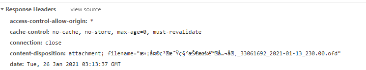

# 一、 get方法下载文件

```javascript
windown.open(url)
```

get方法的缺点是参数太长的时候，可能会超出限制，导致下载失败，所以对于参数很长的情况下，就要用到post下载。

# 二、 post方法

## 1. form表单提交

```javascript
post_downLoad (url, params, callback) {
    const form = document.createElement('form')
    form.style.display = 'none'
    form.action = url
    form.method = 'post'
    document.body.appendChild(form)
    for (const key in params) {
        const input = document.createElement('input')
        input.type = 'hidden'
        input.name = key
        input.value = params[key]
        form.appendChild(input)
    }
    form.submit()
    form.remove()
    callback && callback()
}
```

缺点是拿不到后台返回的提示信息，出现错误时不能准确的提示错误信息。

## 2. Blob



```js
post_downLoad(resData) {
    const { data, headers } = resData
    const utf8decoder = new TextDecoder()
    const u8arr = new Uint8Array(data)
    // 将二进制数据转为字符串
    const resString = utf8decoder.decode(u8arr)
    let isSuccess = true
    let errorMsg = ''
    if (resString.includes('operateCode')) { // 判断请求是否成功
        const resObj = JSON.parse(resString)
        if (resObj.operateCode !== 'S' && resObj.operateCode !== 0) {
            isSuccess = false
            errorMsg = resObj.message
        }
    }
    return new Promise((resolve, reject) => {
        if (isSuccess) {
            const disposition = headers['content-disposition'].split(';') // 获取响应头 内容描述
            const obj = {}
            disposition.forEach((item) => {
                const arr = item.split('=')
                if (arr.length === 2) {
                    arr[0] = arr[0].trim()
                    obj[arr[0]] = arr[1].replace(/"/g, '')
                }
            })
            const fileName = decodeURI(escape(obj.filename)) // 获取文件名   文件名后台用了iso-8859-1编码  需要解码
            const lastIdx = fileName.lastIndexOf('.')
            const type = fileName.substring(lastIdx+1) // 获取文件类型  文件名后缀
            const blob = new Blob([data], { type: MIME_TYPE[type] }) // 设置文件格式
            const url = window.URL.createObjectURL(blob)
            const link = document.createElement('a')
            link.style.display = 'none'
            link.href = url
            link.setAttribute('download', fileName)

            document.body.appendChild(link)
            link.click()
            document.body.removeChild(link) // 点击后移除，防止生成很多个隐藏a标签
            resolve()
        } else {
            window.YSY.alertMessage(errorMsg || '下载失败')
            reject()
        }
   }

```

由于后台返回来的是二进制数据，我们要把请求头的`responseType` 设为 `arraybuffer`，`responseType` 它表示服务器响应的数据类型。不设置的话会导致文件打不开或者打开时乱码。

附带给一个[MIME类型手册](https://www.w3school.com.cn/media/media_mimeref.asp)