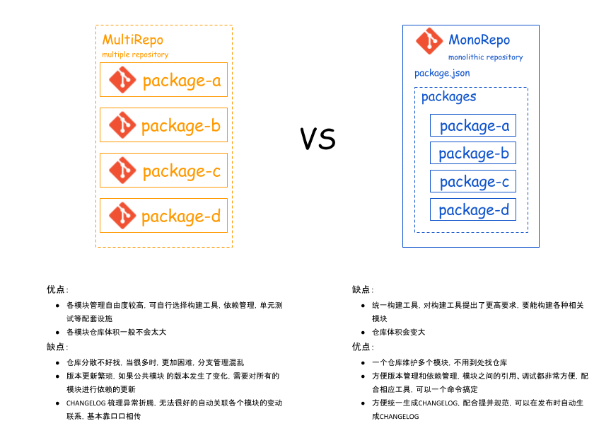
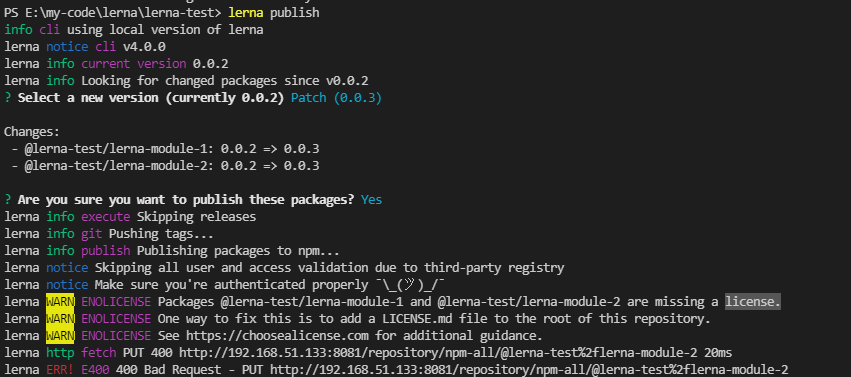
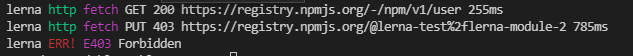
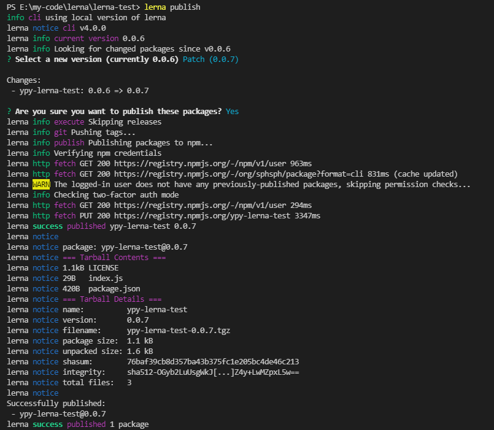
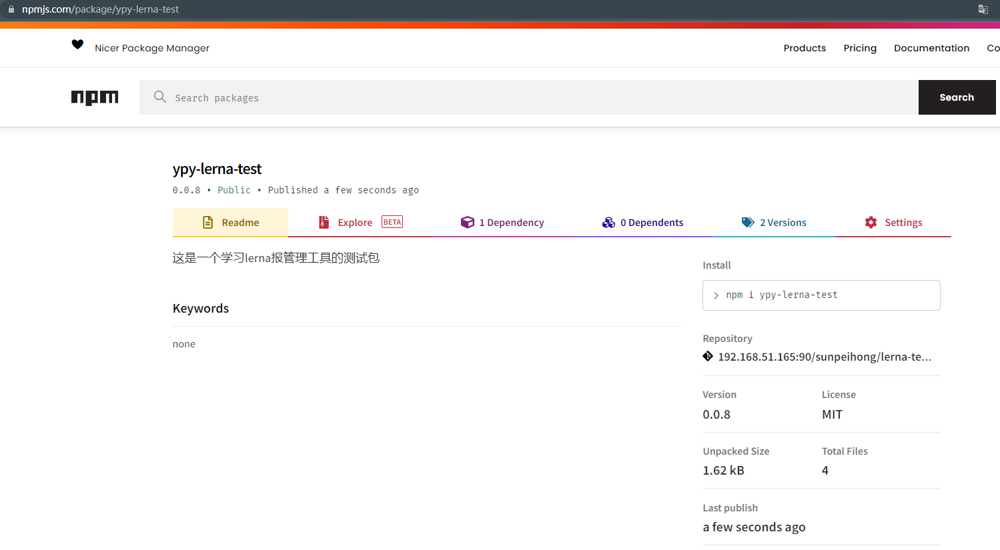

## 什麽是 Monorepo？
monorepo 的全称是 Monolithic Repository，是一种管理项目代码的方式，顾名思义就是只有一个仓库。

以往项目实践中，对于不同模块通常就是建多个各自的仓库，然后各自做维护等等。但这样的坏处就在于，对于维护不是特别方便，如果想去查看别的模块的代码或是逻辑，或是一个需求涉及到多个模块的改动，那我们就必须去不同仓库查找，修改，并且可能又要各自部署，过程中会出现很多的差错，追根究底就是因为这种传统管理代码的方式过于分散，模块之间的联系不够集中。

于是就诞生了 monorepo 的代码管理模式，就是在一个项目仓库(repo)中管理多个模块/包(package)，不同于传统的每个模块建立一个repo。

monorepo 最主要的好处是 统一的工作流 和Code Sharing。比如我想看一个 package 的代码、了解某段逻辑，不需要找它的repo，直接就在当repo；当某个需求要修改多个 pacakge 时，不需要分别到各自的 repo 进行修改、测试、发版，直接在当前repo修改，统一测试、统一发版。只要搭建一套脚手架，就能管理（构建、测试、发布）多个 package。

项目的第一级目录的内容以脚手架为主，主要内容都会在 packages 目录中，分多个 package 进行管理。大致结构会像这样：

├── packages
|   ├── pkg1
|   |   ├── package.json
|   ├── pkg2
|   |   ├── package.json
├── package.json

此时会出现一个问题，虽然这样该分成多个子 npm 包进行管理，但是当仓库内容相关联或是要进行复用时，调适开发就变得困难，可能存在依赖问题等等，也可能存在重複依赖安装的问题，导致项目变得太大。所以，理想的开发环境应该只需要关心业务代码，可以直接跨业务而不关心复用方式。

总的来说，monorepo 最主要的好处是 统一的工作流 和Code Sharing。比如我想看一个 package 的代码、了解某段逻辑，不需要找它的 repo，直接就在当前 repo；当某个需求要修改多个 pacakge 时，不需要分别到各自的 repo 进行修改、测试、发版或者 npm link，直接在当前 repo 修改，统一测试、统一发版。只要搭建一套脚手架，就能管理（构建、测试、发布）多个 package。




## Lerna

Lerna 是一个 npm 模块管理工具，用于管理具有多个包的JavaScript项目的工具。为项目提供了集中管理包的目录模式，如统一的仓库依赖安装，package scripts 和发布等特性。

### 安装  `npm i -g lerna`

### 初始化 `lerna init`

初始化完成之后项目的目录如下：

 

```javascript
//Lerna.json
{
 "packages": [
  "packages/*"
 ],
 "version": "0.0.0",
 "command": {
    "publish": {
      "registry": "https://npm.pkg.github.com"
    }
}

// Package.json

{
 "name": "root",
 "private": true,
 "devDependencies": {
  "lerna": "^4.0.0"
 }
}
```


### 创建子模块

导入子模块`lerna import 本地项目路径` 或者 在packages新建文件夹，然后`npm init`

 

每个被导入的项目都会被存放在根路径的packages目录下。

 

### 安装依赖 `lerna add xxx`

在 lerna 中我们使用 lerna add 指令为模块增加依赖。

为所有模块安装依赖 `lerna add chalk`

为@lerna-test/lerna-module-2 增加依赖

```
lerna add xxx --scope@lerna-test/ lerna-module-2
```

 

增加模块内部间的依赖 @lerna-test/lerna-module-1添加 @lerna-test/lerna-module-2依赖

```
lerna add @lerna-test/lerna-module-2 --scope @lerna-test/lerna-module-1 
```

### 发布 `lerna publish`

1). 先看一下package文件里每个包的package.json里有一个 repository 字段是否已经配置该包对应的远程仓库，要注意的是，我们必须为每一个 package 的 package.json 都要加上相应的配置，不需要都是同一个仓库，但是都需要配置。


配置好之后把代码push到远程仓库。

2). 发布命令`lerna publish`

发布过程可能出现的问题：

第一个问题是`401 Unauthorized - GET https://registry.npmjs.org/-/npm/v1/user
lerna ERR! EWHOAMI Authentication error. Use `npm whoami` to troubleshoot.`

这个原因是因为还没有登录`npm`账号， `npm login`登录就可以了（没有账号的先去npm注册一下）。

登录的时候注意看一下npm镜像源是否是你要发布的地址，如果不是要先切换


第二个问题，登录上之后再次执行`lerna publish`，出现以下报错：



从错误提示可以看出是缺少许可证书。因为 `npm` 有一百多万的包，所以我们使用的名称会和别的包重名而无法发布。而有些私有包，你在 `npm` 上无法找到，但也确确实实存在。因此需要在每个包的 `package.json` 增加 `"license": "MIT"`，然后在根目录增加 `LICENSE` 的文件，内容如下：

```markdown
The MIT License (MIT)

Copyright (c) 2013-present, yourAccountName (*********@qq.com)

Permission is hereby granted, free of charge, to any person obtaining a copy
of this software and associated documentation files (the "Software"), to deal
in the Software without restriction, including without limitation the rights
to use, copy, modify, merge, publish, distribute, sublicense, and/or sell
copies of the Software, and to permit persons to whom the Software is
furnished to do so, subject to the following conditions:

The above copyright notice and this permission notice shall be included in
all copies or substantial portions of the Software.

THE SOFTWARE IS PROVIDED "AS IS", WITHOUT WARRANTY OF ANY KIND, EXPRESS OR
IMPLIED, INCLUDING BUT NOT LIMITED TO THE WARRANTIES OF MERCHANTABILITY,
FITNESS FOR A PARTICULAR PURPOSE AND NONINFRINGEMENT. IN NO EVENT SHALL THE
AUTHORS OR COPYRIGHT HOLDERS BE LIABLE FOR ANY CLAIM, DAMAGES OR OTHER
LIABILITY, WHETHER IN AN ACTION OF CONTRACT, TORT OR OTHERWISE, ARISING FROM,
OUT OF OR IN CONNECTION WITH THE SOFTWARE OR THE USE OR OTHER DEALINGS IN
THE SOFTWARE.
```

然后再次git push提交代码到远程仓库，然后再执行`lerna publish`命令，又又出现报错了



查了资料之后发现是在[package](https://so.csdn.net/so/search?q=package&spm=1001.2101.3001.7020).json中登记的name已近被采用了。重名了，所以你得换一个。我们在发布一个包之前，最好拿着这个登记的name去搜一下，如果已经有了，那就要换一个，。。。真是路途多艰，那就去换名字吧。经过一番折腾，再次执行`lerna publish`命令，哈哈，终于成功啦！！！！



去npm搜一下，就可以查到了，至此大功告成！！！




## 依赖包管理

上述大概包含了 `lerna` 的整个生命周期了。不过当我们维护这个项目时，新拉下来仓库的代码后，需要为各个 package 安装依赖包。

在 lerna add 时也发现了，为某个 package 安装的包被放到了这个 package 目录下的 node_modules 目录下。这样对于多个 package 都依赖的包，会被多个 package 安装多次，并且每个 package 下都维护 node_modules ，也不清爽。

为此 lerna 也提供了一个 --hoist 参数来把每个 package 下的依赖包都提升到工程根目录，来降低安装以及管理的成本。

依赖提升

```
lerna bootstrap --hoist
```

lerna可以通过lerna bootstrap 命令安装所有子项目的依赖包，而且在安装依赖时还有依赖提升功能，所谓**“依赖提升”**，就是把所有项目npm依赖文件都提升到根目录下，这样能避免相同依赖包在不同项目安装多次。比如多个项目都用了axios，通过依赖提升，只需要下载一次放到根目录的node_modules目录下，就可供其他所有项目来使用。不过，需要额外的参数--hoist让依赖提升生效。

为了省去每次都输入 --hoist 参数的麻烦，可以在 lerna.json 配置：

```javascript
{
 "packages": [
  "packages/*"
 ],
 "command": {
  "bootstrap": {
   "hoist": true
  }
 },
 "version": "0.0.0"
}
```

配置好后，对于之前依赖包已经被安装到各个 package 下的情况，我们只需要清理一下安装的依赖即可：`lerna clean` 就可以清除安装包。

然后再执行`lerna bootstrap` 即可看到依赖都被安装到根目录下的 node_modules 中了（但是模块间的依赖不会被提升） 

 

