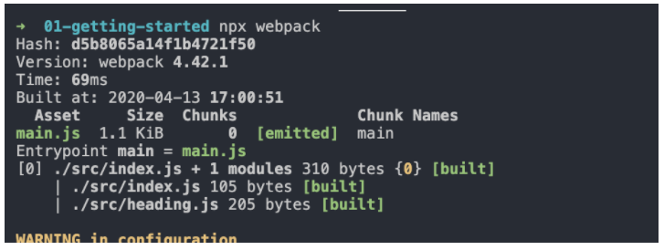

我们对模块化打包方案或工具的设想或者说是诉求有三个：

- 能够将散落的模块打包到一起；
- 能够编译代码中的新特性；
- 能够支持不同种类的前端资源模块。

目前，前端领域有一些工具能够很好的满足以上这 3 个需求，其中最为主流的就是 Webpack、Parcel 和 Rollup，我们以 Webpack 为例：

- Webpack 作为一个模块打包工具，本身就可以解决模块化代码打包的问题，将零散的 JavaScript 代码打包到一个 JS 文件中。
- 对于有环境兼容问题的代码，Webpack 可以在打包过程中通过 Loader 机制对其实现编译转换，然后再进行打包。
- 对于不同类型的前端模块类型，Webpack 支持在 JavaScript 中以模块化的方式载入任意类型的资源文件，例如，我们可以通过 Webpack 实现在 JavaScript 中加载 CSS 文件，被加载的 CSS 文件将会通过 style 标签的方式工作。

除此之外，Webpack 还具备代码拆分的能力，它能够将应用中所有的模块按照我们的需要分块打包。这样一来，就不用担心全部代码打包到一起，产生单个文件过大，导致加载慢的问题。我们可以把应用初次加载所必需的模块打包到一起，其他的模块再单独打包，等到应用工作过程中实际需要用到某个模块，再异步加载该模块，实现增量加载，或者叫作渐进式加载，非常适合现代化的大型 Web 应用。

当然，除了 Webpack，其他的打包工具也都类似，总之，所有的打包工具都是以实现模块化为目标，让我们可以在开发阶段更好的享受模块化带来的优势，同时又不必担心模块化在生产环境中产生新的问题。

## Webpack 快速上手
Webpack 作为目前最主流的前端模块打包器，提供了一整套前端项目模块化方案，而不仅仅局限于对 JavaScript 的模块化。通过 Webpack，我们可以轻松的对前端项目开发过程中涉及的所有资源进行模块化。

因为 Webpack 的设计思想比较先进，起初的使用过程比较烦琐，再加上文档也晦涩难懂，所以在最开始的时候，Webpack 对开发者并不友好，但是随着版本的迭代，官方文档的不断更新，目前 Webpack 对开发者已经非常友好了。此外，随着 React 和 Vue.js 这类框架的普及，Webpack 也随之受到了越来越多的关注，现阶段可以覆盖绝大多数现代 Web 应用的开发过程。

接下来我将通过一个案例，带你快速了解 Webpack 的基本使用，具体操作如下所示：

```javascript
└─ 02-configuation
   ├── src
   │   ├── heading.js
   │   └── index.js
   └── index.html
// ./src/heading.js
export default () => {
  const element = document.createElement('h2')
  element.textContent = 'Hello webpack'
  element.addEventListener('click', () => alert('Hello webpack'))
  return element
}
// ./src/index.js
import createHeading from './heading.js'
const heading = createHeading()
document.body.append(heading)

```

```html
<!DOCTYPE html>
<html lang="en">
<head>
  <meta charset="UTF-8">
  <title>Webpack - 快速上手</title>
</head>
<body>
  <script type="module" src="src/index.js"></script>
</body>
</html>
```


>  P.S. type="module" 这种用法是 ES Modules 中提出的标准，用来区分加载的是一个普通 JS 脚本还是一个模块。


在上面这个案例中，我们创建了两个 JS 文件，其中 heading.js 中以 ES Modules 的方式导出了一个创建元素的函数，然后在 index.js 中导入 heading.js 并使用了这个模块，最后在 html 文件中通过 script 标签，以模块化的方式引入了 index.js，

按照 ES Modules 的标准，这里的 index.html 可以直接在浏览器中正常工作，但是对于不支持 ES Modules 标准的浏览器，直接使用就会出现错误，所以我们需要使用 Webpack 这样的工具，将我们这里按照模块化方式拆分的 JS 代码再次打包到一起。

接下来我们就尝试引入 Webpack 去处理上述案例中的 JS 模块打包。由于 Webpack 是一个 npm 工具模块，所以我们先初始化一个 package.json 文件，用来管理 npm 依赖版本，完成之后，再来安装 Webpack 的核心模块以及它的 CLI 模块，具体操作如下：

```
npm init --yes
npm i webpack webpack-cli --save-dev
```

> P.S. webpack 是 Webpack 的核心模块，webpack-cli 是 Webpack 的 CLI 程序，用来在命令行中调用 Webpack。

安装完成之后，webpack-cli 所提供的 CLI 程序就会出现在 node_modules/.bin 目录当中，我们可以通过 npx 快速找到 CLI 并运行它，具体操作如下：

`$ npx webpack --version`
v4.42.1

> P.S. npx 是 npm 5.2 以后新增的一个命令，可以用来更方便的执行远程模块或者项目 node_modules 中的 CLI  程序。

这里我们使用的 Webpack 版本是 v4.42.1，有了 Webpack 后，就可以直接运行 webpack 命令来打包 JS 模块代码，具体操作如下：
`$ npx webpack`
这个命令在执行的过程中，Webpack 会自动从 src/index.js 文件开始打包，然后根据代码中的模块导入操作，自动将所有用到的模块代码打包到一起。

完成之后，控制台会提示：顺着 index.js 有两个 JS 文件被打包到了一起。与之对应的就是项目的根目录下多出了一个 dist 目录，我们的打包结果就存放在这个目录下的 main.js 文件中，具体操作如下图所示：



这里我们回到 index.html 中修改引入文件的路径，由于打包后的代码就不会再有 import 和 export 了，所以我们可以删除 type="module"。再次回到浏览器中，查看这个页面，这时我们的代码仍然可以正常工作，index.html 的代码如下所示：

```html
<html lang="en">
<head>
  <meta charset="UTF-8">
  <title>Webpack - 快速上手</title>
</head>
<body>
  <script src="dist/main.js"></script>
</body>
</html>
```


我们也可以将 Webpack 命令定义到 npm scripts 中，这样每次使用起来会更加方便，具体如下：

```javascript
{
  "name": "01-getting-started",
  "version": "0.1.0",
  "main": "n/a",
  "author": "zce <w@zce.me> (https://zce.me)",
  "license": "MIT",
  "scripts": {
    "build": "webpack"
  },
  "devDependencies": {
    "webpack": "^4.42.1",
    "webpack-cli": "^3.3.11"
  }
}
```

对于 Webpack 最基本的使用，总结下来就是：先安装 webpack 相关的 npm 包，然后使用 webpack-cli 所提供的命令行工具进行打包。

配置 Webpack 的打包过程
Webpack 4 以后的版本支持零配置的方式直接启动打包，整个过程会按照约定将 src/index.js 作为打包入口，最终打包的结果会存放到 dist/main.js 中。

但很多时候我们需要自定义这些路径约定，例如，在下面这个案例中，我需要它的打包入口是 src/main.js，那此时我们通过配置文件的方式修改 Webpack 的默认配置，在项目的根目录下添加一个 webpack.config.js，具体结构如下：

```
 └─ 02-configuation
    ├── src
    │ ├── heading.js
    │ └── main.js
    ├── index.html
    ├── package.json

+   └── webpack.config.js ···················· Webpack 配置文件
```


webpack.config.js 是一个运行在 Node.js 环境中的 JS 文件，也就是说我们需要按照 CommonJS 的方式编写代码，这个文件可以导出一个对象，我们可以通过所导出对象的属性完成相应的配置选项。

这里先尝试添加一个 entry 属性，这个属性的作用就是指定 Webpack 打包的入口文件路径。我们将其设置为 src/main.js，具体代码如下所示：

```javascript
// ./webpack.config.js
module.exports = {
  entry: './src/main.js'
}
```

配置完成之后，回到命令行终端重新运行打包命令，此时 Webpack 就会从 src/main.js 文件开始打包。

除了 entry 的配置以外，我们还可以通过 output 属性设置输出文件的位置。output 属性的值必须是一个对象，通过这个对象的 filename 指定输出文件的文件名称，path 指定输出的目录，具体代码如下所示：

```javascript
// ./webpack.config.js
const path = require('path')

module.exports = {
  entry: './src/main.js',
  output: {
    filename: 'bundle.js',
    path: path.join(__dirname, 'output')
  }
}
```

TIPS：webpack.config.js 是运行在 Node.js 环境中的代码，所以直接可以使用 path 之类的 Node.js 内置模块。

由于 Webpack 支持的配置有很多，篇幅的关系，这里我们就不一一介绍了，详细的文档你可以在 Webpack 的官网中找到：https://webpack.js.org/configuration/#options

## 让配置文件支持智能提示

在这里，我想跟你分享我在编写 Webpack 配置文件时用过的一个小技巧，因为 Webpack 的配置项比较多，而且很多选项都支持不同类型的配置方式。如果你刚刚接触 Webpack 的配置，这些配置选项一定会让你感到头大。如果开发工具能够为 Webpack 配置文件提供智能提示的话，这种痛苦就会减小很多，配置起来，效率和准确度也会大大提高。

我们知道， VSCode 对于代码的自动提示是根据成员的类型推断出来的，换句话说，如果 VSCode 知道当前变量的类型，就可以给出正确的智能提示。即便你没有使用 TypeScript 这种类型友好的语言，也可以通过类型注释的方式去标注变量的类型。

默认 VSCode 并不知道 Webpack 配置对象的类型，我们通过 import 的方式导入 Webpack 模块中的 Configuration 类型，然后根据类型注释的方式将变量标注为这个类型，这样我们在编写这个对象的内部结构时就可以有正确的智能提示了，具体代码如下所示：

```javascript
// ./webpack.config.js
/** @type {import('webpack').Configuration} */
const config = {
  entry: './src/index.js',
  output: {
    filename: 'bundle.js'
  }
}
module.exports = config
```

## Webpack 工作模式

Webpack 4 新增了一个工作模式的用法，这种用法大大简化了 Webpack 配置的复杂程度。你可以把它理解为针对不同环境的几组预设配置：

- production 模式下，启动内置优化插件，自动优化打包结果，打包速度偏慢；
- development 模式下，自动优化打包速度，添加一些调试过程中的辅助插件；
- none 模式下，运行最原始的打包，不做任何额外处理。

针对工作模式的选项，如果你没有配置一个明确的值，打包过程中命令行终端会打印一个对应的配置警告。在这种情况下 Webpack 将默认使用 production 模式去工作。

production 模式下 Webpack 内部会自动启动一些优化插件，例如，自动压缩打包后的代码。这对实际生产环境是非常友好的，但是打包的结果就无法阅读了。

修改 Webpack 工作模式的方式有两种：

- 通过 CLI --mode 参数传入；
- 通过配置文件设置 mode 属性。

上述三种 Webpack 工作模式的详细差异我们不再赘述了，你可以在官方文档中查看：https://webpack.js.org/configuration/mode/

## 打包结果运行原理

最后，我们来一起学习 Webpack 打包后生成的 bundle.js 文件，深入了解 Webpack 是如何把这些模块合并到一起，而且还能正常工作的。

为了更好的理解打包后的代码，我们先将 Webpack 工作模式设置为 none，这样 Webpack 就会按照最原始的状态进行打包，所得到的结果更容易理解和阅读。

按照 none 模式打包完成后，我们打开最终生成的 bundle.js 文件，如下图所示：


## 总结

最后我来总结一下本课时的重点，你也可以通过这几个重点反思一下掌握与否：

1. Webpack 是如何满足模块化打包需求的。
2. Webpack 打包的配置方式以及一个可以实现配置文件智能提示的小技巧。
3. Webpack 工作模式特性的作用。
4. 通过 Webpack 打包后的结果是如何运行起来的。