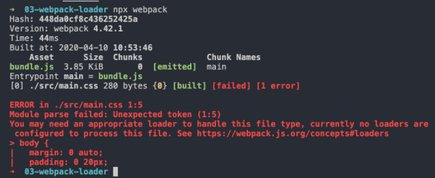
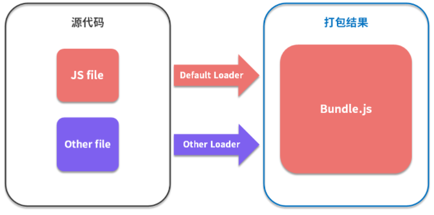
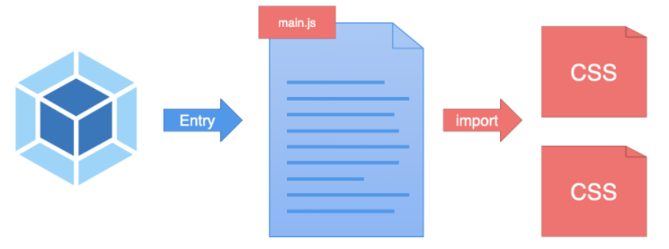

## 如何加载资源模块

首先，我们尝试通过 Webpack 打包项目中的一个 CSS 文件，由此开始探索 Webpack 是如何加载资源模块的？

在下面这个案例中，我们在项目的 src 目录下添加一个普通的样式文件 main.css，具体结构和样式代码如下所示：

```
 └─ 03-webpack-loader ························ sample root dir
    ├── src ·································· source dir
+   │   └── main.css ························· main styles
    ├── package.json ························· package file
    └── webpack.config.js ···················· webpack config file
```

```css
/* ./src/main.css */
body {
  margin: 0 auto;
  padding: 0 20px;
  max-width: 800px;
  background: #f4f8fb;
}

```

然后将 Webpack 配置中的入口文件路径指定为 main.css 的文件路径，让 Webpack 直接打包 CSS 资源文件，具体配置如下所示：

```javascript
module.exports = {
  // 样式文件路径
  entry: './src/main.css',
  output: {
    filename: 'bundle.js'
  }
}
```

你可能会好奇：Webpack 的打包入口不是应该是一个 JS 文件吗？为什么这里配置成了一个 CSS 文件呢？

其实 Webpack 并没有强制要求我们必须以 JS 文件作为打包入口，只是在绝大多数情况下，我们会用 JS 文件作为打包入口，因为 JS 文件才是程序的逻辑入口，以 JS 文件作为入口相对更合理。

那么，我们这里为什么要使用 CSS 文件作为入口呢？其实就是单纯地为了尝试使用 Webpack 直接去打包 CSS 文件，关于同时打包 JS 和 CSS 的操作，待会儿会详细介绍。

配置完成过后回到命令行终端再次运行 Webpack 打包命令，此时你会发现命令行报出了一个模块解析错误，如下所示：



错误信息大体的意思是说，在解析模块过程中遇到了非法字符，而且错误出现的位置就是在我们的 CSS 文件中。

出现这个错误的原因是因为 Webpack 内部默认只能够处理 JS 模块代码，也就是说在打包过程中，它默认把所有遇到的文件都当作 JavaScript 代码进行解析，但是此处我们让 Webpack 处理的是 CSS 代码，而 CSS 代码是不符合 JavaScript 语法的，所以自然会报出模块解析错误。

为了佐证 Webpack 默认只能够按照 JavaScript 语法解析模块，你可以尝试将 main.css 文件中的代码修改为一段 JavaScript 代码，然后重新运行 Webpack 打包来看一下结果。具体操作如下：

```javascript
/* ./src/main.css */

console.log('This is a style sheet.') 

/* 只是为了证明 Webpack 默认按照 JS 语法解析模块 */
```

这里有一个非常重要的提示：*You may need an appropriate loader to handle this file type, currently no loaders are configured to process this file. （我们需要用适当的加载器来处理这种文件类型，而当前并没有配置一个可以用来处理此文件的加载器）。*

根据这个错误说明，我们发现 Webpack 是用 Loader（加载器）来处理每个模块的，而内部默认的 Loader 只能处理 JS 模块，如果需要加载其他类型的模块就需要配置不同的 Loader。这也就引出了我们今天的主角：Loader。



## 加载器的使用方式

需要的是一个可以加载 CSS 模块的 Loader，最常用到的是 css-loader。我们需要通过 npm 先去安装这个 Loader，然后在配置文件中添加对应的配置，具体操作和配置如下所示：

`npm install css-loader --save-dev `

```javascript
// ./webpack.config.js

module.exports = {
  entry: './src/main.css',
  output: {
    filename: 'bundle.js'
  },
  module: {
    rules: [
      {
        test: /\.css$/, // 根据打包过程中所遇到文件路径匹配是否使用这个 loader
        use: 'css-loader' // 指定具体的 loader
      }
    ]
  }
}
```

在配置对象的 module 属性中添加一个 rules 数组。这个数组就是我们针对资源模块的加载规则配置，其中的每个规则对象都需要设置两个属性：

- 首先是 test 属性，它是一个正则表达式，用来匹配打包过程中所遇到文件路径，这里我们是以 .css 结尾；
- 然后是 use 属性，它用来指定匹配到的文件需要使用的 loader，这里用到的是 css-loader。

配置完成过后，我们回到命令行终端重新运行打包命令，打包过程就不会再出现错误了，因为这时 CSS 文件会交给 css-loader 处理过后再由 Webpack 打包。


## 样式模块加载的问题

此时，如果你尝试在页面中使用这里输出的 bundle.js 文件，你会发现刚刚的这个 main.css 模块并没有工作。

如果你之前有些经验，可能知道这个问题的解法，其实很简单，只需要再额外添加一个 style-loader，样式就可以正常工作了。

不过只有解法没有原因不是我们的风格。下面我们来分析产生这个问题的真正原因，首先，我们找到刚刚生成的 bundle.js 文件，因为这个文件是 Webpack 打包后的结果，所有的模块都应该在这个文件中出现。

由于默认打包入口在 Webpack 输出的结果中就是第一个模块，所以我们只需要看第一个模块目前是什么样的，如下图所示：


仔细阅读这个文件，你会发现 css-loader 的作用是将 CSS 模块转换为一个 JS 模块，具体的实现方法是将我们的 CSS 代码 push 到一个数组中，这个数组是由 css-loader 内部的一个模块提供的，但是整个过程并没有任何地方使用到了这个数组。

因此这里样式没有生效的原因是： **css-loader 只会把 CSS 模块加载到 JS 代码中，而并不会使用这个模块。**

所以这里我们还需要在 css-loader 的基础上再使用一个 style-loader，把 css-loader 转换后的结果通过 style 标签追加到页面上。

安装完 style-loader 之后，我们将配置文件中的 use 属性修改为一个数组，将 style-loader 也放进去。这里需要注意的是，一旦配置多个 Loader，执行顺序是从后往前执行的，所以这里一定要将 css-loader 放在最后，因为必须要 css-loader 先把 CSS 代码转换为 JS 模块，才可以正常打包，具体配置如下：

```javascript
// ./webpack.config.js
module.exports = {
  entry: './src/main.css',
  output: {
    filename: 'bundle.js'
  },
  module: {
    rules: [
      {
        test: /\.css$/,
        // 对同一个模块使用多个 loader，注意顺序
        use: [
          'style-loader',
          'css-loader'
        ]
      }
    ]
  }
}
```

配置完成之后，再次回到命令行重新打包，此时 bundle.js 文件中会额外多出两个模块。篇幅的关系，我们这里不再仔细解读。**style-loader 的作用总结一句话就是，将 css-loader 中所加载到的所有样式模块，通过创建 style 标签的方式添加到页面上。**

以上就是我们对 Loader 使用的一些探索，Loader 是 Webpack 实现整个前端模块化的核心。因为只有通过不同的 Loader，Webpack 才可以实现任何类型资源的加载。

## 通过 JS 加载资源模块

正如刚刚所提到的，一般 Webpack 打包的入口还是 JavaScript。因为从某种程度上来说，打包入口就是应用的运行入口，而目前前端应用中的业务是由 JS 驱动的，所以更合理的做法还是把 JS 文件作为打包的入口，然后在 JS 代码中通过 import 语句去加载 CSS 文件。

```
 └─ 03-webpack-loader ······················· sample root dir
    ├── src ································· source dir
    │   ├── style.css ······················· style module
+   │   └── main.js ························· entry module
    ├── package.json ························ package file
    └── webpack.config.js ··················· webpack config file
```

```javascript
// ./src/main.js
import './style.css'

// app logic...
console.log('App starts running~')
```



即便是通过 JS 代码去加载的 CSS 模块，css-loader 和 style-loader 仍然可以正常工作。因为 Webpack 在打包过程中会循环遍历每个模块，然后根据配置将每个遇到的模块交给对应的 Loader 去处理，最后再将处理完的结果打包到一起。

## 为什么要在 JS 中加载其他资源

说到这里，你可能会产生疑惑：Webpack 为什么要在 JS 中载入 CSS 呢？不是应该将样式和行为分离么？

其实 Webpack 不仅是建议我们在 JavaScript 中引入 CSS，还会建议我们在代码中引入当前业务所需要的任意资源文件。因为真正需要这个资源的并不是整个应用，而是你此时正在编写的代码。这就是 Webpack 的设计哲学。

可能你乍一想好像不太容易理解，那你可以做一个假设：假设我们在开发页面上的某个局部功能时，需要用到一个样式模块和一个图片文件。如果你还是将这些资源文件单独引入到 HTML 中，然后再到 JS 中添加对应的逻辑代码。试想一下，如果后期这个局部功能不用了，你就需要同时删除 JS 中的代码和 HTML 中的资源文件引入，也就是同时需要维护这两条线。而如果你遵照 Webpack 的这种设计，所有资源的加载都是由 JS 代码控制，后期也就只需要维护 JS 代码这一条线了。

所以说，通过 JavaScript 代码去引入资源文件，或者说是建立 JavaScript 和资源文件的依赖关系，具有明显的优势。因为 JavaScript 代码本身负责完成整个应用的业务功能，放大来说就是驱动了整个前端应用，而 JavaScript 代码在实现业务功能的过程中需要用到样式、图片等资源文件。如果建立这种依赖关系：

- 一来逻辑上比较合理，因为 JS 确实需要这些资源文件配合才能实现整体功能；
- 二来配合 Webpack 这类工具的打包，能确保在上线时，资源不会缺失，而且都是必要的。

最后说一句题外话，学习新事物不是说学会它的所有用法你就能提高，因为这些照着文档操作基本上谁都可以做到，很多时候它的思想才是突破点。能搞明白新事物为什么这样设计，基本上你就算出道了。

至于其他常用的加载器，我们在理解了 Loader 的机制过后，你可以通过官方的文档自行尝试。这里我罗列了几个开发经常用到的加载器，如下表所示：

| 名称           | 链接                                             |
| -------------- | ------------------------------------------------ |
| file-loader    | https://webpack.js.org/loaders/file-loader       |
| url-loader     | https://webpack.js.org/loaders/url-loader        |
| babel-loader   | https://webpack.js.org/loaders/babel-loader      |
| style-loader   | https://webpack.js.org/loaders/style-loader      |
| css-loader     | https://webpack.js.org/loaders/css-loader        |
| sass-loader    | https://webpack.js.org/loaders/sass-loader       |
| postcss-loader | https://webpack.js.org/loaders/postcss-loader    |
| eslint-loader  | https://github.com/webpack-contrib/eslint-loader |
| vue-loader     | https://github.com/vuejs/vue-loader              |

我每接触到一个新的加载器，核心就是搞明白这个 Loader 内部到底做了什么事情，它的目标是什么，其次才是这个 Loader 的配置用法。

