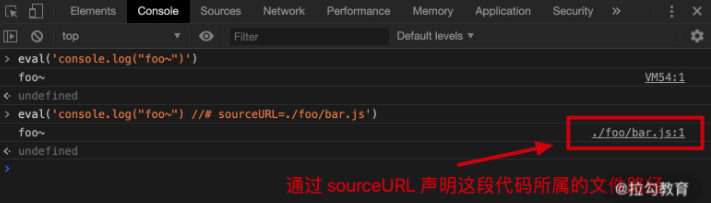
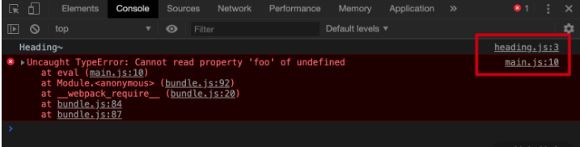
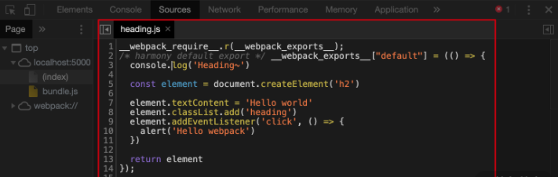
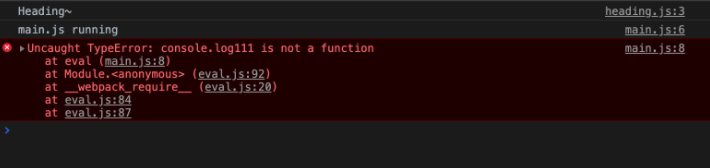

上一讲我们介绍了如何使用 Webpack Dev Server 提高开发效率，今天我们来介绍需要编译的前端项目该如何调试。

通过构建或者编译之类的操作，我们将开发阶段编写的源代码转换为能够在生产环境中运行的代码，这种进步同时也意味着我们实际运行的代码和我们真正编写的代码之间存在很大的差异。

在这种情况下，如果需要调试我们的应用，或是应用运行的过程中出现意料之外的错误，那我们将无从下手。因为无论是调试还是报错，都是基于构建后的代码进行的，我们只能看到错误信息在构建后代码中具体的位置，却很难直接定位到源代码中对应的位置。

所以我们今天来聊聊如何借助工具解决现代化前端应用的调试问题。

## Source Map 简介

Source Map（源代码地图）就是解决此类问题最好的办法，从它的名字就能够看出它的作用：映射转换后的代码与源代码之间的关系。一段转换后的代码，通过转换过程中生成的 Source Map 文件就可以逆向解析得到对应的源代码。


## Webpack 中配置 Source Map

我们使用 Webpack 打包的过程，同样支持为打包结果生成对应的 Source Map。用法上也很简单，不过它提供了很多不同模式，导致大部分初学者操作起来可能会比较懵。那接下来我们就一起研究一下在 Webpack 中如何开启 Source Map，然后再来了解一下几种不同的 Source Map 模式之间存在哪些差异。

我们回到配置文件中，这里我们要使用的配置属性叫作 devtool。这个属性就是用来配置开发过程中的辅助工具，也就是与 Source Map 相关的一些功能。我们可以先将这个属性设置为 source-map，具体代码如下：

```javascript
// ./webpack.config.js
module.exports = {
  devtool: 'source-map' // source map 设置
}
```

然后打开命令行终端，运行 Webpack 打包。打包完成过后，我们打开 dist 目录，此时这个目录中就会生成我们 bundle.js 的 Source Map 文件，与此同时 bundle.js 中也会通过注释引入这个 Source Map 文件，具体如下图所示：


我们再回到命令行，通过 serve 工具把打包结果运行起来，然后打开浏览器，再打开开发人员工具，此时我们就可以直接定位到错误所在的位置了。当然如果需要调试，这里也可以直接调试源代码。


如果你只是需要使用 Source Map 的话，操作到这里就已经实现了。但是只会使用这种最普通的 Source Map 模式还远远不够。

为什么这么说呢？

因为现阶段 Webpack 支持的 Source Map 模式有很多种。每种模式下所生成的 Source Map 效果和生成速度都不一样。显然，效果好的一般生成速度会比较慢，而生成速度快的一般就没有什么效果。

那具体哪种 Source Map 模式才是最好呢？这里我们还需要继续去探索。

Webpack 中的 devtool 配置，除了可以使用 source-map 这个值，它还支持很多其他的选项，具体的我们可以参考文档中的不同模式的对比表。


上表分别从初次构建速度、监视模式重新构建速度、是否适合生成环境使用，以及 Source Map 的质量，这四个维度去横向对比了不同的 Source Map 模式之间的差异。

通过表格中四个维度的对比你可能觉得不够清晰，也不太好理解，所以接下来我们会根据表格中的介绍，通过实际操作来体会这些模式之间的差异，从而带你找到适合自己的最佳实践。

## Eval模式

首先来看 eval 模式。在去具体了解 Webpack eval 模式的 Source Map 之前，我们需要先了解一下 JavaScript 中 eval 的一些特点。

eval 其实指的是 JavaScript 中的一个函数，可以用来运行字符串中的 JavaScript 代码。例如下面这段代码，字符串中的 console.log("foo~") 就会作为一段 JavaScript 代码被执行：

```javascript
const code = 'console.log("foo~")'
eval(code) // 将 code 中的字符串作为 JS 代码执行
```

在默认情况下，这段代码运行在一个临时的虚拟机环境中，我们在控制台中就能够看到：


其实我们可以通过 sourceURL 来声明这段代码所属文件路径，接下来我们再来尝试在执行的 JavaScript 字符串中添加一个 sourceURL 的声明，具体操作如下：



具体就是在 eval 函数执行的字符串代码中添加一个注释，注释的格式：# sourceURL=./path/to/file.js，这样的话这段代码就会执行在指定路径下。

在了解了 eval 函数可以通过 sourceURL 指定代码所属文件路径这个特点过后，我们再来尝试使用这个叫作 eval 模式的 Source Map。

我们回到 Webpack 的配置文件中，将 devtool 属性设置为 eval，具体如下：

```javascript
// ./webpack.config.js
module.exports = {
  devtool: 'eval'
}
```

然后我们回到命令行终端再次运行打包，打包过后，找到生成的 bundle.js 文件，你会发现每个模块中的代码都被包裹到了一个 eval 函数中，而且每段模块代码的最后都会通过 sourceURL 的方式声明这个模块对应的源文件路径，具体如下：


那此时如果我们回到浏览器运行这里的 bundle.js，一旦出现错误，浏览器的控制台就可以定位到具体是哪个模块中的代码，具体效果如下：



但是当你点击控制台中的文件名打开这个文件后，看到的却是打包后的模块代码，而并非我们真正的源代码，具体如下：



综上所述，在 eval 模式下，Webpack 会将每个模块转换后的代码都放到 eval 函数中执行，并且通过 sourceURL 声明对应的文件路径，这样浏览器就能知道某一行代码到底是在源代码的哪个文件中。

因为在 eval 模式下并不会生成 Source Map 文件，所以它的构建速度最快，但是缺点同样明显：它只能定位源代码的文件路径，无法知道具体的行列信息。

## 不同模式的对比

有了不同模式下生成的结果过后，我们就可以仔细去对比不同 Source Map 模式之间的具体差异了。其实也没必要真的一个一个去看，这里我先带你看几个比较典型的模式，然后找出它们的规律，这样你就再也不用头大了。

首先 eval 模式，这个模式刚刚已经单独看过了，它就是将模块代码放到 eval 函数中执行，并且通过 sourceURL 标注所属文件路径，在这种模式下没有 Source Map 文件，所以只能定位是哪个文件出错，具体效果如下图：



然后我们再来看一个叫作 eval-source-map 的模式，这个模式也是使用 eval 函数执行模块代码，不过这里有所不同的是，eval-source-map 模式除了定位文件，还可以定位具体的行列信息。相比于 eval 模式，它能够生成 Source Map 文件，可以反推出源代码，具体效果如下：


紧接着我们再来看一个叫作 cheap-eval-source-map 的模式。根据这个模式的名字就能推断出一些信息，它就是在 eval-source-map 基础上添加了一个 cheap，也就是便宜的，或者叫廉价的。用计算机行业的常用说法，就是阉割版的 eval-source-map，因为它虽然也生成了 Source Map 文件，但是这种模式下的 Source Map 只能定位到行，而定位不到列，所以在效果上差了一点点，但是构建速度会提升很多，具体效果如下图：


接下来再看一个叫作 cheap-module-eval-source-map 的模式。慢慢地我们就发现 Webpack 中这些模式的名字不是随意的，好像都有某种规律。这里就是在 cheap-eval-source-map 的基础上多了一个 module，具体效果如下图：


这种模式同样也只能定位到行，它的特点相比于 cheap-eval-source-map 并不明显 ，如果你没有发现差异，可以再去看看上一种模式，仔细做一个对比，相信对比之后你会发现，cheap-module-eval-source-map 中定位的源代码与我们编写的源代码是一模一样的，而 cheap-eval-source-map 模式中定位的源代码是经过 ES6 转换后的结果，具体对比如下（左图是 cheap-eval-source-map）：


这也是为什么之前我要给 JS 文件配置 Loader 的原因：因为这种名字中带有 module 的模式，解析出来的源代码是没有经过 Loader 加工的，而名字中不带 module 的模式，解析出来的源代码是经过 Loader 加工后的结果。也就是说如果我们想要还原一模一样的源代码，就需要选择 cheap-module-eval-source-map 模式。

了解了这些过后，你基本上就算通盘了解了 Webpack 中所有 Source Map 模式之间的差异，因为其它的模式无外乎就是这几个特点的排列组合罢了。

例如，我们再来看一个 cheap-source-map 模式，这个模式的名字中没有 eval，意味着它没用 eval 执行代码，而名字中没有 module，意味着 Source Map 反推出来的是 Loader 处理后的代码，有 cheap 表示只能定位源代码的行号。

那以上就是我们在日常开发过程中经常用到的几种 Source Map 模式，你在尝试的时候一定要注意：找规律很重要。

除此之外，还有几个特殊一点的模式，我们单独介绍一下：

- inline-source-map 模式
  它跟普通的 source-map 效果相同，只不过这种模式下 Source Map 文件不是以物理文件存在，而是以 data URLs 的方式出现在代码中。我们前面遇到的 eval-source-map 也是这种 inline 的方式。

- hidden-source-map 模式
  在这个模式下，我们在开发工具中看不到 Source Map 的效果，但是它也确实生成了 Source Map 文件，这就跟 jQuery 一样，虽然生成了 Source Map 文件，但是代码中并没有引用对应的 Source Map 文件，开发者可以自己选择使用。

- nosources-source-map 模式：
  在这个模式下，我们能看到错误出现的位置（包含行列位置），但是点进去却看不到源代码。这是为了保护源代码在生产环境中不暴露。

虽然 Webpack 中支持各种各样的 Source Map 模式，但一般应用开发时我们只会用到其中的几种。其实在我们掌握了它们的特点过后，选择上就没有什么需要纠结的地方了。

这里再分享一下我个人开发时的选择，供你参考。

首先开发过程中（开发环境），我会选择 cheap-module-eval-source-map，原因有以下三点：

- 我使用框架的情况会比较多，以 React 和 Vue.js 为例，无论是 JSX 还是 vue 单文件组件，Loader 转换后差别都很大，我需要调试 Loader 转换前的源代码。

- 一般情况下，我编写的代码每行不会超过 80 个字符，对我而言能够定位到行到位置就够了，而且省略列信息还可以提升构建速度。

- 虽然在这种模式下启动打包会比较慢，但大多数时间内我使用的 webpack-dev-server 都是在监视模式下重新打包，它重新打包的速度非常快。

**综上所述，开发环境下我会选择 cheap-module-eval-source-map。**

至于发布前的打包，**也就是生产环境的打包，我选择 none**，它不会生成 Source Map。原因很简单：

- 首先，Source Map 会暴露我的源代码到生产环境。如果没有控制 Source Map 文件访问权限的话，但凡是有点技术的人都可以很容易的复原项目中涉及的绝大多数源代码，这非常不合理也不安全，我想很多人可能都忽略了这个问题。

- 其次，调试应该是开发阶段的事情，你应该在开发阶段就尽可能找到所有问题和隐患，而不是到了生产环境中再去全民公测。如果你对自己的代码实在没有信心，我建议你选择 nosources-source-map 模式，这样出现错误可以定位到源码位置，也不至于暴露源码。

当然这些选择不是绝对的，我们理解这些模式之间的差异的目的，就是为了可以在不同环境中快速选择一个合适的模式，而不是寻求一个通用法则，开发行业也根本不会有绝对的通用法则！

除此之外，我还要强调一点，Source Map 并不是 Webpack 特有的功能，它们两者的关系只是：Webpack 支持 Source Map。大多数的构建或者编译工具也都支持 Source Map。希望你不要把它们二者捆绑到一起，混为一谈。