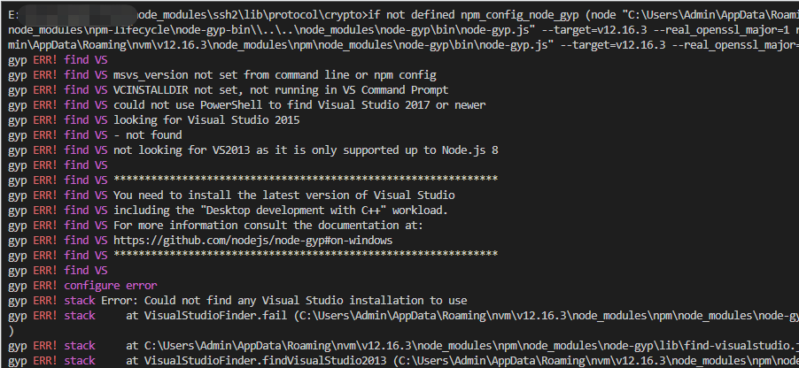
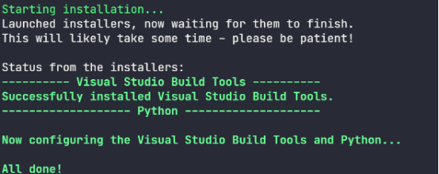

这里是记录软件环境及项目安装依赖过程中，所遇到的报错及解决方案

### 1. gyp ERR! stack Error: Could not find any Visual Studio installation to use at VisualStudioFinder.fail

**解决方案：** 打开cmd,输入`npm install --global --production windows-build-tools`

等待安装完成后，再次进到项目安装依赖就可以了

### 2. 代码修改完准备提交的时候，报如下错误fatal: unable to access 'https://github.com/***': OpenSSL SSL_read: Connection was reset, errno 10054

查了网上说的最多的就是服务器的SSL证书没有经过第三方机构的签署，要修改设置，解除SSL验证。打开 命令行工具， 输入：`git config --global http.sslVerify "false"`

然而并没有效果。还看到有另外一种方法：在项目目录下打开命令行工具，输入`git init` 

我尝试在项目里输入`git init`，可以从仓库拉取，但还是不能提交。后来查了一下可能是提交的内容太多，就分开两次提交，竟然成功了T_T
