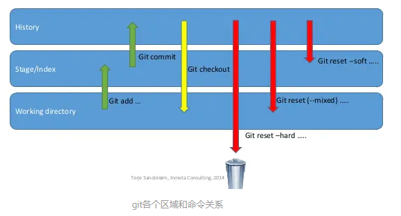

# fork工作流

什么是fork？

fork通常来说，就是copy。例如：团队开发了一个项目ProjectA，并上传到了github上，团队中的其他成员要进行开发时，并不能直接把自己的修改直接merge进去，于是就出现了fork，我们可以复制一份该项目的代码到自己的github上，在自己的github仓库中修改代码，当修改完代码后，提交pull request（PR），当你选择的复核人看到请求后会进行审核，如果觉得ok，就把提交过来的代码merge进来，这样就完成了共同协作开发。

**接下来看看怎么fork项目到自己的仓库：**

1. 从远程仓库A fork到自己仓库B；
2. 从自己仓库clone到本地；
     `git clone fork分支的路径`
3. 创建本地开发分支；（可略过）
     `git checkout -b my_dev_branch`
4. 进到本地项目文件根目录, 添加一个upstream指向远程仓库
   `git remote add upstream http://192.168.xxx/scm/xxxx.git `（远程仓库的路径）

到此项目已经fork到自己仓库了，接下来就可以进行开发了。

1. 获取远程仓库A上分支到自己仓库；
   `git fetch upstream 远程分支名`  （也可以加远程分支名，就是获取所有远程分支）

2. 获取远程分支更新；
   `git merge upstream 远程分支名称`

3. 修改代码；

4. 查看本地代码仓状态；

   `git status`  （可略过）

5. 查看本地修改； 

     `git diff xx（文件名）`  （可略过）

6. 提交代码； git add .       

    `git commit -m 'xxx'`

7. push前需要再同步一下远程分支到自己仓库；（即执行步骤1、2）

8. 推送代码到自己的远程仓库；

   `git pull`    `git push origin 分支名称`

9. 请求合并到远程仓库A，提交请求是要选择reviewer； （pull requests）

一个完整的fork工作流程就完成了。


# git

### 查看分支

```
git branch                               // 查看本地分支
git branch -r                            // 查看远程分支
git branch -a                            // 查看所有分支(可输入q退出)
git branch -v                            // 查看每一个分支的最后一次提交
git branch --merged                      // 查看哪些分支已经合并到当前分支
git branch --no-merged                   // 查看所有包含未合并工作的分支
```

### 新建分支

```
git branch branchname                    // 新建分支
git checkout -b (branchname)             // 新建分支、并切换到新建分支
git switch -c branchname                 // 新建分支、并切换到新建分支              
```

### 切换分支

```
git checkout branchname                  // 切换分支到branchname
git switch branchname                    // 切换到 branchname 
```

### 删除分支

```
git branch -d branchname                // 删除分支 -d选项只能删除已经参与了合并的分支，对于未有合并的分支是无法删除的。如										                      果想强制删除一个分支，可以使用-D选项
git branch -d -r branchname             //删除远程分支，删除后还需推送到服务器
git push origin:branchname              //删除后推送至服务器
git push -d origin branchname            // 删除远程分支
```

### 合并分支

```
git merge (branchname)                   // 合并branchname分支到当前分支
git merge origin/master                  // 把远程master分支合并到当前分支
```

### 远程分支

```
git checkout -b branchname origin/branchname  // 检出远程分支到本地，并切换到该分支
git remote update origin --prune              // 更新远程分支   git remote update origin -p
```


### 添加暂存、提交

```
git add .                                      // 添加所有修改的文件到暂存区
git add [file1] [file2] ...                    // 添加指定文件到暂存区
git add [dir]                                  // 添加指定目录到暂存区，包括子目录
git commit -m [message]                        // 提交暂存区到本地仓库
git commit [file1] [file2] ... -m [message]                     // 提交暂存区到本地仓库

git cherry-pick <commitHash>                   // 将指定的提交（commit）应用于当前分支
```


### 拉取、推送

```
git fetch origin                           // 将远程主机的更新全部取回本地
git fetch origin dev                            // 将远程主机dev分支的更新取回本地
git pull origin <远程分支名>:<本地分支名>     // 拉取远程分支内容 如果本地分支名称和远程分支名称一致，则可以简写  git pull origin branchname
git pull origin dev = git fetch origin dev + git merge FETCH_HEAD
git push origin <本地分支名>:<远程分支名>     // 将本地分支的更新，推送到远程主机的分支   git push origin branchname
```

### 取消修改

```
// 取消工作区文件的修改  即未执行git add .操作的文件
git restore <file>                             // 取消工作区指定文件的修改
git restore .                                  // 取消工作区所有文件的修改
git checkout .                                 // 取消工作区所有文件的修改

// 取消暂存的文件  即已执行git add . 但是没有commit
git restore --staged <file>                    // 取消暂存，文件回到工作区
git restore --staged .                         // 取消所有暂存，文件回到工作区
git reset HEAD                                 // 取消所有暂存，文件回到工作区
```

### 撤销commit

`git reset [--soft | --mixed | --hard] [HEAD] `

有时候，我们用Git的时候有可能commit提交代码后，发现这一次commit的内容是有错误的，那么有两种处理方法：
 1、修改错误内容，再次commit一次      2、使用**git reset** 命令撤销这一次错误的commit

```undefined
git-reset - Reset current HEAD to the specified state
```

意思就是可以让HEAD这个指针指向其他的地方。例如我们有一次commit不是不是很满意，需要回到上一次的Commit里面。那么这个时候就需要通过reset，把HEAD指针指向上一次的commit的点。
 它有三种模式，soft,mixed,hard，具体的使用方法下面这张图，展示的很全面了。



详解可参照https://www.jianshu.com/p/c2ec5f06cf1a，这篇文章讲解的详细，很清晰。


**--mixed** 为默认，可以不用带该参数，保留工作目录，并清空暂存区。也就是说，工作目录的修改、暂存区的内容以及由 **reset** 所导致的新的文件差异，都会被放进工作目录。简而言之，就是「把所有差异都混合（mixed）放在工作目录中」。

```
$ git reset HEAD                 # 取消所有暂存
$ git reset HEAD^                # 回退所有内容到上一个版本  
$ git reset HEAD^ hello.php      # 回退 hello.php 文件的版本到上一个版本  
$ git  reset  052e               # 回退到指定提交  052e是commit id的前几位
```

**--soft**  保留工作目录，并把重置 HEAD 所带来的新的差异放进暂存区：

**reset --soft** 会在重置 **HEAD** 和 **branch** 时，保留工作目录和暂存区中的内容，并把重置 **HEAD** 所带来的新的差异放进暂存区。

```
git reset --soft HEAD~3         # 回退上上上一个版本
```

**--hard**  会在重置 **HEAD** 和**branch**的同时，重置stage区和工作目录里的内容。当你在 **reset** 后面加了 **--hard** 参数时，你的stage区和工作目录里的内容会被完全重置为和**HEAD**的新位置相同的内容。换句话说，就是你的没有**commit**的修改会被全部擦掉。

例如你在上次 **commit** 之后又对文件做了一些改动：把修改后的**ganmes.txt**文件**add**到**stage区**，修改后的**shopping list.txt**保留在**工作目录**，然后，执行`git reset --hard HEAD^`, 你的**HEAD** 和当前**branch**切到上一条**commit** 的同时，你工作目录里的新改动和已经add到stage区的新改动也一起全都消失了。

`git reset --hard HEAD`

```
$ git reset --hard HEAD~3            # 回退上上上一个版本  
$ git reset --hard bae128            # 回退到某个版本回退点之前的所有信息。 
$ git reset --hard origin/master    # 将本地的状态回退到和远程的一样 
```

**注意：**谨慎使用 –hard 参数，它会删除回退点之前的所有信息。

**HEAD 说明：**

- HEAD 表示当前版本

- HEAD^ 上一个版本

- HEAD^^ 上上一个版本

- HEAD^^^ 上上上一个版本

- 以此类推...

  

可以使用 ～数字表示

- HEAD~0 表示当前版本
- HEAD~1 上一个版本
- HEAD^2 上上一个版本
- HEAD^3 上上上一个版本
- 以此类推...

### 版本回退

想要回退到某次提交，先`git log`查看日志，通过`git reset --hard 版本号`来执行回退，然后再强推一次`git push -f`即可。


如上图所示，想要回到init的版本执行以下操作即可

```
// 先执行
git reset --hard f67e6fd022bfb52d2d7

//然后再强推
git push -f
```


### 删除文件

```
/* 
* git clean 删除工作区所有没有 tracked，没有被管理过的文件。
* git clean 和 git reset --hard 结合使用。
* clean 影响没有被 track 过的文件（清除未被 add 或被 commit 的本地修改）
* reset 影响被 track 过的文件 （回退到上一个 commit）
*/
git clean -n                  // 是一次 clean 的演习, 告诉你哪些文件会被删除，不会真的删除
git clean -f                  // 删除当前目录下所有没有 track 过的文件,不会删除 .gitignore 文件里面指定的文件夹和文件, 不管这些文件有没有被 track 过
git clean -f <path>           // 删除指定路径下的没有被 track 过的文件
git clean -df                 // 删除当前目录下没有被 track 过的文件和文件夹  常用
git clean -xf                 // 删除当前目录下所有没有 track 过的文件.不管是否是 .gitignore 文件里面指定的文件夹和文件

//  删除文件 rm
git rm <file>                                   // 将文件从暂存区和工作区中删除
git rm -f <file>                                // 如果删除之前修改过并且已经放到暂存区域的话，则必须要用强制删除选项 -f
git rm --cached <file>                          // 把文件从暂存区域移除，但仍然希望保留在当前工作目录中
git rm –r *                                     // 可以递归删除，即如果后面跟的是一个目录做为参数，则会递归删除整个目录中的所有子目录和文件
```


### 对比差异

```
git diff <file>                    # 比较当前文件和暂存区文件差异 git diff
git diff <id1><id1><id2>           # 比较两次提交之间的差异
git diff <branch1> <branch2>       # 在两个分支之间比较
git diff --staged                  # 比较暂存区和版本库差异
git diff --cached  				  # 比较暂存区和版本库差异
git diff --stat 				  # 仅仅比较统计信息
```


### 查看提交历史 log

```
git log                                          // 查看提交历史
git log -p   或 git log --patch                  // 显示每次提交所引入的差异（按 补丁 的格式输出）
git log -p -2                                    // 限制显示的日志条目数量，显示最近的两次提交
git log -p (branchname)                          // 查看某个分支的提交历史
git log --pretty=oneline                         // 如果嫌输出信息太多，看得眼花缭乱的，可以加上，每个记录只显示一行

git reflog                                       // 查看命令历史
```

### 打标签 tag

```
git tag                               // 列出已有的标签,（可带上可选的 -l 选项 --list）
git tag -l "v1.8*"                    // 列出标签名称含有'v1.8'的选项
git tag -a v1.4                       // 打标签，标签名 v1.4
git tag -a v1.4 -m "my version 1.4"   // 打标签，-m 选项指定了一条将会存储在标签中的信息
git tag -d <tagname>                  // 删除tag
```

**后期打tag**

你也可以对过去的提交打标签。 假设提交历史是这样的：

```
$ git log --pretty=oneline
15027957951b64cf874c3557a0f3547bd83b3ff6 Merge branch 'experiment'
a6b4c97498bd301d84096da251c98a07c7723e65 beginning write support
0d52aaab4479697da7686c15f77a3d64d9165190 one more thing
6d52a271eda8725415634dd79daabbc4d9b6008e Merge branch 'experiment'
0b7434d86859cc7b8c3d5e1dddfed66ff742fcbc added a commit function
4682c3261057305bdd616e23b64b0857d832627b added a todo file
166ae0c4d3f420721acbb115cc33848dfcc2121a started write support
9fceb02d0ae598e95dc970b74767f19372d61af8 updated rakefile
964f16d36dfccde844893cac5b347e7b3d44abbc commit the todo
8a5cbc430f1a9c3d00faaeffd07798508422908a updated readme
```

现在，假设在 v1.2 时你忘记给项目打标签，也就是在 “updated rakefile” 提交。 你可以在之后补上标签。 要在那个提交上打标签，你需要在命令的末尾指定提交的校验和（或部分校验和）：

```
git tag -a v1.2 9fceb02 -m "xxxx"
```


### 贮藏  stash

```
git stash                        // 会把暂存区和工作区的改动贮藏起来
git stash push -m 'XXX'          // 贮藏 并添加备注
git stash list                   // 查看贮藏列表
git stash apply                  // 应用贮藏 默认应用最新一个,即stash@{0}  不会把存储从存储列表中删除
git stash apply stash@{1}        //  应用第二个贮藏   git stash apply stash@{$num}
git stash pop stash@{$num}       // 应用贮藏，并将缓存堆栈中的对应stash删除  stash@{$num}可省略，默认num为0
git stash drop stash@{$num}      // 删除贮藏  stash@{$num}可省略，默认num为0
git stash clear                  // 删除所有缓存的stash
```


