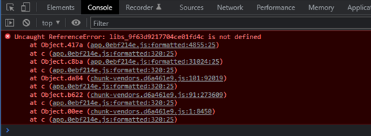
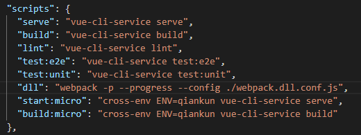

背景：一次发版之后，发现80%的用户访问页面一片空白，手动刷新页面或者清除缓存之后就可以正常访问。

看到控制台报错

是因为重新执行了`npm run dll`命令，重新生成了libs-mainfest.jsom文件和libs.ddl.js文件，文件里libs_XXX序列号更新了。浏览器的缓存导致了还是去读老的libs_xxx，从而出现报错。



解决办法就是在生成文件时，文件名加上hash值，就不会出现缓存的问题了。

项目文件根目录下的webpak.dll.conf.js里修改

```javascript
module.exports = {
  mode: 'production',
  entry: {
    libs: vendors
  },
  output: {
    path: path.resolve(__dirname, dllPath),
    filename: '[name].ddl.[hash].js', // [name].ddl.js 改为 [name].ddl.[hash].js
    library: '[name]_[hash]',
    libraryTarget: 'umd'
  },
  plugins: [
    new CleanWebpackPlugin(),
    new webpack.DllPlugin({
      name: '[name]_[hash]',
      path: path.join(__dirname, dllPath, '[name]-mainfest.json'),
      context: process.cwd()
    })
  ]
}
```

