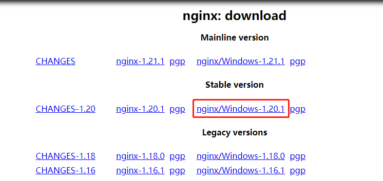
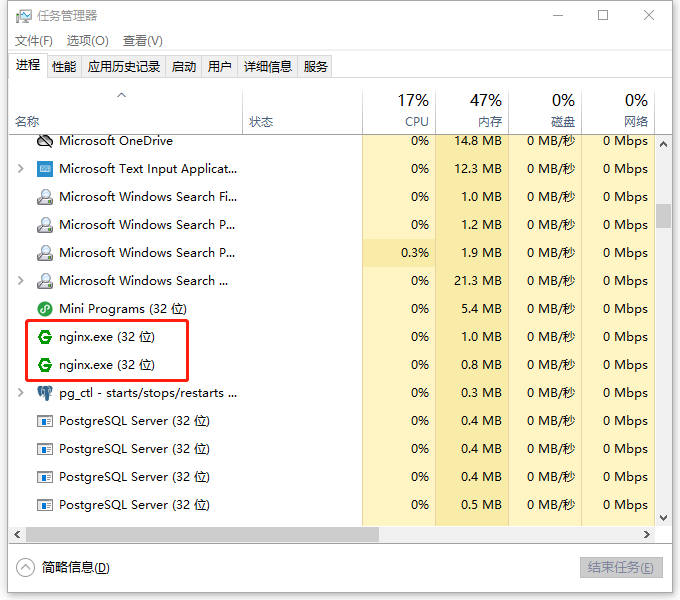
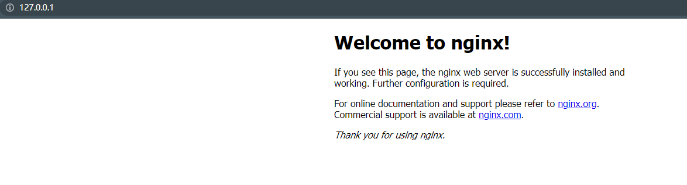

## windows下安装nginx

1. 到nginx官网上下载相应的安装包，http://nginx.org/en/download.html

   

2. 下载进行解压，将解压后的文件放到自己心仪的目录下。

3. 进入window的cmd窗口，输入如下图所示的命令，进入到存放nginx的目录，使用`start nginx.exe `进行nginx的安装。

4. 安装成功后，在“任务管理器”中会看到“nginx.exe”进程，如下图所示：

   

5.  在浏览器地址栏输入：127.0.0.1，会看到如下图所示的nginx欢迎界面

   

## Windows下Nginx的启动、停止、重启等命令

cmd命令进入安装文件目录，执行以下操作

**1. 启动** 

`start nginx `  或者  `nginx.exe`

> 建议使用前者，后者会使你的cmd一直处于执行中，不能进行其他命令操作

**2. 停止**

`nginx.exe -s stop`  或者  `nginx.exe -s quit`

> stop是快速停止nginx，可能并不保存相关信息；quit是完整有序的停止nginx，并保存相关信息

**3. 重新载入Nginx**

`nginx.exe -s reload`    

当配置信息修改，需要重新载入这些配置时使用此命令

**4. 重新打开日志文件**

`nginx.exe -s reopen`

**5. 查看Nginx版本**

`nginx -v`

