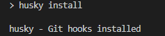
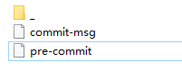
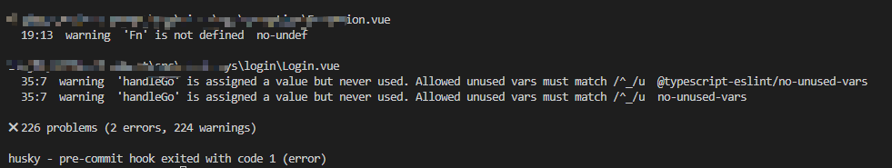
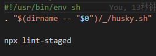

##  一、Commit message规范

## 1.Commit message结构

首先先了解一下 Commit message的结构，一般包括三部分：Header、Body、Footer

```shell
<type>(<scope>): <subject>
< 空一行 >
<body>
< 空一行 >
<footer>
```

**Header**  

`type(scope):subject` type(必需)、scope(可选) 和 subject(必需)

- type：用于说明 commit 的类别，规定为如下几种

  ```
  -   `feat` 增加新功能
  -   `fix` 修复问题/BUG
  -   `style` 不改变代码逻辑 (仅仅修改了空格、格式缩进、逗号等等)
  -   `perf` 优化相关，比如提升性能、体验
  -   `refactor` 重构 （既不修复错误也不添加功能）
  -   `revert` 撤销修改
  -   `test` 测试相关
  -   `docs` 修改文档/注释，比如 README, CHANGELOG 等等
  -   `chore` 依赖更新/脚手架配置修改等
  -   `workflow` 工作流改进
  -   `ci` 持续集成, 自动化流程配置或脚本修改
  -   `types` 类型定义文件更改
  -   `wip` 开发中
  -   `build` 构建系统或外部依赖项的更改
  ```

- scope：(可选)用于说明 commit 影响的范围；
- subject：commit 的简要说明，尽量简短。

**Body** 

Body 部分是对本次 commit 的详细描述，可以分成多行。

**Footer**

Footer 部分只用于两种情况。

- 不兼容变动

  如果当前代码与上一个版本不兼容，则 Footer 部分以 **BREAKING CHANGE** 开头，后面是对变动的描述、以及变动理由和迁移方法。

- 关闭 Issue

  如果当前 commit 针对某个 issue，那么可以在 Footer 部分关闭这个 issue, 也可以一次关闭多个 issue。

  ```
  ? Select the **type** of change that you're committing:
  (type) 选择提交更改的类型
  ? What is the **scope** of this change (e.g. component or file name)? (press enter to skip)
  (scope) 此次更改的范围是什么（组件或者文件名）
  ? Write a **short**, imperative tense description of the change:
  (subject) 写一个简短的，命令式的变化描述
  ? Provide a **longer description** of the change: (press enter to skip)
  (Body) 提供更改的长描述
  ? Are there any **breaking changes**?
  (Footer) 有没有突破性的变化
  ? Does this change affect any open **issues**? (y/N)
  (Footer) 此次更改是否有要关闭 issues
  ```

  如果当前 commit 针对某个 issues
  
  ```
  ? Does this change affect any open issues? (y/N)
  ```
  
  选择 Y，输入 **Closes #1** (表示关闭第 1 个 issues)
  
  也可以一次关闭多个 issues ： Closes #1 #2 #3

## 2.配置提交规范校验

提交信息 header必须包含type、subject，subject的描述要尽量精简， body和footer可以省略。提交时尽量避免将不相关的功能更改混合提交。为了保证提交的规范性，在提交时进行自动校验。

**全局安装**

`yarn global add @commitlint/cli @commitlint/config-conventional`

**创建配置文件**

在项目根目录下创建commitlint.config.js文件，自定义配置提交message规范。

配置项

- extends 继承外部配置文件或npm配置包

  ```
  extends: ['@commitlint/config-conventional']  // 使用第三方npm包
  ```

- parserPreset 解析器路径

  ```
  parserPreset: 'conventional-changelog-atom',
  ```

- formatter 格式化工具

  ```
  formatter: '@commitlint/format',
  ```

- rules 本地自定义规则, 优先级高于extends

  ```
  rules: {
    'type-enum': [2, 'always', ['foo']],
  }
  ```

  规则格式： [规则名称]:[level, applicable, value]

  level 校验等级：0 禁言，1 警告，2 错误

  applicable 规则匹配模式：always 正匹配，nerver 反匹配

  value 参数值：规则可接收的参数 1. 规则数组 []，2. 返回规则数组的函数 () => Array，3. Promise规则数组 Promise<<Array>>

  ```
  {
    "rules":{
        "header-max-length": [0, "always", 72],
        "header-max-length": () => [0, "always", 72],
        "header-max-length": async () => [0, "always", 72],
    }
  }
  ```

例子：

```
module.exports = {
  ignores: [(commit) => commit.includes('init')],
  extends: ['@commitlint/config-conventional'],
  rules: {
    'body-leading-blank': [2, 'always'],
    'footer-leading-blank': [1, 'always'],
    'header-max-length': [2, 'always', 108],
    'subject-empty': [2, 'never'],
    'type-empty': [2, 'never'],
    'subject-case': [0],
    'type-enum': [
      2,
      'always',
      [
        'feat',
        'fix',
        'perf',
        'style',
        'docs',
        'test',
        'refactor',
        'build',
        'ci',
        'chore',
        'revert',
        'wip',
        'workflow',
        'types',
        'release',
      ],
    ],
  },
};

```

上面我们就完成了`commitlint`的安装与提交规范的制定。检验`commit message`的**最佳方式是结合git hook，所以需要配合Husky**，实现提交时强制校验。

## husky

husky继承了Git下所有的钩子，在触发钩子的时候，husky可以阻止不合法的commit,push等等。**注意使用husky之前，必须先将代码放到git 仓库中，否则本地没有.git文件，就没有地方去继承钩子了。**

1. 安装 `yarn add husky -D` 或者 `npm install husky --save-dev`

2. 启动hooks，生成 .husky 文件

   `npx husky install`

3. 可以在 `package.json`里配置指令

   `"prepare": "husky install"`

4. 执行`prepare`指令

   执行成功

5. 配置.husky 文件内容

   `npx husky add .husky/commit-msg 'npx --no-install commitlint --edit "$1"'`

至此，就已经处理好了强制规范化的提交要求，不符合规范的**提交信息**将不能被提交。


6. 通过`pre-commit`检测提交时代码规范

   通过husky监测 `pre-commit`钩子，在该钩子下执行 `npx husky add .husky/pre-commit "npx eslint --ext .js,.jsx,.vue src"`指令来进行相关检测，执行后会生成对应文件 pre-commit

   

   到这里，已经通过 `pre-commit`检测到了**代码**的提交规范问题。

   

错误是被拦截了，但是报了这么多问题抛出来，一个一个去改想想都恐怖。那么有没有办法在提交时发现错误可以自动修复一些代码格式上的问题呢？想知道的继续往下看~

7. lint-staged自动修复格式错误

   上面我们通过`pre-commit`处理了监测代码的提交规范问题，当我们提交代码时，会检测所有的代码格式规范。但是会存在两个问题：

   1. 我们只修改了一个文件，没必要检测所有的文件代码格式。
   2. 只能给出错误的提示，还需要我们手动进行代码修改。

   这里我们就用另外一个插件`lint-staged`处理一下这两个问题。

   lint-staged可以只检查本次修改的更新代码，并在出现错误的时候，自动修复并且推送；并且无需单独安装，在生成项目的时候，vue-cli已经帮助我们安装过了，所以可以直接使用。

   把package.json添加的lint-staged代码改

   ```
   "lint-staged": {
       "*.{js,jsx,ts,tsx}": [
         "eslint --fix",
         "prettier --write"
       ],
       "{!(package)*.json,*.code-snippets,.!(browserslist)*rc}": [
         "prettier --write--parser json"
       ],
       "package.json": [
         "prettier --write"
       ],
       "*.vue": [
         "eslint --fix",
         "prettier --write",
         "stylelint --fix"
       ],
       "*.{scss,less,styl,html}": [
         "stylelint --fix",
         "prettier --write"
       ],
       "*.md": [
         "prettier --write"
       ]
     }
   ```

   如上配置，每次它只会在你本地 commit 之前，校验你提交的内容是否符合你本地配置的 eslint规则(这个见文档 ESLint )，校验会出现两种结果：

   1. 如果符合规则：则会提交成功。

   2. 如果不符合规则：它会自动执行 eslint --fix 尝试帮你自动修复，如果修复成功则会帮你把修复好的代码提交，如果失败，则会提示你错误，让你修好这个错误之后才能允许你提交代码。

   修改 .husky/pre-commit 文件

   

   再次执行提交代码，发现 暂存区 不符合 ESlint 的内容被自动修复了！

# 二、自动生成提交日志

安装

`yarn add conventional-changelog-cli -D`

配置package.json

`"changelog": "conventional-changelog -p angular -i CHANGELOG.md -s -r"`

上面 changelog 命令不会覆盖以前的 `CHANGELOG`，只会在 **CHANGELOG.md** 的**头部**加上自从上次发布以来的变动。

执行`npm run changelog`就会生CHANGELOG.md文件

**自定义日志格式**

安装 custom-config  `yarn add conventional-changelog-custom-config -D`

在根目录创建changelog-option.js，在这里面配置想要的效果。如果我只关注 feat(新功能) 、fix(Bug 修复) 、perf(性能优化)、revert(回退)，那么我就可以在配置中这样写。

```
module.exports = {
   writerOpts: {
       transform: (commit, context) => { 
           if (commit.type === 'feat') {
               commit.type = '✨ Features | 新功能'
           } else if (commit.type === 'fix') {
               commit.type = '🐛 Bug Fixes | Bug 修复'
           } else if (commit.type === 'perf') {
               commit.type = '⚡ Performance Improvements | 性能优化'
           } else if (commit.type === 'revert' || commit.revert) {
               commit.type = '⏪ Reverts | 回退'
           } 
		return
       }
```

这样一来就只会生成需要的日志而不会生成其他的日志。

修改package.json：`"changelog": "conventional-changelog -p custom-config -i CHANGELOG.md -s -r -n ./changelog-option.js"`

如果现在之日上添加上提交者的名字，可以在package.json添加

```
"changelog": {
    "emojis": true, // 是否使用图标
    "authorName": true // 作者
  }
```


完整配置

```
const compareFunc = require('compare-func')
module.exports = {
    writerOpts: {
        transform: (commit, context) => {
            let discard = true
            const issues = []

            commit.notes.forEach(note => {
                note.title = 'BREAKING CHANGES'
                discard = false
            })
            if (commit.type === 'feat') {
                commit.type = '✨ Features | 新功能'
            } else if (commit.type === 'fix') {
                commit.type = '🐛 Bug Fixes | Bug 修复'
            } else if (commit.type === 'perf') {
                commit.type = '⚡ Performance Improvements | 性能优化'
            } else if (commit.type === 'revert' || commit.revert) {
                commit.type = '⏪ Reverts | 回退'
            } else if (discard) {
                return
            } else if (commit.type === 'docs') {
                commit.type = '📝 Documentation | 文档'
            } else if (commit.type === 'style') {
                commit.type = '💄 Styles | 风格'
            } else if (commit.type === 'refactor') {
                commit.type = '♻ Code Refactoring | 代码重构'
            } else if (commit.type === 'test') {
                commit.type = '✅ Tests | 测试'
            } else if (commit.type === 'build') {
                commit.type = '👷‍ Build System | 构建'
            } else if (commit.type === 'ci') {
                commit.type = '🔧 Continuous Integration | CI 配置'
            } else if (commit.type === 'chore') {
                commit.type = '🎫 Chores | 其他更新'
            }


            if (commit.scope === '*') {
                commit.scope = ''
            }
            if (typeof commit.hash === 'string') {
                commit.hash = commit.hash.substring(0, 7)

            }
            if (typeof commit.subject === 'string') {
                let url = context.repository
                    ? `${context.host}/${context.owner}/${context.repository}`
                    : context.repoUrl
                if (url) {
                    url = `${url}/issues/`
                    // Issue URLs.
                    commit.subject = commit.subject.replace(/#([0-9]+)/g, (_, issue) => {
                        issues.push(issue)
                        return `[#${issue}](${url}${issue})`
                    })
                }
                if (context.host) {
                    // User URLs.
                    commit.subject = commit.subject.replace(/\B@([a-z0-9](?:-?[a-z0-9/]){0,38})/g, (_, username) => {
                        if (username.includes('/')) {
                            return `@${username}`
                        }

                        return `[@${username}](${context.host}/${username})`
                    })
                }
            }

            // remove references that already appear in the subject
            commit.references = commit.references.filter(reference => {
                if (issues.indexOf(reference.issue) === -1) {
                    return true
                }

                return false
            })
            return commit
        },
        groupBy: 'type',
        commitGroupsSort: 'title',
        commitsSort: ['scope', 'subject'],
        noteGroupsSort: 'title',
        notesSort: compareFunc
    }
}
```

**忽略校验**

```
git commit -m "feat:xxxx" --no-verify
```

