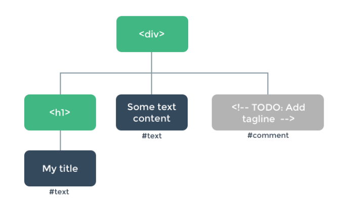

# 节点、树以及虚拟DOM

在深入渲染函数之前，了解一些浏览器的工作原理是很重要的。以下面这段 HTML 为例：

```html
<div>
  <h1>My title</h1>
  Some text content
  <!-- TODO: Add tagline -->
</div>
```

当浏览器读到这些代码时，它会建立一个[“DOM 节点”树](https://javascript.info/dom-nodes)来保持追踪所有内容，如同你会画一张家谱树来追踪家庭成员的发展一样。

上述 HTML 对应的 DOM 节点树如下图所示：



每个元素都是一个节点。每段文字也是一个节点。甚至注释也都是节点。一个节点就是页面的一个部分。就像家谱树一样，每个节点都可以有孩子节点 (也就是说每个部分可以包含其它的一些部分)。

高效地更新所有这些节点会是比较困难的，不过所幸你不必手动完成这个工作。你只需要告诉 Vue 你希望页面上的 HTML 是什么，这可以是在一个模板里：

```html
<h1>{{ blogTitle }}</h1>
```

或者一个渲染函数里：

```javascript
render: function (createElement) {
  return createElement('h1', this.blogTitle)
}
```

在这两种情况下，Vue 都会自动保持页面的更新，即便 `blogTitle` 发生了改变。

# 虚拟DOM

Vue 通过建立一个**虚拟 DOM** 来追踪自己要如何改变真实 DOM。请仔细看这行代码：

```javascript
return createElement('h1', this.blogTitle)
```

`createElement` 到底会返回什么呢？其实不是一个*实际的* DOM 元素。它更准确的名字可能是 `createNodeDescription`，因为它所包含的信息会告诉 Vue 页面上需要渲染什么样的节点，包括及其子节点的描述信息。我们把这样的节点描述为“虚拟节点 (virtual node)”，也常简写它为“**VNode**”。“虚拟 DOM”是我们对由 Vue 组件树建立起来的整个 VNode 树的称呼。

# creatElement参数

这里是 `createElement` 接收的参数：

```javascript
// @returns {VNode}
createElement(
  // {String | Object | Function}
  // 一个 HTML 标签名、组件选项对象，或者
  // resolve 了上述任何一种的一个 async 函数。必填项。
  'div',

  // {Object}
  // 一个与模板中 attribute 对应的数据对象。可选。
  {
    // (详情见下一节)
  },

  // {String | Array}
  // 子级虚拟节点 (VNodes)，由 `createElement()` 构建而成，
  // 也可以使用字符串来生成“文本虚拟节点”。可选。
  [
    '先写一些文字',
    createElement('h1', '一则头条'),
    createElement(MyComponent, {
      props: {
        someProp: 'foobar'
      }
    })
  ]
)
```

## 深入数据对象

有一点要注意：正如 `v-bind:class` 和 `v-bind:style` 在模板语法中会被特别对待一样，它们在 VNode 数据对象中也有对应的顶层字段。该对象也允许你绑定普通的 HTML attribute，也允许绑定如 `innerHTML` 这样的 DOM property (这会覆盖 `v-html` 指令)。

```javascript
{
  // 与 `v-bind:class` 的 API 相同，
  // 接受一个字符串、对象或字符串和对象组成的数组
  'class': {
    foo: true,
    bar: false
  },
  // 与 `v-bind:style` 的 API 相同，
  // 接受一个字符串、对象，或对象组成的数组
  style: {
    color: 'red',
    fontSize: '14px'
  },
  // 普通的 HTML attribute
  attrs: {
    id: 'foo'
  },
  // 组件 prop
  props: {
    myProp: 'bar'
  },
  // DOM property
  domProps: {
    innerHTML: 'baz'
  },
  // 事件监听器在 `on` 内，
  // 但不再支持如 `v-on:keyup.enter` 这样的修饰器。
  // 需要在处理函数中手动检查 keyCode。
  on: {
    click: this.clickHandler
  },
  // 仅用于组件，用于监听原生事件，而不是组件内部使用
  // `vm.$emit` 触发的事件。
  nativeOn: {
    click: this.nativeClickHandler
  },
  // 自定义指令。注意，你无法对 `binding` 中的 `oldValue`
  // 赋值，因为 Vue 已经自动为你进行了同步。
  directives: [
    {
      name: 'my-custom-directive',
      value: '2',
      expression: '1 + 1',
      arg: 'foo',
      modifiers: {
        bar: true
      }
    }
  ],
  // 作用域插槽的格式为
  // { name: props => VNode | Array<VNode> }
  scopedSlots: {
    default: props => createElement('span', props.text)
  },
  // 如果组件是其它组件的子组件，需为插槽指定名称
  slot: 'name-of-slot',
  // 其它特殊顶层 property
  key: 'myKey',
  ref: 'myRef',
  // 如果你在渲染函数中给多个元素都应用了相同的 ref 名，
  // 那么 `$refs.myRef` 会变成一个数组。
  refInFor: true
}
```

# 约束

## VNode 必须唯一

组件树中的所有 VNode 必须是唯一的。这意味着，下面的渲染函数是不合法的：

```javascript
render: function (createElement) {
  var myParagraphVNode = createElement('p', 'hi')
  return createElement('div', [
    // 错误 - 重复的 VNode
    myParagraphVNode, myParagraphVNode
  ])
}
```

如果你真的需要重复很多次的元素/组件，你可以使用工厂函数来实现。例如，下面这渲染函数用完全合法的方式渲染了 20 个相同的段落：

```javascript
render: function (createElement) {
  return createElement('div',
    Array.apply(null, { length: 20 }).map(function () {
      return createElement('p', 'hi')
    })
  )
}
```

